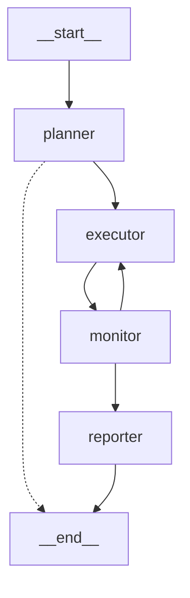

# 🚀 快速开始指南

## 分布式 Agent 调度器（基于 LangManus 重构）

---

## 📋 前置要求

1. **Python 3.12+**
2. **uv 包管理器**
3. **LLM API Key**（OpenAI 或 DeepSeek）

---

## ⚡ 快速启动（3步）

### 步骤 1：配置环境变量

复制并修改 `.env` 文件：

```bash
cp .env.example .env
```

编辑 `.env`，填入你的 API Key：

```bash
# LLM 配置（用于 Planner 节点）
REASONING_MODEL=deepseek-reasoner
REASONING_API_KEY=sk-your-deepseek-key

BASIC_MODEL=gpt-4o
BASIC_API_KEY=sk-your-openai-key
```

### 步骤 2：安装依赖

```bash
# 使用 uv 安装
uv sync

# 如果没有 requests（通常已包含）
uv pip install requests
```

### 步骤 3：运行示例

```bash
# 方式 1：命令行参数
python distributed_main.py "帮我搜索 Python 3.13 的新特性并总结"

# 方式 2：交互式输入
python distributed_main.py
```

---

## 📖 使用示例

### 示例 1：基础查询

```bash
python distributed_main.py "搜索 DeepSeek R1 模型的相关信息"
```

**预期输出**：
```
==========================================================
🚀 分布式 Agent 调度器 (Ubiquitous Agent System - L2)
==========================================================

📝 用户请求: 搜索 DeepSeek R1 模型的相关信息
------------------------------------------------------------

[1] PLANNER
------------------------------------------------------------
## 📋 任务规划完成

**思考过程**：用户需要搜索 DeepSeek R1 模型信息，这需要使用搜索能力的 Agent。

**任务总数**：1

**任务列表**：
1. **搜索 DeepSeek R1 信息** → Agent: `search_agent_001` (IP: 192.168.1.10:8080)

[2] EXECUTOR
------------------------------------------------------------
### 任务执行结果 (1/1)

**任务**: 搜索 DeepSeek R1 信息
**Agent**: search_agent_001 (192.168.1.10:8080)
**状态**: ✅ 成功

**结果**:
[Mock 结果] Agent search_agent_001 已完成任务...

[3] REPORTER
------------------------------------------------------------
# 🎯 分布式任务执行报告

## 📊 执行统计
- **总任务数**: 1
- **成功**: 1 ✅
- **失败**: 0 ❌
- **成功率**: 100.0%
```

### 示例 2：复杂任务（多 Agent 协作）

```bash
python distributed_main.py "搜索最新的 AI 新闻，然后用 Python 分析热门关键词"
```

**预期规划**：
1. Task 1: 搜索 AI 新闻 → `search_agent_001`
2. Task 2: 分析关键词 → `compute_agent_001`

---

## 🔧 配置说明

### 1. 修改 Mock Agent 列表

编辑 `src/service/agent_registry.py`：

```python
def _init_mock_agents(self) -> List[AgentInfo]:
    return [
        {
            "id": "your_custom_agent",
            "ip": "192.168.1.100",      # 修改为你的 Agent IP
            "port": 8080,
            "capability": "custom_task",
            "status": "online",
            "description": "你的 Agent 描述"
        },
        # 添加更多 Agent...
    ]
```

### 2. 调整超时和重试

在运行时传入参数：

```python
from src.distributed_workflow import run_distributed_workflow

result = run_distributed_workflow(
    user_input="你的查询",
    debug=True,
    max_retries=5,          # 最大重试次数
    timeout_seconds=60      # 超时时间（秒）
)
```

---

## 🐛 调试模式

### 启用详细日志

```python
# distributed_main.py 已默认启用 debug=True
result = run_distributed_workflow(user_input=query, debug=True)
```

### 查看 Graph 结构

```bash
python -c "from src.distributed_workflow import visualize_graph; print(visualize_graph())"
```

输出 Mermaid 图表：


---

## 🔄 从 Mock 切换到生产环境

### Step 1：部署真实的 L3 Agent

每个 L3 Agent 需要提供 HTTP 接口：

```python
# L3 Agent 端（FastAPI 示例）
from fastapi import FastAPI
from pydantic import BaseModel

app = FastAPI()

class TaskRequest(BaseModel):
    task_id: str
    task_description: str
    context: dict

@app.post("/execute")
def execute_task(request: TaskRequest):
    # 执行任务逻辑
    result = perform_your_task(request.task_description)
    
    return {
        "status": "success",
        "task_id": request.task_id,
        "result": result,
        "execution_time": 1.23
    }

# 运行：uvicorn main:app --host 0.0.0.0 --port 8080
```

### Step 2：配置真实的注册中心

修改 `src/service/agent_registry.py`：

```python
class AgentRegistryClient:
    def __init__(self, registry_url: str = "http://your-etcd-server:2379"):
        self.registry_url = registry_url
    
    def query_agents(self, capability: str = None):
        # 从真实的注册中心查询
        response = requests.get(f"{self.registry_url}/v2/keys/agents")
        agents_data = response.json()
        return self._parse_agents(agents_data)
```

### Step 3：启用真实 HTTP 调用

修改 `src/graph/distributed_nodes.py` 中的 `distributed_executor_node`：

```python
# 删除 Mock 代码：
# result_data = {"status": "success", "result": "[Mock]..."}

# 启用真实调用：
response = requests.post(target_url, json=payload, timeout=timeout)
response.raise_for_status()
result_data = response.json()
```

---

## 📂 项目结构

```
langmanus/
├── distributed_main.py              # 🆕 分布式版本的 CLI 入口
├── src/
│   ├── distributed_workflow.py      # 🆕 分布式工作流
│   ├── graph/
│   │   ├── distributed_types.py     # 🆕 分布式 State 定义
│   │   ├── distributed_nodes.py     # 🆕 分布式节点实现
│   │   └── distributed_builder.py   # 🆕 分布式 Graph 构建
│   └── service/
│       └── agent_registry.py        # 🆕 L3 注册表客户端
│
├── REFACTORING_GUIDE.md             # 🆕 详细重构指南
├── CODE_COMPARISON.md               # 🆕 代码对比文档
└── QUICK_START.md                   # 🆕 本文档
```

---

## ❓ 常见问题

### Q1：为什么现在返回的是 Mock 数据？

**A**：当前实现使用 Mock 数据用于开发和测试。要使用真实数据：
1. 部署真实的 L3 Agent（提供 HTTP 接口）
2. 修改 `agent_registry.py` 连接真实注册中心
3. 启用 `distributed_nodes.py` 中的真实 HTTP 调用

### Q2：如何添加新的 Agent 能力？

**A**：在 `agent_registry.py` 的 `_init_mock_agents()` 中添加：

```python
{
    "id": "translation_agent_001",
    "ip": "192.168.1.20",
    "port": 8080,
    "capability": "translation",  # 新能力
    "status": "online",
    "description": "多语言翻译 Agent"
}
```

### Q3：如何监控远程调用的性能？

**A**：可以在 `distributed_executor_node` 中添加监控：

```python
import time

start_time = time.time()
response = requests.post(target_url, json=payload, timeout=timeout)
execution_time = time.time() - start_time

logger.info(f"任务执行时间：{execution_time:.2f}秒")
```

### Q4：支持并行执行多个任务吗？

**A**：当前实现是串行执行。要支持并行，可以修改 `distributed_executor_node`：

```python
import asyncio
import aiohttp

async def execute_tasks_parallel(tasks):
    async with aiohttp.ClientSession() as session:
        tasks = [call_agent(session, task) for task in tasks]
        results = await asyncio.gather(*tasks)
    return results
```

---

## 🎯 下一步

1. **测试 Mock 模式** ✅
   ```bash
   python distributed_main.py "测试查询"
   ```

2. **可视化工作流** 🔍
   ```bash
   python src/distributed_workflow.py
   ```

3. **部署 L3 Agent** 🚀
   - 参考上文 "从 Mock 到生产环境"

4. **集成监控** 📊
   - 添加 Prometheus metrics
   - 配置 Grafana dashboard

---

## 📚 相关文档

- [详细重构指南](./REFACTORING_GUIDE.md) - 完整的代码重构说明
- [代码对比文档](./CODE_COMPARISON.md) - 原始 vs 分布式版本对比
- [原始 LangManus README](./README_zh.md) - 原项目文档

---

## 💬 获取帮助

遇到问题？

1. 检查日志输出（debug 模式已启用）
2. 查看 `REFACTORING_GUIDE.md` 的详细说明
3. 确认 API Key 配置正确
4. 验证网络连接（生产环境）

---

**开始使用吧！** 🎉

```bash
python distributed_main.py "你的第一个查询"
```
