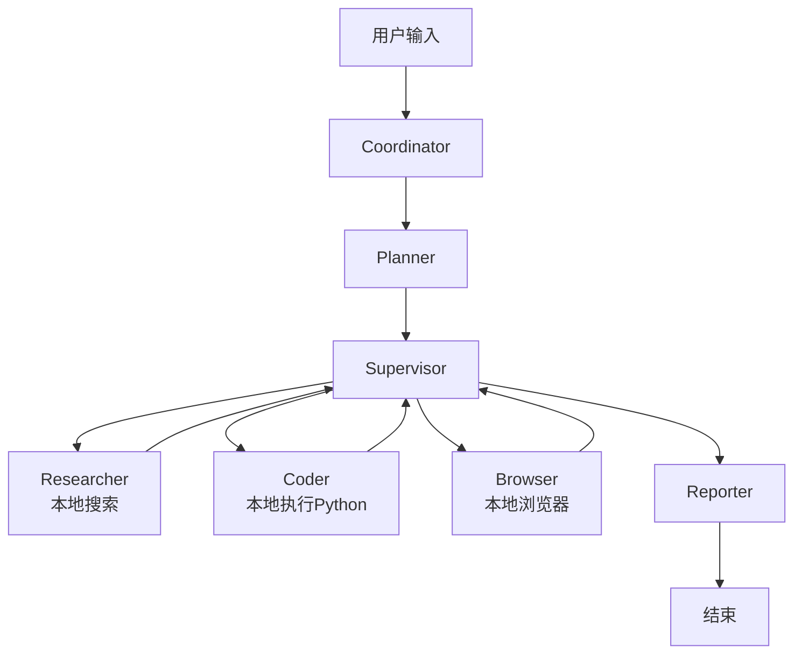
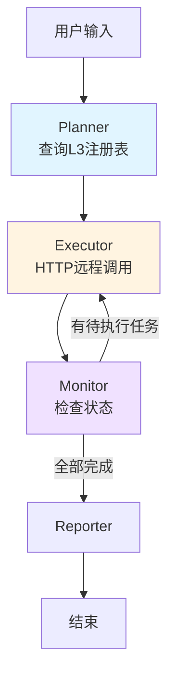

# 分布式 Agent 调度器重构指南

## 📖 概述

本文档详细说明了如何将 LangManus 项目从**工具使用型 Agent** 重构为**分布式 Agent 调度器（Ubiquitous Agent System - Layer 2）**。

---

## 🎯 重构目标

### 原始架构（LangManus）
```
用户请求 → Planner → Supervisor → 本地工具执行（search/python/browser）→ 结果汇总
```

### 新架构（分布式调度器）
```
用户请求 → Planner（查询L3注册表+任务分配）→ Executor（HTTP远程调用）→ Monitor（检查状态）→ Reporter（生成报告）
```

---

## 📁 新增文件说明

### 1. `src/graph/distributed_types.py`

**功能**：定义分布式系统的 State 和类型

**复用的原始代码**：
- `MessagesState` 基类（来自 LangGraph）
- TypedDict 类型定义方式

**新增内容**：
```python
class AgentInfo(TypedDict):
    """L3 Agent 的注册信息"""
    id: str
    ip: str
    port: int
    capability: str
    status: str
    description: str

class TaskAssignment(TypedDict):
    """任务分配信息，包含目标 IP"""
    task_id: str
    task_title: str
    task_description: str
    assigned_agent_id: str
    target_ip: str          # ← 核心新增
    target_port: int        # ← 核心新增
    status: str
    result: str
    retry_count: int

class DistributedState(MessagesState):
    """扩展的状态，支持分布式调度"""
    agent_registry_cache: List[AgentInfo]  # ← L3 注册表缓存
    execution_plan: List[TaskAssignment]   # ← 执行计划
    # ... 其他字段
```

**关键变化**：
- ❌ 删除：`TEAM_MEMBERS`（不再需要本地 Agent 列表）
- ✅ 新增：`agent_registry_cache`（动态查询的 L3 Agent）
- ✅ 新增：`execution_plan`（包含 target_ip 的任务列表）

---

### 2. `src/service/agent_registry.py`

**功能**：模拟 L3 Agent 注册表服务

**这是全新的模块**，原 LangManus 中不存在。

**核心类**：
```python
class AgentRegistryClient:
    def query_agents(self, capability: str = None) -> List[AgentInfo]:
        """查询可用的 L3 Agent"""
        # Mock 实现：返回预定义的 Agent 列表
        # 生产环境：调用真实的注册中心 API（如 etcd, Consul）
        
    def get_agent_by_id(self, agent_id: str) -> AgentInfo:
        """根据 ID 获取特定 Agent"""
```

**Mock 数据示例**：
```python
[
    {
        "id": "search_agent_001",
        "ip": "192.168.1.10",
        "port": 8080,
        "capability": "search",
        "status": "online",
        "description": "网络搜索 Agent"
    },
    # ... 更多 Agent
]
```

---

### 3. `src/graph/distributed_nodes.py`

**功能**：实现分布式系统的所有节点

#### 3.1 `distributed_planner_node`

**复用的原始代码**：
- `src/graph/nodes.py` 中的 `planner_node` 结构
- LLM 调用方式（`get_llm_by_type("reasoning")`）
- Prompt 构建方式（SystemMessage + HumanMessage）

**新增逻辑**：
```python
def distributed_planner_node(state: DistributedState):
    # 1. 查询 L3 注册表 ← 新增
    registry_client = get_registry_client()
    available_agents = registry_client.query_agents()
    
    # 2. 构建新的 System Prompt ← 修改
    system_prompt = f"""
    你是分布式任务调度规划器。
    
    可用的 L3 Agent：
    {agent_capabilities_desc}  # ← 动态生成
    
    输出格式：JSON 任务列表，每个任务包含 assigned_agent_id
    """
    
    # 3. 调用 LLM ← 复用
    llm = get_llm_by_type("reasoning")
    response = llm.invoke(messages)
    
    # 4. 解析并补充 IP 信息 ← 新增
    for task in plan_data["tasks"]:
        agent_info = registry_client.get_agent_by_id(task["assigned_agent_id"])
        task["target_ip"] = agent_info["ip"]
        task["target_port"] = agent_info["port"]
    
    return Command(goto="executor", update={"execution_plan": execution_plan})
```

**关键变化**：
- ❌ 删除：`search_before_planning`（不再本地搜索）
- ✅ 新增：L3 注册表查询
- ✅ 修改：Prompt 要求 LLM 输出 `assigned_agent_id`
- ✅ 新增：将 Agent ID 映射到 IP 地址

---

#### 3.2 `distributed_executor_node`

**完全替换** 原 `research_node`, `code_node`, `browser_node`。

**原始逻辑**：
```python
# 原 LangManus 的执行方式
def research_node(state):
    result = research_agent.invoke(state)  # ← 本地工具调用
    return Command(goto="supervisor")
```

**新逻辑**：
```python
def distributed_executor_node(state):
    # 1. 获取当前任务
    task = execution_plan[current_task_index]
    
    # 2. 构建 HTTP 请求 ← 核心变化
    target_url = f"http://{task['target_ip']}:{task['target_port']}/execute"
    payload = {
        "task_id": task["task_id"],
        "task_description": task["task_description"]
    }
    
    # 3. 发送远程调用 ← 新增
    try:
        response = requests.post(target_url, json=payload, timeout=30)
        result = response.json()
    except Exception as e:
        # 错误处理
    
    # 4. 更新任务状态
    execution_plan[current_task_index]["status"] = "completed"
    execution_plan[current_task_index]["result"] = result
    
    return Command(goto="monitor")
```

**关键变化**：
- ❌ 删除：所有本地工具导入（`tavily_tool`, `python_repl_tool`, `browser_tool`）
- ❌ 删除：`create_react_agent`（不再需要 ReAct Agent）
- ✅ 新增：`requests` HTTP 客户端
- ✅ 新增：超时和重试机制
- ✅ 新增：连接错误处理

**Stub 实现说明**：
```python
# ⚠️ 当前代码中的 Mock 响应
result_data = {
    "status": "success",
    "result": "[Mock] 任务完成"
}

# 🔧 生产环境需替换为：
response = requests.post(target_url, json=payload, timeout=timeout)
result_data = response.json()
```

---

#### 3.3 `distributed_monitor_node`

**功能**：替代原 `supervisor_node` 的路由决策。

**原始 Supervisor**：
```python
def supervisor_node(state):
    # 使用 LLM 决策下一步
    response = llm.with_structured_output(Router).invoke(messages)
    goto = response["next"]  # "researcher" | "coder" | "FINISH"
    return Command(goto=goto)
```

**新 Monitor**：
```python
def distributed_monitor_node(state):
    # 简单的逻辑判断（不需要 LLM）
    if current_task_index < total_tasks:
        return Command(goto="executor")  # 继续执行下一个任务
    else:
        return Command(goto="reporter")  # 所有任务完成，生成报告
```

**关键变化**：
- ❌ 删除：LLM 调用（监控节点只需要简单判断）
- ✅ 简化：基于任务索引的线性路由

---

#### 3.4 `distributed_reporter_node`

**复用** 原 `reporter_node` 的结构，但不调用 LLM。

```python
def distributed_reporter_node(state):
    # 汇总执行结果
    report = f"""
    # 执行报告
    
    总任务数：{total_tasks}
    成功：{completed_tasks}
    失败：{failed_tasks}
    
    详细结果：
    {format_results(execution_plan)}
    """
    
    return Command(goto="__end__", update={"messages": [report]})
```

---

### 4. `src/graph/distributed_builder.py`

**功能**：构建分布式 Graph

**复用**：
```python
from langgraph.graph import StateGraph, START  # ← 完全复用

def build_distributed_graph():
    builder = StateGraph(DistributedState)  # ← 使用新的 State
    builder.add_edge(START, "planner")      # ← 复用
    builder.add_node("planner", distributed_planner_node)  # ← 新节点
    # ...
    return builder.compile()
```

**Graph 结构对比**：

| 原 LangManus | 分布式版本 |
|-------------|-----------|
| coordinator → planner | ❌ 删除 coordinator |
| planner → supervisor | planner → executor |
| supervisor → [researcher, coder, browser] | executor → monitor |
| [workers] → supervisor | monitor → executor (循环) |
| supervisor → reporter | monitor → reporter |

---

### 5. `src/distributed_workflow.py`

**功能**：工作流入口

**复用** `src/workflow.py` 的结构：
```python
# 原 workflow.py
def run_agent_workflow(user_input, debug=False):
    result = graph.invoke({
        "messages": [{"role": "user", "content": user_input}],
        "TEAM_MEMBERS": TEAM_MEMBERS,
        "deep_thinking_mode": True
    })
    return result

# 新 distributed_workflow.py
def run_distributed_workflow(user_input, debug=False, max_retries=3, timeout_seconds=30):
    result = distributed_graph.invoke({
        "messages": [{"role": "user", "content": user_input}],
        "max_retries": max_retries,        # ← 新增
        "timeout_seconds": timeout_seconds, # ← 新增
        "execution_plan": [],               # ← 新增
        "agent_registry_cache": []          # ← 新增
    })
    return result
```

---

### 6. `distributed_main.py`

**功能**：CLI 入口

**完全复用** 原 `main.py` 的结构：
```python
if __name__ == "__main__":
    if len(sys.argv) > 1:
        user_query = " ".join(sys.argv[1:])
    else:
        user_query = input("Enter your query: ")
    
    result = run_distributed_workflow(user_input=user_query, debug=True)
    
    for message in result["messages"]:
        print(f"[{message.type}]: {message.content}")
```

---

## 🔄 工作流对比

### 原 LangManus 工作流



### 新分布式工作流



---

## 🚀 运行方式

### 1. 安装依赖

```bash
# 原有依赖保持不变
uv sync

# 如果需要 requests（可能已包含）
uv pip install requests
```

### 2. 运行分布式版本

```bash
# 方式 1：命令行参数
python distributed_main.py "帮我搜索 DeepSeek R1 模型的信息"

# 方式 2：交互式输入
python distributed_main.py
```

### 3. 可视化 Graph

```bash
python -c "from src.distributed_workflow import visualize_graph; print(visualize_graph())"
```

---

## ⚙️ 配置说明

### 环境变量（`.env`）

保持原有配置，需要的字段：
```bash
# LLM 配置（用于 Planner）
REASONING_MODEL=deepseek-reasoner
REASONING_API_KEY=your_api_key

BASIC_MODEL=gpt-4o
BASIC_API_KEY=your_api_key
```

### Mock 数据配置

在 `src/service/agent_registry.py` 中修改 `_init_mock_agents()` 方法：
```python
{
    "id": "your_agent_id",
    "ip": "your_agent_ip",    # ← 修改为实际 IP
    "port": 8080,
    "capability": "your_capability",
    "status": "online",
    "description": "描述"
}
```

---

## 🔧 从 Mock 切换到生产环境

### 步骤 1：实现真实的注册表客户端

```python
# src/service/agent_registry.py

class AgentRegistryClient:
    def query_agents(self, capability=None):
        # 替换为真实 API 调用
        response = requests.get(f"{self.registry_url}/agents", params={"capability": capability})
        return response.json()
```

### 步骤 2：在 Executor 中启用真实 HTTP 调用

```python
# src/graph/distributed_nodes.py - distributed_executor_node

# 删除 Mock 代码块：
# result_data = {"status": "success", "result": "[Mock]..."}

# 启用真实调用：
response = requests.post(target_url, json=payload, timeout=timeout)
response.raise_for_status()
result_data = response.json()
```

### 步骤 3：部署 L3 Agent

每个 L3 Agent 需要提供 HTTP 接口：
```python
# L3 Agent 端的 API
@app.post("/execute")
def execute_task(request: TaskRequest):
    task_id = request.task_id
    task_description = request.task_description
    
    # 执行任务
    result = perform_task(task_description)
    
    return {
        "status": "success",
        "task_id": task_id,
        "result": result
    }
```

---

## 📊 复用情况总结

| 组件 | 复用程度 | 说明 |
|------|---------|------|
| **LangGraph 框架** | 100% | StateGraph, Command, MessagesState 完全复用 |
| **LLM 调用** | 90% | 复用 `get_llm_by_type`，只修改 Prompt |
| **State 结构** | 60% | 保留 MessagesState，新增分布式字段 |
| **Graph 构建** | 80% | 复用 StateGraph API，调整节点和边 |
| **Planner 逻辑** | 50% | 复用 LLM 调用，重写 Prompt 和后处理 |
| **Executor 逻辑** | 10% | 完全重写（从本地工具 → HTTP 调用）|
| **Monitor/Supervisor** | 30% | 保留路由概念，简化为逻辑判断 |
| **Reporter** | 70% | 保留结构，修改报告内容 |
| **工具集** | 0% | 不再使用本地工具 |

---

## 🎯 核心改变总结

### 删除的部分
- ❌ 本地工具（search, python_repl, browser）
- ❌ ReactAgent（`create_react_agent`）
- ❌ Coordinator 节点
- ❌ 静态的 `TEAM_MEMBERS` 配置

### 新增的部分
- ✅ L3 Agent 注册表客户端
- ✅ 包含 `target_ip` 的执行计划
- ✅ HTTP 远程调用逻辑
- ✅ 错误重试和超时机制
- ✅ Monitor 路由节点

### 保留的部分
- ✅ LangGraph 核心框架
- ✅ LLM 调用接口
- ✅ MessagesState 消息流
- ✅ Command 路由模式
- ✅ 日志和调试系统

---

## 📝 下一步建议

1. **测试 Mock 模式**：先运行 `distributed_main.py` 验证流程
2. **部署 L3 Agent**：实现真实的 Agent HTTP 服务
3. **集成注册中心**：使用 etcd/Consul 替代 Mock
4. **添加监控**：集成 Prometheus/Grafana 监控远程调用
5. **优化性能**：实现并行调用、连接池等

---

## ❓ 常见问题

### Q1：为什么删除了 Coordinator？
A：分布式版本不需要与用户多轮对话，直接进入任务规划。

### Q2：能否保留本地工具作为备选？
A：可以！在 `distributed_executor_node` 中添加本地工具的 fallback 逻辑。

### Q3：如何处理 Agent 不可用的情况？
A：Monitor 节点可以检测失败任务并重新分配给其他 Agent。

---

## 📚 参考文档

- [LangGraph 官方文档](https://langchain-ai.github.io/langgraph/)
- [原 LangManus README](./README_zh.md)
- [分布式系统设计模式](https://microservices.io/patterns/)

---

**重构完成日期**：2026-01-12  
**作者**：Senior Python Architect  
**版本**：1.0.0
