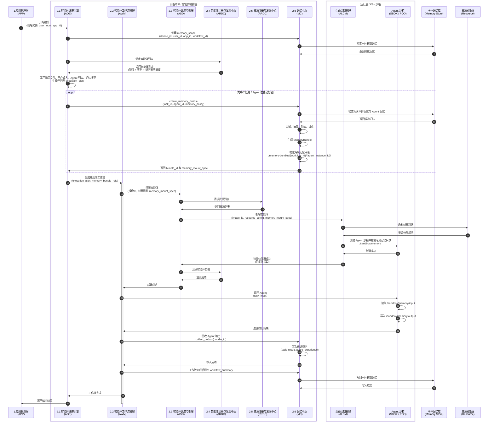
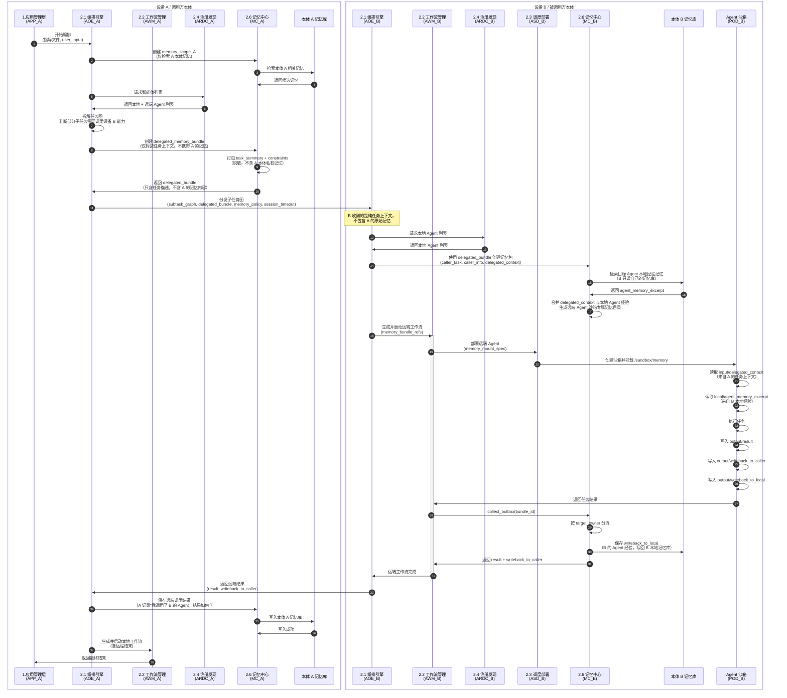
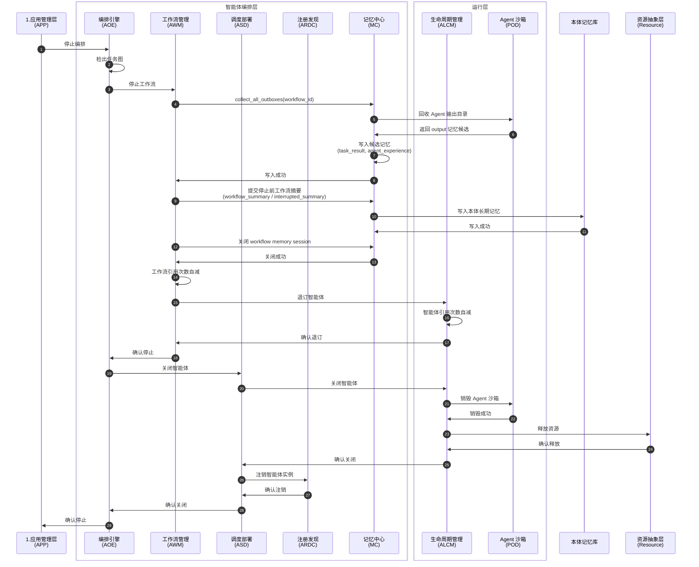
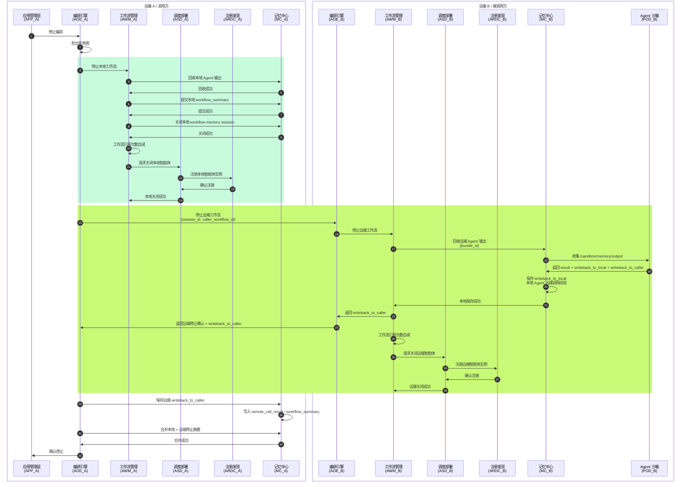
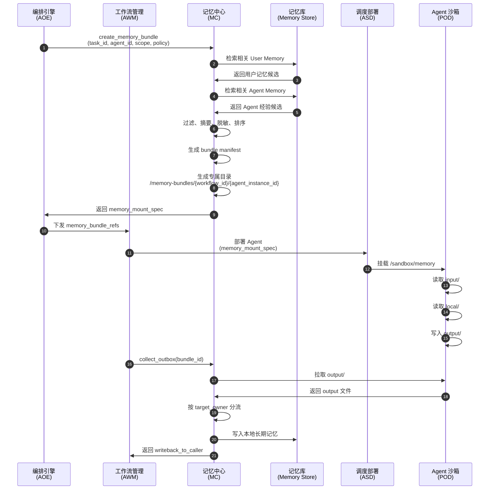
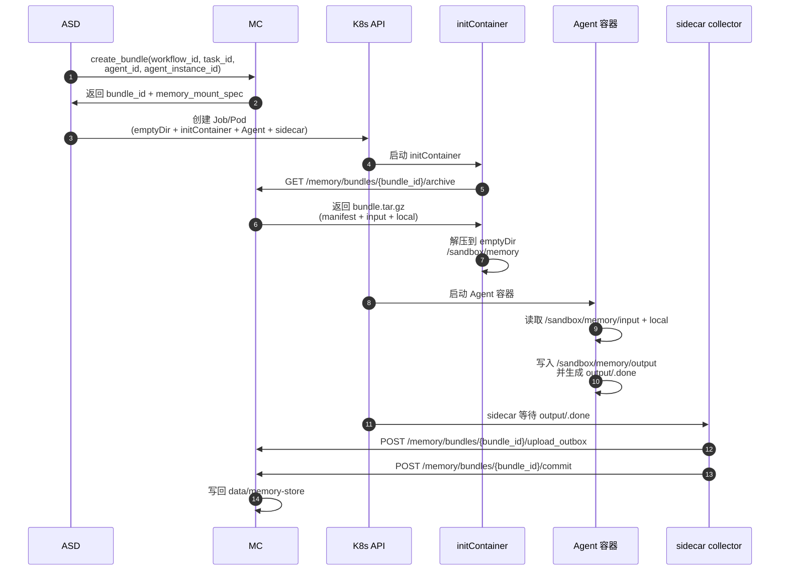

# MC 记忆中心（Memory Center）实现文档

> 对应接口设计文档：`接口/智能体编排层接口流程v2.md`
> 实现位置：`src/sdk/`

---

## 目录

1. [架构概述](#1-架构概述)
2. [组件说明](#2-组件说明)
3. [文件清单](#3-文件清单)
4. [执行流程](#4-执行流程)
5. [REST API 总览](#5-rest-api-总览)
6. [Agent SDK 使用说明](#6-agent-sdk-使用说明)
7. [编排层调用示例](#7-编排层调用示例)
8. [数据模型](#8-数据模型)
9. [路由顺序说明](#9-路由顺序说明)

---

## 1. 架构概述

### 1.1 定位

MC（Memory Center / 记忆中心）是**编排层控制面组件**，不是普通业务 Agent。它运行在**设备本体**（主 API 服务进程内），不在 K8s 集群中。

职责：

| 职责 | 说明 |
|------|------|
| 记忆域创建 | 工作流启动时创建 `memory_scope`，检索长期记忆供 Planner 使用 |
| 记忆包生成 | 为每个 Agent 实例从存储取出记忆，物化成临时目录 |
| 沙箱挂载 | 将临时目录通过 ASD/ALCM 挂载到 Agent 沙箱 `/sandbox/memory` |
| 记忆回收 | Agent 执行后回收 `output/`，按双归属分流写回 |
| 跨设备委派 | 接收远端委派记忆包，合并本地经验生成沙箱目录 |
| 生命周期管理 | 工作流结束时清理所有临时目录 |

### 1.2 位置关系

```
┌──────────────────────────────────────────────────┐
│  设备本体（物理机 / 虚拟机）                         │
│                                                  │
│  ┌─ 智能体编排层 (控制面) ──────────────────────┐   │
│  │  主进程: server.py (FastAPI :8000)         │   │
│  │  ├─ AOE   编排引擎                          │  │
│  │  ├─ AWM   工作流管理                        │  │
│  │  ├─ ASD   调度部署                          │  │
│  │  ├─ ARDC  注册发现中心                       │  │
│  │  └─ MC    记忆中心 ←── 我们在这里             │  │
│  └────────────────────────────────────────────┘  │
│                                                  │
│  ┌─ 本体记忆库 ────────────────────────────────┐   │
│  │  data/memory-store/    长期记忆持久化        │  │
│  │  data/memory-bundles/  Agent 临时目录       │  │
│  └───────────────────────────────────────────┘  │
│                                                 │
│  ┌─ K8s 集群 (运行层) ─────────────────────────┐  │
│  │  Pod: Agent 沙箱                           │  │
│  │    /sandbox/memory/  ← MC 物化后挂载进来     │  │
│  │    Agent 只读 input/ + local/, 写 output/  │  │
│  └───────────────────────────────────────────┘  │
└─────────────────────────────────────────────────┘
```

### 1.3 核心原则

| 原则 | 说明 |
|------|------|
| Agent 不能直连 MC | Agent 只访问 `/sandbox/memory/` 文件系统 |
| 目录天然隔离 | 每个 Agent 实例一个目录，不同实例互不可见 |
| 双归属记忆 | 远端调用产出同时写回调用方和被调用方 |
| 回收后才入库 | MC 回收 `output/` 后按策略筛选写入长期存储 |

---

## 2. 组件说明

### 2.1 组件树

```
src/sdk/
├── __init__.py           # 公开导出
├── memory_models.py      # Pydantic 数据模型
├── memory_sdk.py         # Agent 侧 SandboxMemory SDK
├── mc_service.py         # MC 服务端核心逻辑
└── mc_router.py          # FastAPI Router（21 个路由）
```

### 2.2 组件职责

| 组件 | 文件 | 核心类/对象 | 职责 |
|------|------|------------|------|
| **数据模型** | `memory_models.py` | `MemoryBundle`/`MemoryScope`/`DelegatedMemoryBundle`/`WritebackEntry` 等 | 定义所有数据结构 |
| **Agent SDK** | `memory_sdk.py` | `SandboxMemory` | Agent 在沙箱内操作 `/sandbox/memory/` 的接口 |
| **服务端** | `mc_service.py` | `MemoryCenterService` | 存储 ↔ 临时目录的编排：创建/物化/回收/提交/清理 |
| **API 路由** | `mc_router.py` | `mc_router` (APIRouter) | 21 个 REST 端点，注册到 FastAPI |

### 2.3 集成点

| 现有文件 | 改动 |
|---------|------|
| `src/api/app.py` | `from src.sdk.mc_router import mc_router` + `app.include_router(mc_router)` — 已完成 |
| `src/service/agent_scheduler.py` | 需增加 `memory_mount_spec` 参数支持（待对接） |
| `src/graph/distributed_types.py` | 需增加 `memory_scope`/`memory_bundles` 等字段（待对接） |
| `src/service/workflow_service.py` | 需接入 MC 流程钩子（待对接） |

---

## 3. 文件清单

### 3.1 新增文件

| 文件 | 行数 | 说明 |
|------|------|------|
| `src/sdk/__init__.py` | ~80 | 公开导出所有组件 |
| `src/sdk/memory_models.py` | ~200 | 15 个 Pydantic 模型 |
| `src/sdk/memory_sdk.py` | ~260 | SandboxMemory 类 |
| `src/sdk/mc_service.py` | ~420 | MemoryCenterService 类 |
| `src/sdk/mc_router.py` | ~280 | 21 个路由端点 |
| `k8s/mc-emptydir-mock-agent-job.yaml` | ~190 | MC 外置 + K8s 沙箱 Agent 的最小验证 Job 模板 |

### 3.2 修改文件

| 文件 | 改动内容 |
|------|---------|
| `src/api/app.py` | +2行: 导入并注册 `mc_router` |
| `src/sdk/mc_router.py` | 新增 `GET /memory/bundles/{bundle_id}/archive`，供 K8s initContainer 下载 bundle tar.gz |

### 3.3 数据目录

```
data/
├── memory-store/                # 长期记忆库（持久化）
│   ├── user_memory/{user_id}/   # 用户记忆
│   ├── agent_memory/{agent_id}/ # Agent 经验
│   └── workflow_summary/        # 工作流摘要
│
└── memory-bundles/              # 临时目录（Pod 销毁后清理）
    └── {workflow_id}/
        └── {agent_instance_id}/ ← 挂载到 Pod 的 /sandbox/memory
            ├── manifest.json
            ├── input/
            ├── local/
            └── output/
```

---

## 4. 执行流程

### 4.1 单主体工作流完整流程（§2）



说明：

* Agent 不直接访问 MC 全量记忆库。
* Agent 只访问 `/sandbox/memory`。
* MC 在 Agent 启动前为其生成专属 MemoryBundle。
* Agent 执行后将候选记忆写入 `/sandbox/memory/output`。
* MC 回收 output 后决定是否写入长期记忆。

---

### 4.2 跨主体工作流流程（§3）



说明：

* 调用方 A 只向 B 发送纯任务上下文（`delegated_bundle`），**不携带 A 的任何本体记忆**。
* 被调用方 B 只从**自己的记忆库**检索本地 Agent 经验，跟 A 的记忆无关。
* B 的 Agent 执行后产生两类写回，各自归属各自设备：

  * `writeback_to_caller`：写回 A_MC（A 记录"我调用了 B 的 Agent"）。
  * `writeback_to_local`：写回 B_STORE（B 记录"我的 Agent 被调用的经验"）。
* 每个主体只读写自己的记忆库，不交叉访问对方记忆。

---

### 4.3 单主体工作流停止编排（§5）



说明：

* Pod 销毁前必须先由 MC 回收 output。
* MC 关闭 workflow memory session 后，沙箱专属记忆目录可以归档或删除。
* 归档策略由 `memory_policy` 决定。

---

### 4.4 跨主体工作流停止编排（§6）



说明：

* 远端停止时，B_MC 回收 Agent output 后，`writeback_to_local` 存到 B_STORE（B 的本地经验），`writeback_to_caller` 返回 A_MC。
* A_MC 收到 `writeback_to_caller` 后写入 A_STORE（A 记录"我调用了 B 的结果"）。
* B_MC 只写 B 本地记忆库，A_MC 只写 A 本地记忆库，不交叉。
* 最终 A_MC 合并本地 + 远端停止摘要，用于追踪完整工作流状态。

---

### 4.5 MC 记忆包管理流程（§7）



---

### 4.6 K8s 实现方式（§14）

当前验证采用 **MC 外置 + K8s 沙箱 Agent**：

```text
设备本体 / K8s 外：
  FastAPI 主服务 + MC
  data/memory-store/
  data/memory-bundles/

K8s / 沙箱内：
  Job 或 Pod
    initContainer: 下载 bundle tar.gz
    Agent 容器: 读 /sandbox/memory/input + local，写 output
    sidecar: 上传 output 并触发 commit
    emptyDir: 每个 Pod 独立的 /sandbox/memory
```

这种方式不要求 K8s 节点能访问 MC 的本机文件路径，也不需要 `hostPath`。



优点：

```text
1. Agent 不需要直接访问 MC 全量存储
2. 每个 Pod 的 memory 目录天然隔离
3. Pod 销毁后 output 已由 sidecar 回收
4. 不依赖跨 Pod 共享文件系统
```

并发隔离规则：

```text
每个 Agent 实例必须有独立 agent_instance_id。
每个 Agent 实例必须先创建独立 MemoryBundle。
每个 Job/Pod 只接收自己的 BUNDLE_ID。
每个 Pod 的 emptyDir 天然独立，即使容器内都挂载为 /sandbox/memory，也不会互相可见。
```

示例：

```text
Job A:
  agent_instance_id = agent-a-inst-001
  bundle_id = mb_a
  MC 目录 = data/memory-bundles/wf1/agent-a-inst-001
  Pod 内路径 = /sandbox/memory

Job B:
  agent_instance_id = agent-b-inst-001
  bundle_id = mb_b
  MC 目录 = data/memory-bundles/wf1/agent-b-inst-001
  Pod 内路径 = /sandbox/memory
```

这两个 `/sandbox/memory` 路径名相同，但属于不同 Pod 的不同 `emptyDir`，不会混用。

---

## 5. REST API 总览

所有端点前缀：`/memory`

### 5.1 记忆域接口

| 方法 | 路径 | 说明 | 调用方 |
|------|------|------|--------|
| POST | `/memory/scope/create` | 创建 Workflow 记忆域 | AOE |

### 5.2 本地记忆包接口（§12.1）

| 方法 | 路径 | 说明 |
|------|------|------|
| POST | `/memory/bundles/create` | 创建 MemoryBundle |
| POST | `/memory/bundles/{bundle_id}/materialize` | 物化记忆包为沙箱目录 |
| GET | `/memory/bundles/{bundle_id}/download` | 查询 bundle 在 MC 本机上的 source_path（调试用） |
| GET | `/memory/bundles/{bundle_id}/archive` | initContainer 下载 bundle tar.gz |
| POST | `/memory/bundles/{bundle_id}/upload_outbox` | sidecar 上传 Agent output |
| POST | `/memory/bundles/{bundle_id}/commit` | 提交记忆包输出（回收+写回） |
| DELETE | `/memory/bundles/{bundle_id}` | 删除或归档记忆包 |

### 5.3 跨设备委派接口（§12.2）

| 方法 | 路径 | 说明 |
|------|------|------|
| POST | `/memory/delegations/create` | 调用方创建委派记忆包 |
| POST | `/memory/delegations/accept` | 被调用方接收委派记忆包 |
| POST | `/memory/delegations/{delegation_id}/writeback` | 被调用方向调用方写回候选记忆 |
| DELETE | `/memory/delegations/{delegation_id}` | 删除或关闭委派会话 |

### 5.4 记忆查询接口（§12.3）

| 方法 | 路径 | 说明 |
|------|------|------|
| POST | `/memory/search` | 查询本体记忆 / Agent 记忆 |
| POST | `/memory/write` | 写入本地记忆 |
| POST | `/memory/batch_write` | 批量写入本地记忆 |
| GET | `/memory/{memory_id}` | 查询单条记忆 |
| DELETE | `/memory/{memory_id}` | 删除记忆 |

### 5.5 工作流生命周期接口

| 方法 | 路径 | 说明 |
|------|------|------|
| POST | `/memory/outboxes/collect_all` | 回收 workflow 下所有 Agent output（§5） |
| POST | `/memory/workflow/{workflow_id}/close` | 关闭 workflow memory session（§5） |

### 5.6 Agent 会话接口

| 方法 | 路径 | 说明 |
|------|------|------|
| GET | `/memory/session/{instance_id}` | Agent 查询记忆路径信息 |
| POST | `/memory/session/{instance_id}/notify_start` | Agent 通知任务开始 |
| POST | `/memory/session/{instance_id}/notify_complete` | Agent 通知任务完成 |

---

## 6. Agent SDK 使用说明

### 6.1 初始化

```python
from src.sdk import SandboxMemory

# 文件系统模式（沙箱内默认）
mem = SandboxMemory()
# 等价于: SandboxMemory(memory_root="/sandbox/memory", auto_discover=True)

# 自定义路径（测试用）
mem = SandboxMemory(memory_root="/tmp/my_test_dir")

# 双模式（加 API 通知）
mem = SandboxMemory(mc_api_url="http://localhost:8000")
```

### 6.2 读取输入（input/ + local/）

```python
# 一次性加载所有输入
all_inputs = await mem.load_all_inputs()

# 或按需加载
manifest = await mem.read_manifest()           # manifest.json
task     = await mem.read_task_description()   # input/task.md
caller   = await mem.read_caller_info()        # input/caller_info.json
policy   = await mem.read_policy()             # input/policy.json
dc       = await mem.read_delegated_context()   # input/delegated_context.json
cons     = await mem.read_constraints()        # input/constraints.json
profile  = await mem.read_agent_profile()      # local/agent_profile.json
excerpt  = await mem.read_agent_memory_excerpt() # local/agent_memory_excerpt.json
device   = await mem.read_device_context()     # local/device_public_context.json
```

### 6.3 写入输出（output/）

```python
from src.sdk import WritebackEntry

# 写执行结果
await mem.write_result({"status": "success", "data": {...}})

# 写执行笔记
await mem.write_execution_notes("任务执行完成，耗时2.3s")

# 写回本地经验（供 MC 回收后写入本地 Agent 记忆）
await mem.write_to_local(WritebackEntry(
    memory_type="agent_experience",
    target_owner="local_agent",
    agent_id="vision_agent_001",
    content="目标检测任务完成，准确率95%",
    confidence=0.95,
))

# 写回调用方（跨设备场景）
await mem.write_to_caller(WritebackEntry(
    memory_type="remote_call_result",
    target_owner="caller",
    content="device_B 的 Agent 完成检测，耗时2.3s",
    confidence=0.91,
))

# 写工件文件
await mem.write_artifact("chart.png", png_bytes)

# 通用追加
await mem.append_to_file("custom_log.txt", "一行日志")

# 快捷收尾
await mem.finalize({"status": "done"}, "全部完成")
```

### 6.4 文件查询

```python
mem.file_exists("manifest.json")        # 检查文件
mem.list_dir("input")                    # 列出 input/ 目录
mem.list_dir("output")                   # 列出 output/ 目录
```

### 6.5 API 通知（可选）

```python
# 需要初始化时传入 mc_api_url
mem = SandboxMemory(mc_api_url="http://mc-service:8000")

await mem.get_memory_path_remote()       # 查询实例路径信息
await mem.notify_task_started()          # 通知 MC 任务开始
await mem.notify_task_completed()        # 通知 MC 任务完成
```

### 6.6 完整示例

```python
from src.sdk import SandboxMemory, WritebackEntry

async def agent_main():
    mem = SandboxMemory()
    
    # 1. 读取任务
    task = await mem.read_task_description()
    excerpt = await mem.read_agent_memory_excerpt()
    
    # 2. 执行任务...
    result = {"status": "success", "accuracy": 0.95}
    
    # 3. 写回结果
    await mem.write_result(result)
    await mem.write_execution_notes("视觉识别任务完成")
    
    # 4. 写回记忆
    await mem.write_to_local(WritebackEntry(
        memory_type="agent_experience",
        target_owner="local_agent",
        agent_id=mem.agent_id,
        content="目标检测完成",
        confidence=0.95,
    ))
    
    # 5. 通知完成（如果配置了 API）
    await mem.notify_task_completed()
```

---

## 7. 编排层调用示例

### 7.1 AOE 启动工作流

```python
import httpx

mc_url = "http://localhost:8000"
workflow_id = "wf_001"

# 1. 创建记忆域
resp = await httpx.AsyncClient().post(f"{mc_url}/memory/scope/create", json={
    "device_id": "device_A",
    "user_id": "user_001",
    "app_id": "app_vehicle_decision",
    "workflow_id": workflow_id,
})
scope_ctx = resp.json()["data"]
planner_context = scope_ctx["planner_memory_context"]  # 用于生成任务图

# 2. 为每个 Agent 创建记忆包
bundles = []
for task in tasks:
    resp = await client.post(f"{mc_url}/memory/bundles/create", json={
        "task_id": task.id,
        "agent_id": task.agent_id,
        "workflow_id": workflow_id,
        "device_id": "device_A",
        "user_id": "user_001",
    })
    bundle = resp.json()["data"]
    bundles.append(bundle)
    # bundle["memory_mount_spec"] 传给 ASD 部署
```

### 7.2 AWM / sidecar 回收结果

```python
# Agent Pod 内 sidecar 上传 output
await client.post(f"{mc_url}/memory/bundles/{bundle_id}/upload_outbox", json={
    "result": {"ok": True},
    "writeback_to_local": [
        {
            "memory_type": "agent_experience",
            "target_owner": "local_agent",
            "content": "本次任务经验",
            "agent_id": "agent_001",
        }
    ],
    "writeback_to_caller": [],
    "artifacts": {},
})

# sidecar 或 AWM 触发 commit，MC 内部会 collect_outbox 并写回长期存储
resp = await client.post(f"{mc_url}/memory/bundles/{bundle_id}/commit")

# 停止时回收所有
resp = await client.post(f"{mc_url}/memory/outboxes/collect_all", json={
    "workflow_id": workflow_id,
})
# 然后提交工作流摘要
resp = await client.post(f"{mc_url}/memory/workflow/{workflow_id}/close")
```

### 7.3 跨设备委派

```python
# 设备 A：创建委派
resp = await client.post(f"{mc_url}/memory/delegations/create", json={
    "caller_device_id": "device_A",
    "caller_workflow_id": "wf_001",
    "caller_task_id": "task_003",
    "callee_device_id": "device_B",
    "target_agent_id": "vision_agent_B",
    "delegated_context": {
        "task_summary": "请对脱敏后的目标区域进行视觉识别",
        "allowed_memories": [],
        "constraints": {}
    }
})
delegation_id = resp.json()["data"]["delegation_id"]

# 设备 B：接收委派
resp = await client.post(f"{mc_url}/memory/delegations/accept", json={
    "delegation_id": delegation_id,
    "workflow_id": "wf_remote_001",
})

# 设备 B：写回
resp = await client.post(f"{mc_url}/memory/delegations/{delegation_id}/writeback", json={
    "writeback_entries": [{
        "content": "device_B 的 vision_agent_B 完成目标检测",
        "memory_type": "remote_call_result",
    }]
})
```

---

## 8. 数据模型

所有模型定义在 `src/sdk/memory_models.py`。

### 8.1 核心模型

| 模型 | 对应文档 | 关键字段 |
|------|---------|---------|
| `MemoryBundlePolicy` | §9 policy | `input_readonly`, `output_collect`, `allow_writeback_to_caller` |
| `DelegatedPolicy` | §16 | `allow_callee_local_memory_read`, `caller_writeback_allowed` 等 7 字段 |
| `Manifest` | §8 | `bundle_id`, `workflow_id`, `task_id`, `agent_id`, `policy` |
| `CallerInfo` | §8.1 | `caller_device_id`, `caller_workflow_id` |
| `DelegatedContext` | §8.1 | `task_summary`, `allowed_memories`, `constraints` |
| `WritebackEntry` | §15 | `memory_type`, `target_owner`, `content`, `confidence` |
| `MemoryBundle` | §9 | `bundle_id`, `owner_device_id`, `workflow_id`, `agent_id`, `policy` |
| `DelegatedMemoryBundle` | §10 | `delegation_id`, `caller_device_id`, `callee_device_id`, `policy` |
| `MemoryScope` | §11 | `owner_device_id`, `owner_user_id`, `app_id`, `workflow_id` |
| `MemoryScopeContext` | §11 | `scope`, `planner_memory_context` |

### 8.2 请求/响应模型

| 模型 | 用途 |
|------|------|
| `CreateScopeRequest` | POST `/memory/scope/create` 请求体 |
| `CreateBundleRequest` | POST `/memory/bundles/create` 请求体 |
| `CreateBundleResponse` | 创建成功返回 `bundle_id` + `memory_mount_spec` |
| `OutboxData` | `collect_outbox` 返回的结构化 output 数据 |
| `MemorySearchRequest` | POST `/memory/search` 请求体 |
| `MemoryWriteRequest` | POST `/memory/write` 请求体 |
| `BatchMemoryWriteRequest` | POST `/memory/batch_write` 请求体 |
| `SessionPathResponse` | GET `/memory/session/{id}` 响应 |

### 8.3 Data Directory 结构

```
data/memory-bundles/{workflow_id}/{instance_id}/
├── manifest.json
├── input/
│   ├── task.md
│   ├── delegated_context.json
│   ├── constraints.json
│   ├── policy.json
│   └── caller_info.json
├── local/
│   ├── agent_profile.json
│   ├── agent_memory_excerpt.json
│   └── device_public_context.json
└── output/
    ├── result.json
    ├── execution_notes.md
    ├── writeback_to_caller.jsonl
    ├── writeback_to_local.jsonl
    └── artifacts/
```

---

## 9. 路由顺序说明

FastAPI 中通配路由 `/{memory_id}` 必须放在具体路由之后，否则会拦截请求。当前路由注册顺序（共 21 个）：

```
 1  POST  /memory/scope/create
 2  POST  /memory/bundles/create
 3  POST  /memory/bundles/{bundle_id}/materialize
 4  GET   /memory/bundles/{bundle_id}/download
 5  GET   /memory/bundles/{bundle_id}/archive
 6  POST  /memory/bundles/{bundle_id}/upload_outbox
 7  POST  /memory/bundles/{bundle_id}/commit
 8  DELETE /memory/bundles/{bundle_id}
 9  POST  /memory/delegations/create
10  POST  /memory/delegations/accept
11  POST  /memory/delegations/{delegation_id}/writeback
12  DELETE /memory/delegations/{delegation_id}
13  POST  /memory/outboxes/collect_all
14  POST  /memory/workflow/{workflow_id}/close
15  GET   /memory/session/{instance_id}
16  POST  /memory/session/{instance_id}/notify_start
17  POST  /memory/session/{instance_id}/notify_complete
17  POST  /memory/search
18  POST  /memory/write
19  POST  /memory/batch_write
20  GET   /memory/{memory_id}           ← 通配路由（放末尾）
21  DELETE /memory/{memory_id}          ← 通配路由（放末尾）
```

---

## 附录

### A. 文件对照（文档 → 代码）

| 文档章节 | 代码文件 | 关键方法 |
|---------|---------|---------|
| §2 单主体编排 | `mc_service.py` | `create_memory_scope()`, `create_bundle()`, `collect_outbox()`, `commit_bundle()` |
| §3 跨主体委派 | `mc_service.py` | `create_delegated_bundle()` |
| §5 停止编排 | `mc_service.py` | `collect_all_outboxes()`, `close_workflow_session()` |
| §7 记忆包流程 | `mc_service.py` + `mc_router.py` | 6 个 bundes 端点 |
| §8 沙箱目录 | `memory_sdk.py` | 读写 input/local/output 各方法 |
| §9 MemoryBundle | `memory_models.py` | `MemoryBundle` 类 |
| §10 DelegatedBundle | `memory_models.py` | `DelegatedMemoryBundle` 类 |
| §11 DistributedState | `memory_models.py` | `MemoryScope`, `MemoryScopeContext` |
| §12.1 本地包接口 | `mc_router.py` | 6 个 bundles 端点 |
| §12.2 委派接口 | `mc_router.py` | 4 个 delegations 端点 |
| §12.3 查询接口 | `mc_router.py` | 5 个 memory 端点 |
| §15 写回策略 | `memory_models.py` + `memory_sdk.py` | `WritebackEntry`, `write_to_caller()`, `write_to_local()` |
| §16 权限策略 | `memory_models.py` | `DelegatedPolicy` 类 |

### B. 测试验证

运行 `PYTHONPATH=. python3.12` 执行完整测试（覆盖 12 项功能）：

```bash
# 检查语法
python -c "import src.sdk" && echo "OK"

# 运行功能测试（见 mc_router.py 同目录测试代码）
```
