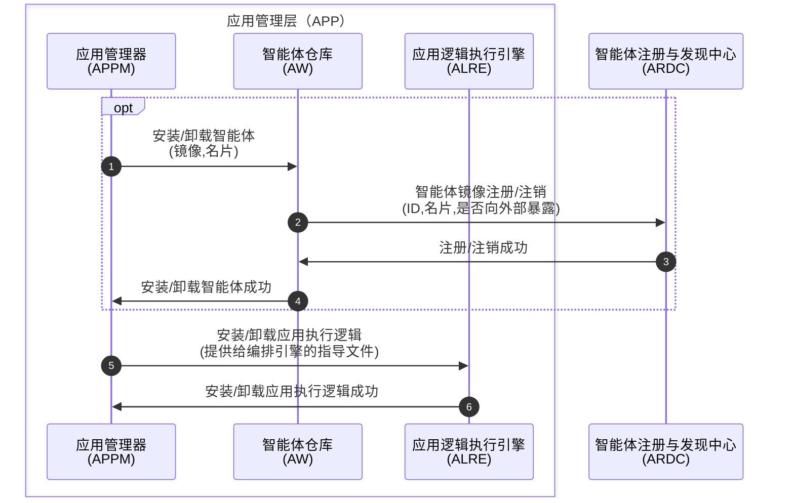
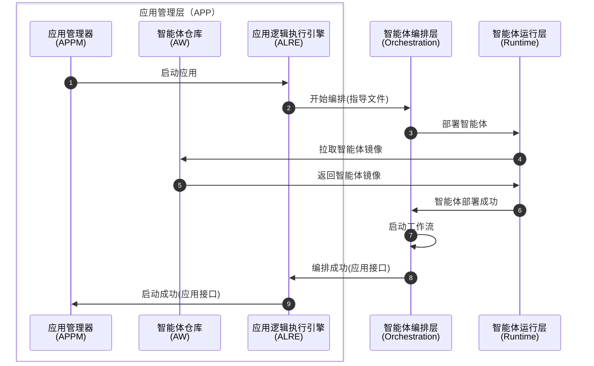
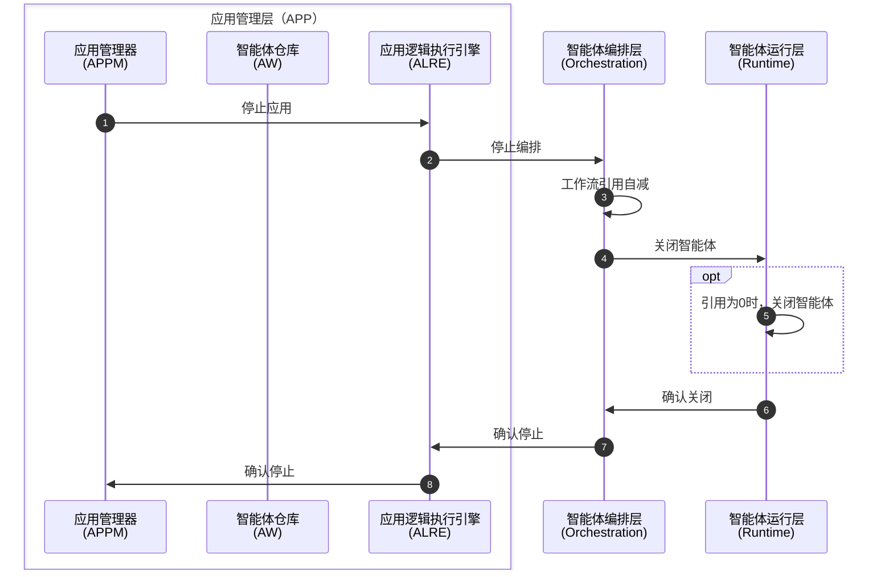
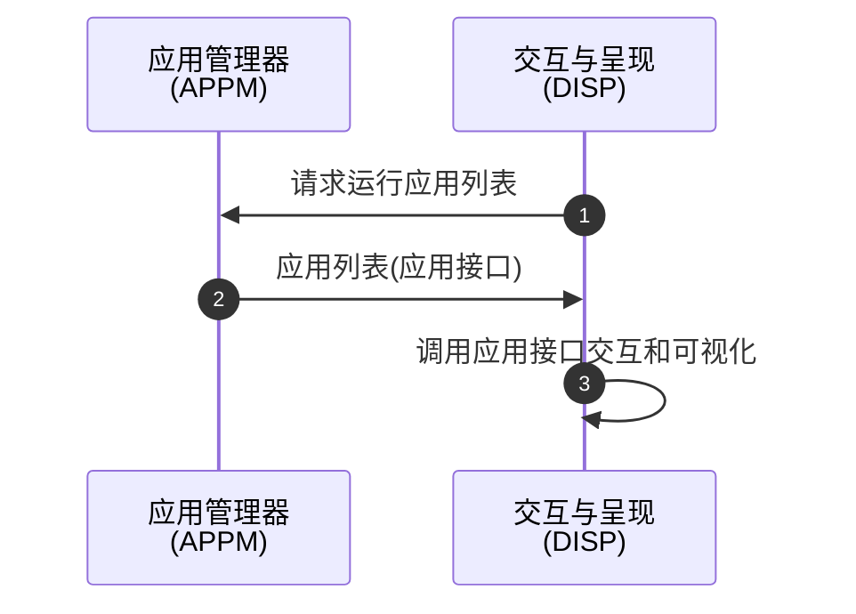

# 1 安装/卸载应用

```mermaid
sequenceDiagram
autonumber
box 应用管理层（APP）
    participant APPM as 应用管理器<br>(APPM)
    participant AW as 智能体仓库<br>(AW)
    participant ALRE as 应用逻辑执行引擎<br>(ALRE)
end
participant ARDC as 智能体注册与发现中心<br>(ARDC)

opt
	APPM->>AW: 安装/卸载智能体<br>(镜像,名片)
    AW->>ARDC: 智能体镜像注册/注销<br>(ID,名片,是否向外部暴露)
    ARDC->>AW: 注册/注销成功
    AW->>APPM: 安装/卸载智能体成功
end
APPM->>ALRE: 安装/卸载应用执行逻辑<br>(提供给编排引擎的指导文件)
ALRE->>APPM: 安装/卸载应用执行逻辑成功
```
说明：
- 应用逻辑执行引擎：暂时只存储编排指导文件（即载运装备信息模型）
- 智能体仓库：只负责存储镜像，只有向智能体注册与发现中心注册，才能够被使用。注册时，需声明是否允许被外部使用

# 2 启动应用

```mermaid
sequenceDiagram
autonumber

box 应用管理层（APP）
    participant APPM as 应用管理器<br>(APPM)
    participant AW as 智能体仓库<br>(AW)
    participant ALRE as 应用逻辑执行引擎<br>(ALRE)
end

participant ORCH as 智能体编排层<br>(Orchestration)
participant RUN as 智能体运行层<br>(Runtime)

APPM->>ALRE: 启动应用
ALRE->>ORCH: 开始编排(指导文件)

ORCH->>RUN: 部署智能体
RUN->>AW: 拉取智能体镜像
AW->>RUN: 返回智能体镜像
RUN->>ORCH: 智能体部署成功
ORCH->>ORCH: 启动工作流
ORCH->>ALRE: 编排成功(应用接口)
ALRE->>APPM: 启动成功(应用接口)
```

# 3 停止应用

```mermaid
sequenceDiagram
autonumber

box 应用管理层（APP）
    participant APPM as 应用管理器<br>(APPM)
    participant AW as 智能体仓库<br>(AW)
    participant ALRE as 应用逻辑执行引擎<br>(ALRE)
end

participant ORCH as 智能体编排层<br>(Orchestration)
participant RUN as 智能体运行层<br>(Runtime)

APPM->>ALRE: 停止应用
ALRE->>ORCH: 停止编排
ORCH->>ORCH: 工作流引用自减
ORCH->>RUN: 关闭智能体

opt
    RUN->>RUN: 引用为0时，关闭智能体
end
RUN->>ORCH: 确认关闭
ORCH->>ALRE: 确认停止
ALRE->>APPM: 确认停止
```

# 4 交互呈现

```mermaid
sequenceDiagram
autonumber

participant APPM as 应用管理器<br>(APPM)
participant DISP as 交互与呈现<br>(DISP)

DISP->>APPM: 请求运行应用列表
APPM->>DISP: 应用列表(应用接口)
DISP->>DISP: 调用应用接口交互和可视化

```

