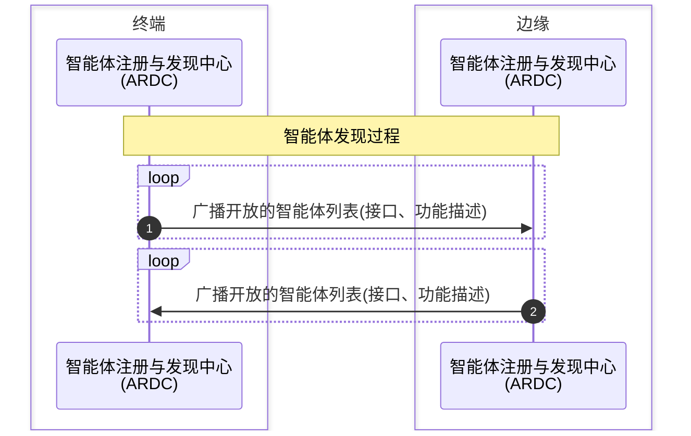
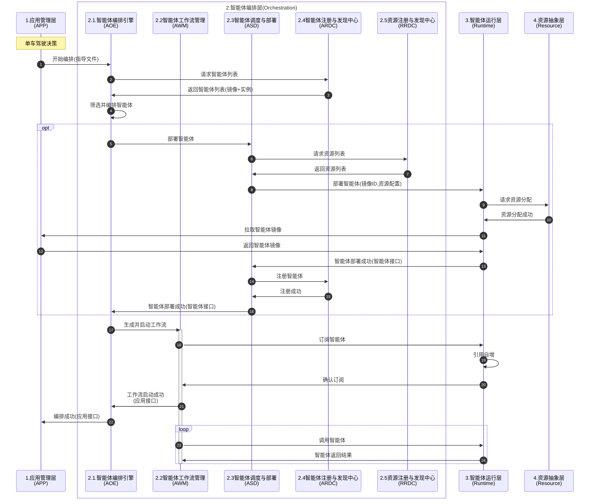
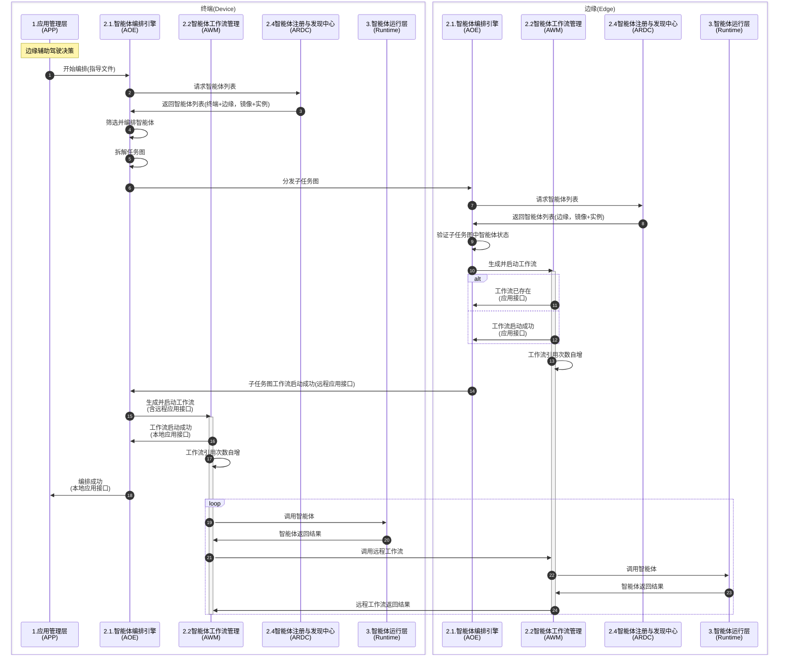
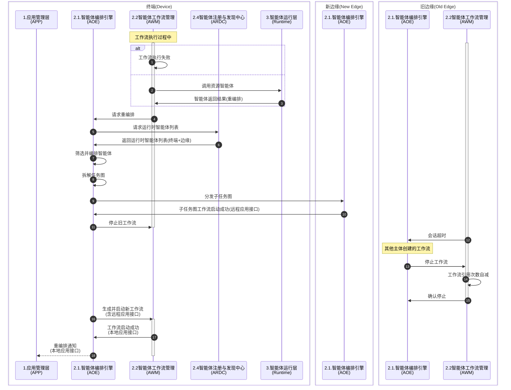
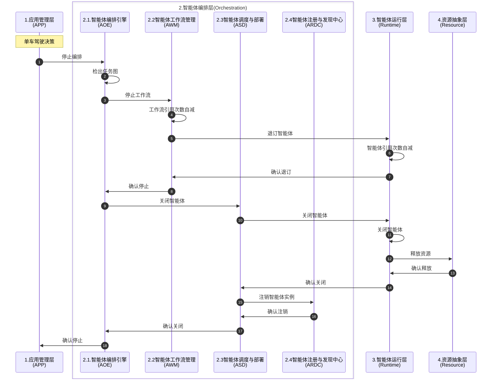
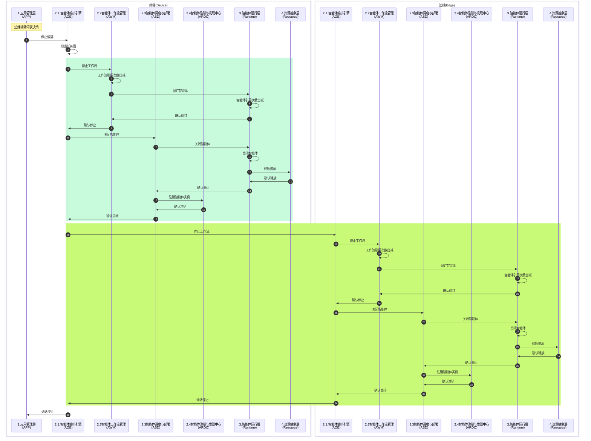

# 1 智能体发现

```mermaid
sequenceDiagram
autonumber

box 终端
    participant D_ARDC as 智能体注册与发现中心<br>(ARDC)
end

box 边缘
    participant E_ARDC as 智能体注册与发现中心<br>(ARDC)
end

note over D_ARDC,E_ARDC: 智能体发现过程
loop
    D_ARDC->>E_ARDC: 广播开放的智能体列表(接口、功能描述)
end

loop
    E_ARDC->>D_ARDC: 广播开放的智能体列表(接口、功能描述)
end


```

# 2 智能体编排与工作流部署

## 2.1 单主体工作流编排

```mermaid
sequenceDiagram
autonumber

participant D_APP as 1.应用管理层<br>(APP)
box 2.智能体编排层(Orchestration)
    participant D_AOE as 2.1.智能体编排引擎<br>(AOE)
    participant D_AWM as 2.2智能体工作流管理<br>(AWM)
    participant D_ASD as 2.3智能体调度与部署<br>(ASD)
    participant D_ARDC as 2.4智能体注册与发现中心<br>(ARDC)
    participant D_RRDC as 2.5资源注册与发现中心<br>(RRDC)
end
participant D_RUN as 3.智能体运行层<br>(Runtime)
participant D_RES as 4.资源抽象层<br>(Resource)

note over D_APP: 单车驾驶决策
D_APP->>D_AOE: 开始编排(指导文件)
D_AOE->>D_ARDC: 请求智能体列表
D_ARDC->>D_AOE: 返回智能体列表(镜像+实例)

D_AOE->>D_AOE: 筛选并编排智能体
opt
    D_AOE->>D_ASD: 部署智能体
    D_ASD->>D_RRDC: 请求资源列表
    D_RRDC->>D_ASD: 返回资源列表
    D_ASD->>D_RUN: 部署智能体(镜像ID,资源配置)

    D_RUN->>D_RES: 请求资源分配
    D_RES->>D_RUN: 资源分配成功

    D_RUN->>D_APP: 拉取智能体镜像
    D_APP->>D_RUN: 返回智能体镜像

    D_RUN->>D_ASD: 智能体部署成功(智能体接口)

    D_ASD->>D_ARDC: 注册智能体
    D_ARDC->>D_ASD: 注册成功
    D_ASD->>D_AOE: 智能体部署成功(智能体接口)
end
D_AOE->>D_AWM: 生成并启动工作流
activate D_AWM
D_AWM->>D_RUN: 订阅智能体
D_RUN->>D_RUN: 引用自增
D_RUN->>D_AWM: 确认订阅

D_AWM->>D_AOE: 工作流启动成功<br>(应用接口)
D_AOE->>D_APP: 编排成功(应用接口)

loop
    D_AWM->>D_RUN: 调用智能体
    D_RUN->>D_AWM: 智能体返回结果
end

deactivate D_AWM
```

## 2.2 跨主体工作流编排

```mermaid
sequenceDiagram
autonumber

box 终端(Device)
    participant D_APP as 1.应用管理层<br>(APP)
    participant D_AOE as 2.1.智能体编排引擎<br>(AOE)
    participant D_AWM as 2.2智能体工作流管理<br>(AWM)
    participant D_ARDC as 2.4智能体注册与发现中心<br>(ARDC)
    participant D_RUN as 3.智能体运行层<br>(Runtime)
end

box 边缘(Edge)
    participant E_AOE as 2.1.智能体编排引擎<br>(AOE)
    participant E_AWM as 2.2智能体工作流管理<br>(AWM)

    participant E_ARDC as 2.4智能体注册与发现中心<br>(ARDC)
    participant E_RUN as 3.智能体运行层<br>(Runtime)
end

note over D_APP: 边缘辅助驾驶决策
D_APP->>D_AOE: 开始编排(指导文件)
D_AOE->>D_ARDC: 请求智能体列表
D_ARDC->>D_AOE: 返回智能体列表(终端+边缘，镜像+实例)

D_AOE->>D_AOE: 筛选并编排智能体
D_AOE->>D_AOE: 拆解任务图

D_AOE->>E_AOE: 分发子任务图
E_AOE->>E_ARDC: 请求智能体列表
E_ARDC->>E_AOE: 返回智能体列表(边缘，镜像+实例)
E_AOE->>E_AOE: 验证子任务图中智能体状态
E_AOE->>E_AWM: 生成并启动工作流
activate E_AWM
alt
    E_AWM->>E_AOE: 工作流已存在<br>(应用接口)
else
    E_AWM->>E_AOE: 工作流启动成功<br>(应用接口)
end
E_AWM->>E_AWM: 工作流引用次数自增
E_AOE->>D_AOE: 子任务图工作流启动成功(远程应用接口)

D_AOE->>D_AWM: 生成并启动工作流<br>(含远程应用接口)
activate D_AWM
D_AWM->>D_AOE: 工作流启动成功<br>(本地应用接口)
D_AWM->>D_AWM: 工作流引用次数自增
D_AOE->>D_APP: 编排成功<br>(本地应用接口)

loop
    D_AWM->>D_RUN: 调用智能体
    D_RUN->>D_AWM: 智能体返回结果
    D_AWM->>E_AWM: 调用远程工作流
    E_AWM->>E_RUN: 调用智能体
    E_RUN->>E_AWM: 智能体返回结果
    E_AWM->>D_AWM: 远程工作流返回结果
end
deactivate D_AWM
deactivate E_AWM
```
说明：
- 由其他主体创建的工作流，需设置会话超时；由应用管理器创建的工作流，无需关注会话超时。
## 2.3 跨主体工作流重编排（智能体失效）

```mermaid
sequenceDiagram
autonumber

box 终端(Device)
    participant D_APP as 1.应用管理层<br>(APP)
    participant D_AOE as 2.1.智能体编排引擎<br>(AOE)
    participant D_AWM as 2.2智能体工作流管理<br>(AWM)
    participant D_ARDC as 2.4智能体注册与发现中心<br>(ARDC)
    participant D_RUN as 3.智能体运行层<br>(Runtime)
end

box 新边缘(New Edge)
    participant E_AOE as 2.1.智能体编排引擎<br>(AOE)
end

box 旧边缘(Old Edge)
    participant E_AOE2 as 2.1.智能体编排引擎<br>(AOE)
    participant E_AWM2 as 2.2智能体工作流管理<br>(AWM)
end

note over D_AWM: 工作流执行过程中
activate E_AWM2
activate D_AWM
alt
    D_AWM->>D_AWM: 工作流执行失败
else
    D_AWM->>D_RUN: 调用资源智能体
    D_RUN->>D_AWM: 智能体返回结果(重编排)
end
D_AWM->>D_AOE: 请求重编排
D_AOE->>D_ARDC: 请求运行时智能体列表
D_ARDC->>D_AOE: 返回运行时智能体列表(终端+边缘)
D_AOE->>D_AOE: 筛选并编排智能体
D_AOE->>D_AOE: 拆解任务图
D_AOE->>E_AOE: 分发子任务图
E_AOE->>D_AOE: 子任务图工作流启动成功(远程应用接口)
D_AOE->>D_AWM: 停止旧工作流
deactivate D_AWM

E_AWM2->>E_AOE2: 会话超时
note over E_AOE2: 其他主体创建的工作流
E_AOE2->>E_AWM2: 停止工作流
E_AWM2->>E_AWM2: 工作流引用次数自减
E_AWM2->>E_AOE2: 确认停止
deactivate E_AWM2

D_AOE->>D_AWM: 生成并启动新工作流<br>(含远程应用接口)
activate D_AWM
D_AWM->>D_AOE: 工作流启动成功<br>(本地应用接口)
D_AOE-->>D_APP: 重编排通知<br>(本地应用接口)

deactivate D_AWM
```

## 2.3 单主体工作流停止编排

```mermaid
sequenceDiagram
autonumber

participant D_APP as 1.应用管理层<br>(APP)
box 2.智能体编排层(Orchestration)
    participant D_AOE as 2.1.智能体编排引擎<br>(AOE)
    participant D_AWM as 2.2智能体工作流管理<br>(AWM)
    participant D_ASD as 2.3智能体调度与部署<br>(ASD)
    participant D_ARDC as 2.4智能体注册与发现中心<br>(ARDC)
end
participant D_RUN as 3.智能体运行层<br>(Runtime)
participant D_RES as 4.资源抽象层<br>(Resource)

note over D_APP: 单车驾驶决策
D_APP->>D_AOE: 停止编排
D_AOE->>D_AOE: 检出任务图
D_AOE->>D_AWM: 停止工作流

D_AWM->>D_AWM: 工作流引用次数自减
D_AWM->>D_RUN: 退订智能体
D_RUN->>D_RUN: 智能体引用次数自减
D_RUN->>D_AWM: 确认退订

D_AWM->>D_AOE: 确认停止

D_AOE->>D_ASD: 关闭智能体


D_ASD->>D_RUN: 关闭智能体

D_RUN->>D_RUN: 关闭智能体

D_RUN->>D_RES: 释放资源
D_RES->>D_RUN: 确认释放

D_RUN->>D_ASD: 确认关闭
D_ASD->>D_ARDC: 注销智能体实例
D_ARDC->>D_ASD: 确认注销


D_ASD->>D_AOE: 确认关闭
D_AOE->>D_APP: 确认停止
```

## 2.4 跨主体工作流停止编排

```mermaid
sequenceDiagram
autonumber

box 终端(Device)
    participant D_APP as 1.应用管理层<br>(APP)
    participant D_AOE as 2.1.智能体编排引擎<br>(AOE)
    participant D_AWM as 2.2智能体工作流管理<br>(AWM)
    participant D_ASD as 2.3智能体调度与部署<br>(ASD)
    participant D_ARDC as 2.4智能体注册与发现中心<br>(ARDC)
    participant D_RUN as 3.智能体运行层<br>(Runtime)
    participant D_RES as 4.资源抽象层<br>(Resource)
end

box 边缘(Edge)
    participant E_AOE as 2.1.智能体编排引擎<br>(AOE)
    participant E_AWM as 2.2智能体工作流管理<br>(AWM)
    participant E_ASD as 2.3智能体调度与部署<br>(ASD)
    participant E_ARDC as 2.4智能体注册与发现中心<br>(ARDC)
    participant E_RUN as 3.智能体运行层<br>(Runtime)
    participant E_RES as 4.资源抽象层<br>(Resource)
end

note over D_APP: 边缘辅助驾驶决策
D_APP->>D_AOE: 停止编排
D_AOE->>D_AOE: 检出任务图

rect rgb(200,250,220)
    D_AOE->>D_AWM: 停止工作流

    D_AWM->>D_AWM: 工作流引用次数自减
    D_AWM->>D_RUN: 退订智能体
    D_RUN->>D_RUN: 智能体引用次数自减
    D_RUN->>D_AWM: 确认退订

    D_AWM->>D_AOE: 确认停止

    D_AOE->>D_ASD: 关闭智能体


    D_ASD->>D_RUN: 关闭智能体

    D_RUN->>D_RUN: 关闭智能体

    D_RUN->>D_RES: 释放资源
    D_RES->>D_RUN: 确认释放

    D_RUN->>D_ASD: 确认关闭
    D_ASD->>D_ARDC: 注销智能体实例
    D_ARDC->>D_ASD: 确认注销


    D_ASD->>D_AOE: 确认关闭
end

rect rgb(200,250,120)
    D_AOE->>E_AOE: 停止工作流
    E_AOE->>E_AWM: 停止工作流

    E_AWM->>E_AWM: 工作流引用次数自减
    E_AWM->>E_RUN: 退订智能体
    E_RUN->>E_RUN: 智能体引用次数自减
    E_RUN->>E_AWM: 确认退订

    E_AWM->>E_AOE: 确认停止

    E_AOE->>E_ASD: 关闭智能体


    E_ASD->>E_RUN: 关闭智能体

    E_RUN->>E_RUN: 关闭智能体

    E_RUN->>E_RES: 释放资源
    E_RES->>E_RUN: 确认释放

    E_RUN->>E_ASD: 确认关闭
    E_ASD->>E_ARDC: 注销智能体实例
    E_ARDC->>E_ASD: 确认注销


    E_ASD->>E_AOE: 确认关闭
    E_AOE->>D_AOE: 确认停止
end

D_AOE->>D_APP: 确认停止

```

