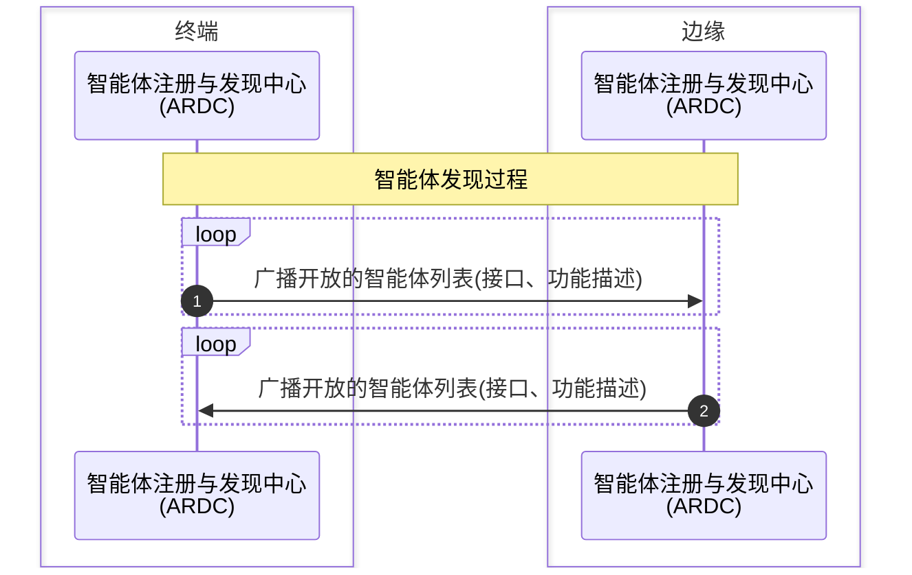
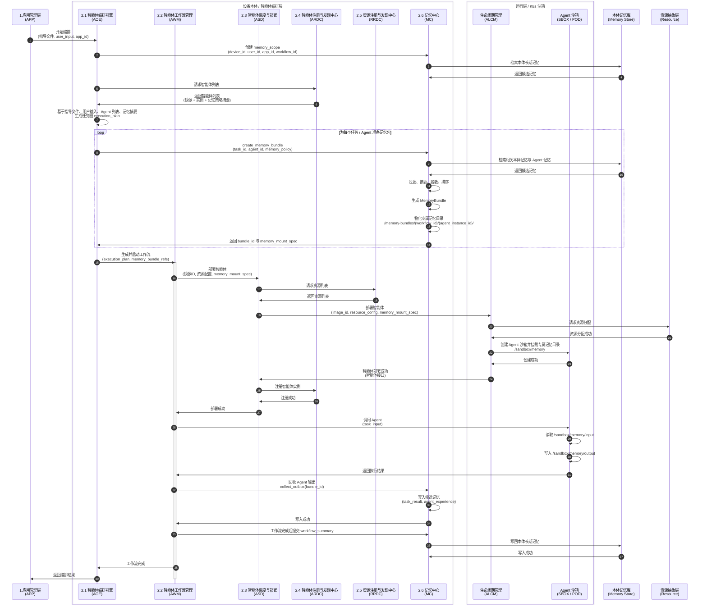
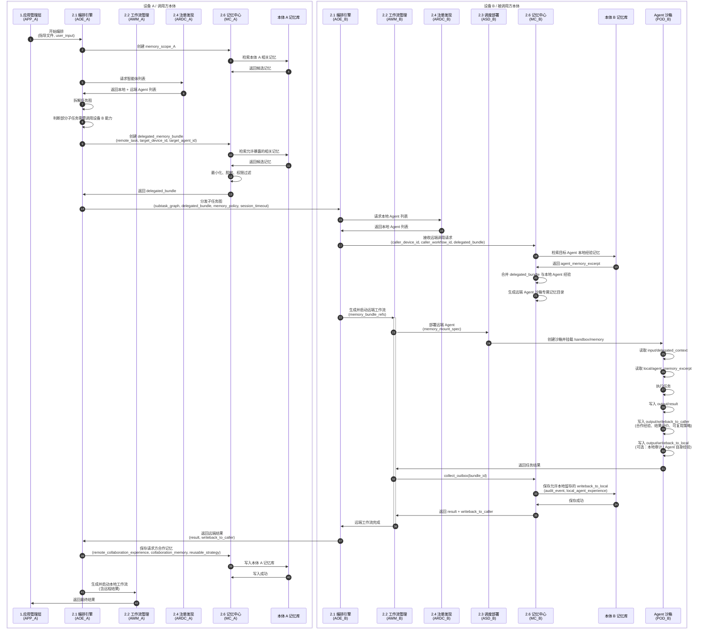
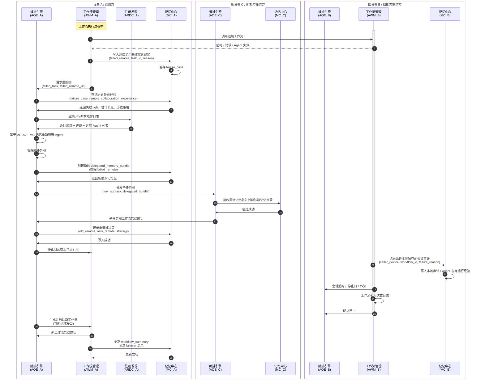
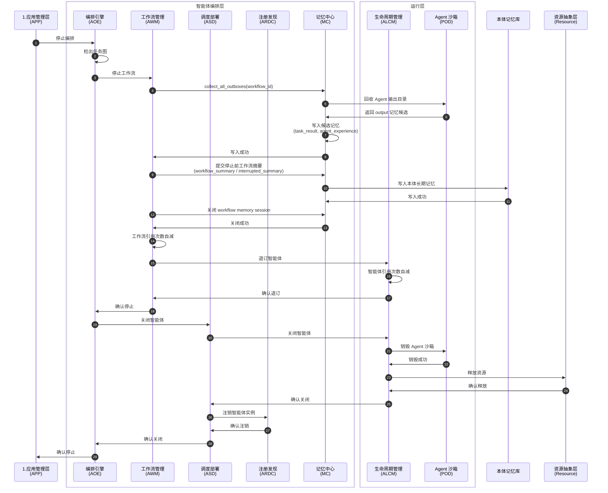
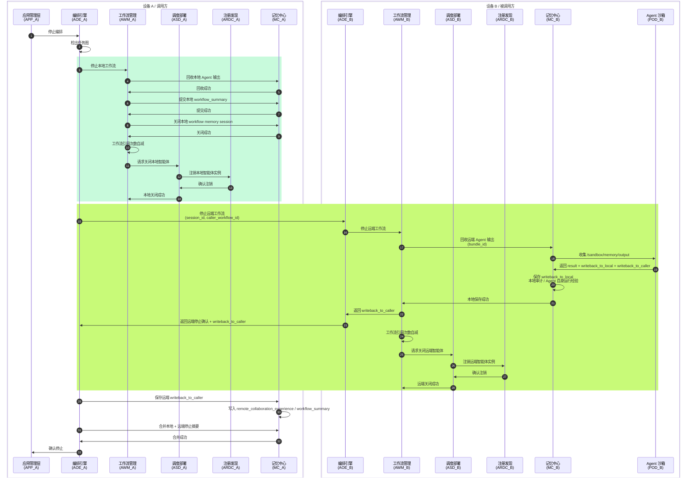
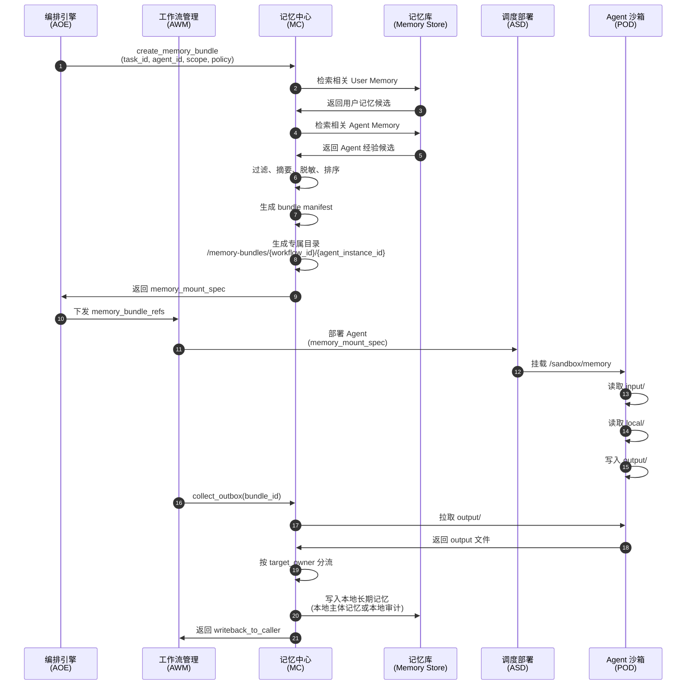
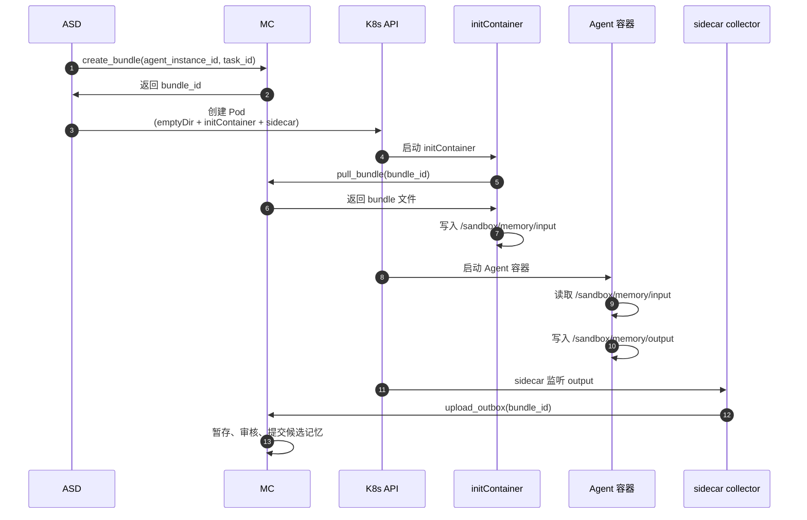

# 智能体编排层接口流程 v2

> 本版本在原“智能体编排层接口流程 v1”基础上新增 **MC：记忆中心（Memory Center）**。
> MC 不是普通业务智能体，而是编排层控制面组件，负责记忆抽取、记忆包生成、沙箱挂载、远端委派记忆、执行后记忆回收与本地写回。

---

## 0. 核心设计原则

### 0.1 每个设备都是独立本体

系统中的每个设备都可视为一个独立客户端：

```text
设备 A = 一个独立客户端 / 本体 A
设备 B = 一个独立客户端 / 本体 B
```

每个设备拥有：

```text
1. 本地应用管理层 APP
2. 本地智能体编排层 Orchestration
3. 本地智能体运行层 Runtime
4. 本地记忆中心 MC
5. 本地记忆库 Memory Store
```

设备之间可以互相调用能力，但默认不共享本体私有记忆。

---

### 0.2 Agent 沙箱只能访问专属记忆目录

Agent 由 K8s 沙箱调度，不同 Agent 实例、不同 Workflow、不同设备之间不共享文件系统。

每个 Agent 实例启动前，MC 会为其生成专属记忆包，并由 ASD / ALCM 挂载到沙箱内：

```text
/sandbox/memory
```

Agent 沙箱只能访问该目录，不能访问：

```text
1. 其他 Agent 的记忆目录
2. 其他 Workflow 的记忆目录
3. 本设备全量长期记忆库
4. 其他设备的本体记忆
```

---

### 0.3 远端调用采用请求方主归属记忆

当设备 A 调用设备 B 的 Agent 时，合作记忆以请求方 A 为主体保存。

```text
1. 请求方合作记忆：
   设备 A 记录“我为了某个任务调用了设备 B 的某个 Agent，远端能力效果如何，
   哪些上下文、约束、参数、失败/成功策略可复用”。

2. 被调用方本地审计 / 自身经验：
   设备 B 只在策略允许时记录“我的某个 Agent 被设备 A 的某个 Workflow 调用，
   执行了什么类型任务，资源消耗与本地 Agent 表现如何”。
```

请求方保存合作记忆的原因是：A 可能只和 B 合作一次。下次 A 在设备 C 上执行相同或相似合作时，A 仍需要复用这次远端协作的经验、参数选择、失败规避和结果评价。

被调用设备可以保存：

```text
1. 调用事实
2. 调用方设备 ID
3. 调用方 Workflow ID
4. 任务类型
5. 执行结果摘要
6. 性能指标
7. 本地 Agent 自身运行经验
```

但合作主体经验、调用方业务上下文、跨设备策略、可迁移协作经验应写回调用方 MC；被调用方不得保存调用方未授权暴露的私有原始记忆、敏感上下文或全量用户记忆。

---

## 1. 智能体发现



说明：

* ARDC 仍然只负责智能体发现。
* MC 不参与 Agent 能力注册，但 ARDC 中可记录 Agent 的记忆策略摘要。
* 设备之间不广播本体私有记忆。
* 可广播的信息包括：

  * Agent 是否允许远端调用；
  * Agent 是否允许保存远端调用审计和自身运行经验；
  * Agent 是否允许读取本地 Agent Memory；
  * Agent 是否允许接收委派记忆包。

---

## 2. 单主体工作流编排



说明：

* Agent 不直接访问 MC 全量记忆库。
* Agent 只访问 `/sandbox/memory`。
* MC 在 Agent 启动前为其生成专属 MemoryBundle。
* Agent 执行后将候选记忆写入 `/sandbox/memory/output`。
* MC 回收 output 后决定是否写入长期记忆。

---

## 3. 跨主体工作流编排



说明：

* 调用方 A 只向 B 发送经过脱敏和最小化的 delegated_memory_bundle。
* 被调用方 B 可以结合自己的本地 Agent Memory 执行任务。
* B 的 Agent 执行后会产生两类写回：

  * `writeback_to_caller`：返回给 A_MC，作为请求方合作记忆的主写回通道，保存远端能力效果、协作策略、可复用经验和失败/成功摘要。
  * `writeback_to_local`：只保存到 B_MC 的本地审计或 B Agent 自身运行经验，不作为跨主体合作经验的主存储。
* B 不保存 A 未授权暴露的私有原始上下文。
* A_MC 后续为 A 调用 C 创建 delegated_memory_bundle 时，可以检索此前 A 调用 B 的合作记忆，用于选择能力、设置约束、复用参数和规避失败策略。

---

## 4. 跨主体工作流重编排



说明：

* A 侧记录“调用 B 失败，并切换到 C”。
* B 侧只记录策略允许的本地失败审计和自身运行状态。
* C 侧如果执行成功，也只保存策略允许的本地审计；协作成功经验仍回写 A_MC。
* 重编排时 A_MC 的历史失败经验和协作记忆可以影响新的 Agent 选择。

---

## 5. 单主体工作流停止编排



说明：

* Pod 销毁前必须先由 MC 回收 output。
* MC 关闭 workflow memory session 后，沙箱专属记忆目录可以归档或删除。
* 归档策略由 `memory_policy` 决定。

---

## 6. 跨主体工作流停止编排



说明：

* 远端停止时，B_MC 只保存策略允许的本地审计和 Agent 自身运行经验。
* B_MC 再将调用方可见的 writeback 返回 A_MC。
* A_MC 保存“我调用远端能力的结果、远端协作经验、可迁移策略”。
* B_MC 不作为 A-B 合作记忆的主存储；B_MC 保存“我的 Agent 被远端调用时自身如何运行”的本地记录。

---

## 7. MC 记忆包管理流程



---

## 8. Agent 沙箱记忆目录规范

每个 Agent 实例只允许访问自己的 `/sandbox/memory`。

```text
/sandbox/memory/
├── manifest.json
├── input/
│   ├── task.md
│   ├── delegated_context.json
│   ├── constraints.json
│   ├── policy.json
│   └── caller_info.json
│
├── local/
│   ├── agent_profile.json
│   ├── agent_memory_excerpt.json
│   └── device_public_context.json
│
└── output/
    ├── result.json
    ├── execution_notes.md
    ├── writeback_to_caller.jsonl
    ├── writeback_to_local.jsonl
    └── artifacts/
```

### 8.1 input 目录

由 MC 生成，Agent 只读。

```text
input/task.md
```

当前任务描述。

```text
input/delegated_context.json
```

调用方允许暴露的上下文。单主体任务中可为空。

```text
input/policy.json
```

当前任务的记忆读写策略。

```text
input/caller_info.json
```

调用方设备、Workflow、Session 信息。单主体任务中 caller 与本设备相同。

---

### 8.2 local 目录

由被调用方本地 MC 生成，Agent 只读。

```text
local/agent_profile.json
```

当前 Agent 的身份、能力、版本、约束。

```text
local/agent_memory_excerpt.json
```

MC 为当前任务抽取的 Agent 本地经验。

```text
local/device_public_context.json
```

本设备允许公开给本地 Agent 的上下文。

---

### 8.3 output 目录

由 Agent 写入，MC 回收。

```text
output/result.json
```

任务执行结果。

```text
output/writeback_to_caller.jsonl
```

返回给调用方 MC 的候选记忆。跨主体任务中，这是合作记忆的主写回通道。

```text
output/writeback_to_local.jsonl
```

写回当前执行方本地 MC 的候选记忆。跨主体任务中仅用于本地审计、资源表现、Agent 自身运行经验，不保存请求方业务上下文或合作主体经验。

---

## 9. MemoryBundle 数据结构

```json
{
  "bundle_id": "mb_xxx",
  "owner_device_id": "device_A",
  "owner_user_id": "user_A",
  "workflow_id": "wf_xxx",
  "task_id": "task_001",
  "agent_id": "vision_agent_001",
  "agent_instance_id": "inst_xxx",
  "mount_path": "/sandbox/memory",
  "visibility": "local",
  "created_at": "2026-06-10T10:00:00Z",
  "expires_at": "2026-06-10T12:00:00Z",
  "policy": {
    "input_readonly": true,
    "output_collect": true,
    "allow_agent_read_local_memory": true,
    "allow_agent_write_local_memory": true,
    "allow_writeback_to_caller": false,
    "allow_save_raw_input": false
  }
}
```

---

## 10. DelegatedMemoryBundle 数据结构

跨设备调用时使用。

```json
{
  "delegation_id": "dmb_xxx",
  "caller_device_id": "device_A",
  "caller_user_id": "user_A",
  "caller_workflow_id": "wf_A_001",
  "caller_task_id": "task_A_003",
  "callee_device_id": "device_B",
  "target_agent_id": "vision_agent_B",
  "remote_session_id": "sess_B_001",
  "delegated_context": {
    "task_summary": "请对脱敏后的目标区域进行视觉识别",
    "allowed_memories": [],
    "constraints": {}
  },
  "policy": {
    "allow_callee_local_memory_read": true,
    "allow_callee_save_local_audit": true,
    "allow_callee_save_caller_identity": true,
    "allow_callee_save_delegated_context": false,
    "allow_callee_save_raw_input": false,
    "caller_writeback_allowed": true,
    "local_audit_writeback_allowed": true,
    "caller_owns_collaboration_memory": true
  },
  "expires_at": "2026-06-10T12:00:00Z"
}
```

---

## 11. DistributedState v2 新增字段

```python
class DistributedState(TypedDict):
    # 原有字段略

    # 记忆开关
    memory_enabled: bool

    # 当前本体
    device_id: str
    user_id: str

    # 当前 Workflow 记忆域
    memory_scope: dict

    # Planner 可见的摘要级记忆
    planner_memory_context: list[dict]

    # 每个 task / agent 的记忆包引用
    memory_bundles: dict[str, dict]

    # 跨设备委派记忆包
    delegated_memory_bundles: dict[str, dict]

    # Agent 沙箱执行后的写回
    memory_writebacks: list[dict]

    # 记忆策略
    memory_policy: dict
```

示例：

```json
{
  "memory_enabled": true,
  "device_id": "device_A",
  "user_id": "user_A",
  "memory_scope": {
    "owner_device_id": "device_A",
    "owner_user_id": "user_A",
    "app_id": "app_vehicle_decision",
    "workflow_id": "wf_001"
  },
  "memory_bundles": {
    "task_001": {
      "bundle_id": "mb_001",
      "agent_id": "vision_agent_001",
      "agent_instance_id": "inst_abc",
      "mount_path": "/sandbox/memory",
      "visibility": "local",
      "input_readonly": true,
      "output_collect": true
    }
  },
  "delegated_memory_bundles": {
    "remote_task_002": {
      "delegation_id": "dmb_001",
      "target_device_id": "device_B",
      "target_agent_id": "vision_agent_B",
      "visibility": "delegated",
      "expires_at": "2026-06-10T12:00:00Z"
    }
  }
}
```

---

## 12. MC 接口定义

### 12.1 本地记忆包接口

| 方法     | 路径                                          | 说明                  |
| ------ | ------------------------------------------- | ------------------- |
| POST   | `/memory/bundles/create`                    | 创建 MemoryBundle     |
| POST   | `/memory/bundles/{bundle_id}/materialize`   | 将记忆包物化为沙箱目录         |
| GET    | `/memory/bundles/{bundle_id}/download`      | 查询 MC 本机 source_path（调试用） |
| GET    | `/memory/bundles/{bundle_id}/archive`       | initContainer 下载 bundle tar.gz |
| POST   | `/memory/bundles/{bundle_id}/upload_outbox` | 上传 Agent output     |
| POST   | `/memory/bundles/{bundle_id}/commit`        | 提交记忆包输出             |
| DELETE | `/memory/bundles/{bundle_id}`               | 删除或归档记忆包            |

---

### 12.2 跨设备委派接口

| 方法     | 路径                                              | 说明             |
| ------ | ----------------------------------------------- | -------------- |
| POST   | `/memory/delegations/create`                    | 调用方创建委派记忆包     |
| POST   | `/memory/delegations/accept`                    | 被调用方接收委派记忆包    |
| POST   | `/memory/delegations/{delegation_id}/writeback` | 被调用方向调用方写回候选记忆 |
| DELETE | `/memory/delegations/{delegation_id}`           | 删除或关闭委派会话      |

---

### 12.3 记忆查询接口

| 方法     | 路径                    | 说明                |
| ------ | --------------------- | ----------------- |
| POST   | `/memory/search`      | 查询本体记忆 / Agent 记忆 |
| POST   | `/memory/write`       | 写入本地记忆            |
| POST   | `/memory/batch_write` | 批量写入本地记忆          |
| GET    | `/memory/{memory_id}` | 查询单条记忆            |
| DELETE | `/memory/{memory_id}` | 删除记忆              |

---

## 13. ASD / ALCM 部署接口新增参数

原部署接口：

```text
部署智能体(镜像ID, 资源配置)
```

v2 增强为：

```text
部署智能体(镜像ID, 资源配置, memory_mount_spec)
```

示例：

```json
{
  "agent_id": "vision_agent_001",
  "image_id": "image_vision",
  "resource_config": {
    "cpu_cores": 2,
    "memory_mb": 4096,
    "gpu_count": 1
  },
  "memory_mount": {
    "bundle_id": "mb_001",
    "mount_path": "/sandbox/memory",
    "input_mode": "readonly",
    "output_mode": "collect",
    "collector": "sidecar"
  }
}
```

---

## 14. K8s 实现方式



优点：

```text
1. Agent 不需要直接访问 MC 全量存储
2. 每个 Pod 的 memory 目录天然隔离
3. Pod 销毁后 output 已由 sidecar 回收
4. 不依赖跨 Pod 共享文件系统
```

## 15. 记忆写回策略

### 15.1 写回调用方

文件：

```text
/sandbox/memory/output/writeback_to_caller.jsonl
```

用途：

```text
返回调用方 MC，用于保存远端调用结果、远端协作经验、可复用策略、失败规避和工作流摘要。
```

示例：

```json
{
  "memory_type": "remote_collaboration_experience",
  "target_owner": "caller",
  "content": "device_A 调用 device_B 的 vision_agent_B 完成目标检测任务，结果可靠，耗时 2.3s。后续在 device_C 上执行同类任务时，可复用相同输入约束和结果校验策略。",
  "confidence": 0.91
}
```

---

### 15.2 写回本地审计 / Agent 自身经验

文件：

```text
/sandbox/memory/output/writeback_to_local.jsonl
```

用途：

```text
写回被调用设备本地 MC，仅保存本地审计、资源表现、Agent 自身运行经验。
不得保存请求方业务上下文、跨主体协作策略或可迁移合作经验。
```

示例：

```json
{
  "memory_type": "local_agent_audit",
  "target_owner": "local_agent",
  "agent_id": "vision_agent_B",
  "caller_device_id": "device_A",
  "caller_workflow_id": "workflow_A_001",
  "content": "vision_agent_B 被 device_A 的 workflow_A_001 调用执行目标检测任务，执行成功，耗时 2.3s。仅记录本地运行状态和审计信息。"
}
```

---

## 16. 记忆权限策略

远端调用的默认策略：

```json
{
  "allow_callee_local_memory_read": true,
  "allow_callee_save_local_audit": true,
  "allow_callee_save_caller_identity": true,
  "allow_callee_save_delegated_context": false,
  "allow_callee_save_raw_input": false,
  "caller_writeback_allowed": true,
  "local_audit_writeback_allowed": true,
  "caller_owns_collaboration_memory": true
}
```

含义：

```text
1. 允许被调用 Agent 读取自己的本地经验。
2. 允许被调用设备保存“被谁调用、任务类型、资源消耗、本地 Agent 表现”等审计和自身运行信息。
3. 不允许被调用设备保存调用方未授权的私有原始上下文。
4. 调用方接收远端执行结果、协作经验、可复用策略和失败/成功摘要。
5. 跨主体合作记忆归请求方所有；被调用方不作为合作记忆主存储。
```
