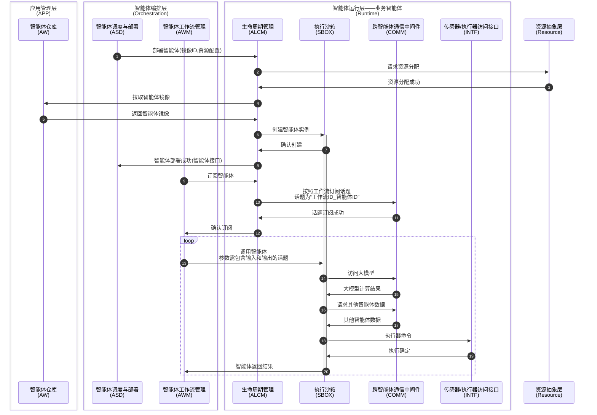
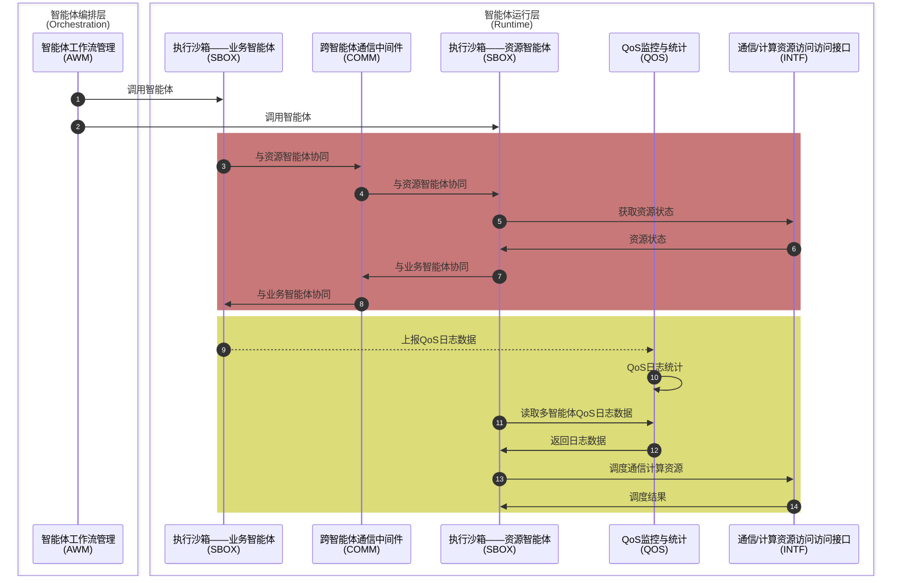

# 1 智能体部署与调用

```mermaid
sequenceDiagram
autonumber

box 应用管理层<br>(APP)
    participant AW as 智能体仓库<br>(AW)
end

box 智能体编排层<br>(Orchestration)
    participant ASD as 智能体调度与部署<br>(ASD)
    participant AWM as 智能体工作流管理<br>(AWM)
end
box 智能体运行层——业务智能体<br>(Runtime)
    participant ALCM as 生命周期管理<br>(ALCM)
    participant SBOX as 执行沙箱<br>(SBOX)
    participant COMM as 跨智能体通信中间件<br>(COMM)
    participant INTF as 传感器/执行器访问接口<br>(INTF)
end

    participant RES as 资源抽象层<br>(Resource)


ASD->>ALCM: 部署智能体(镜像ID,资源配置)
ALCM->>RES: 请求资源分配
RES->>ALCM: 资源分配成功

ALCM->>AW: 拉取智能体镜像
AW->>ALCM: 返回智能体镜像

ALCM->>SBOX: 创建智能体实例
activate SBOX
SBOX->>ALCM: 确认创建

ALCM->>ASD: 智能体部署成功(智能体接口)
AWM->>ALCM: 订阅智能体
ALCM->>COMM: 按照工作流订阅话题<br>话题为“工作流ID_智能体ID”
COMM->>ALCM: 话题订阅成功
ALCM->>AWM: 确认订阅

loop
    AWM->>SBOX: 调用智能体<br>参数需包含输入和输出的话题
    SBOX->>COMM: 访问大模型
    COMM->>SBOX: 大模型计算结果
    SBOX->>COMM: 请求其他智能体数据
    COMM->>SBOX: 其他智能体数据
    SBOX->>INTF: 执行器命令
    INTF->>SBOX: 执行确定

    SBOX->>AWM: 智能体返回结果
end

deactivate SBOX
```

# 2 业务-资源智能体协同

```mermaid
sequenceDiagram
autonumber

box 智能体编排层<br>(Orchestration)
    participant AWM as 智能体工作流管理<br>(AWM)
end
box 智能体运行层<br>(Runtime)
    participant SBOX1 as 执行沙箱——业务智能体<br>(SBOX)
    participant COMM as 跨智能体通信中间件<br>(COMM)
    participant SBOX2 as 执行沙箱——资源智能体<br>(SBOX)
    participant QOS as QoS监控与统计<br>(QOS)
    participant INTF as 通信/计算资源访问访问接口<br>(INTF)
end

    AWM->>SBOX1: 调用智能体
    AWM->>SBOX2: 调用智能体

    rect rgb(200,120,120)
        SBOX1->>COMM: 与资源智能体协同
        COMM->>SBOX2: 与资源智能体协同
        SBOX2->>INTF: 获取资源状态
        INTF->>SBOX2: 资源状态
        SBOX2->>COMM: 与业务智能体协同
        COMM->>SBOX1: 与业务智能体协同
    end

    rect rgb(220,220,120)
        SBOX1-->>QOS: 上报QoS日志数据
        QOS->>QOS: QoS日志统计
        SBOX2->>QOS: 读取多智能体QoS日志数据
        QOS->>SBOX2: 返回日志数据

        SBOX2->>INTF: 调度通信计算资源
        INTF->>SBOX2: 调度结果
    end
```

