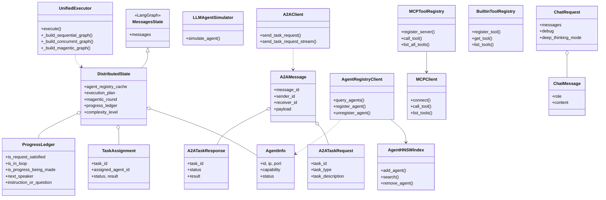
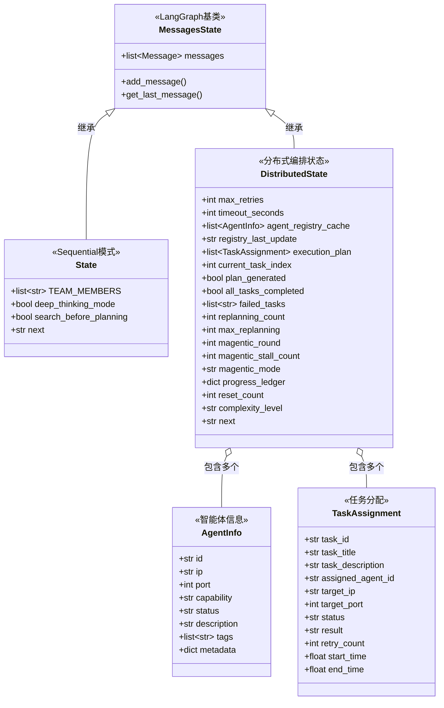
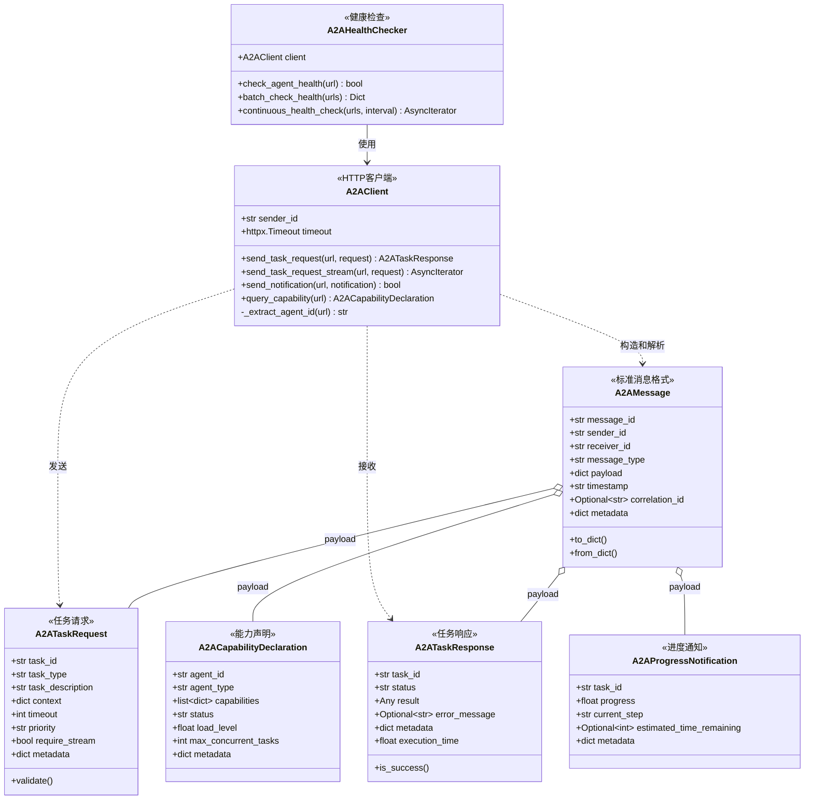
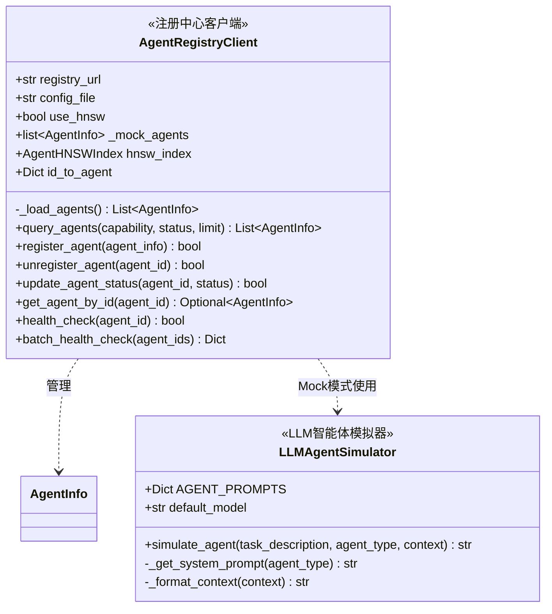
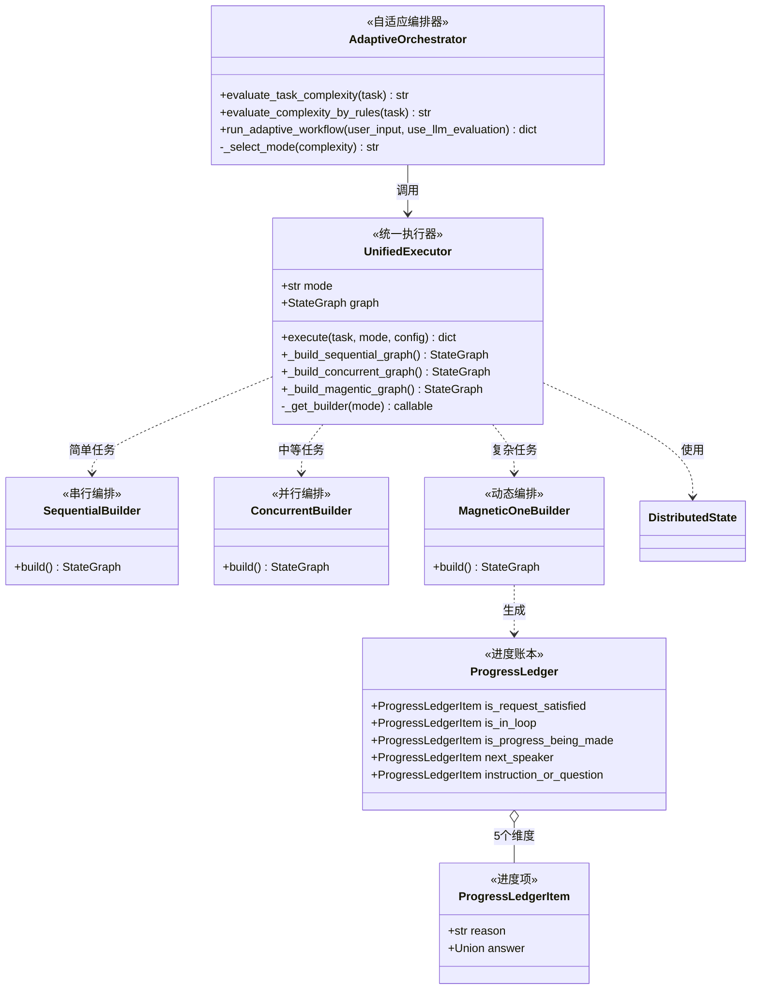
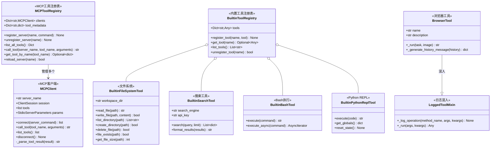
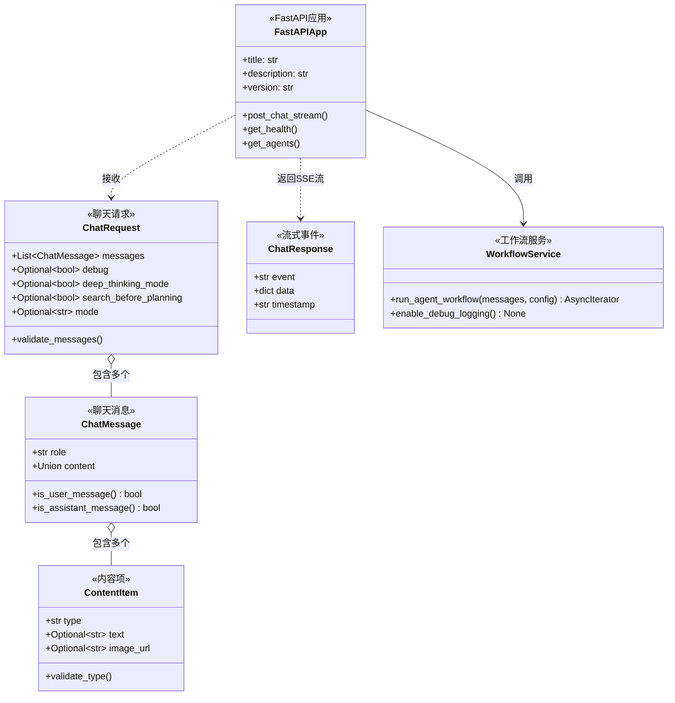
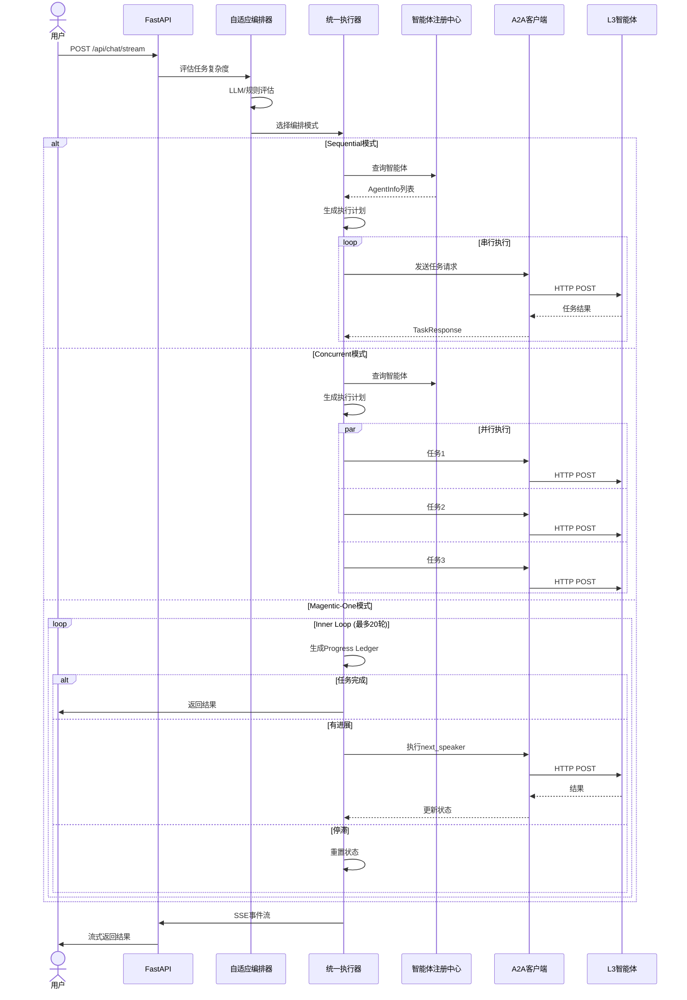
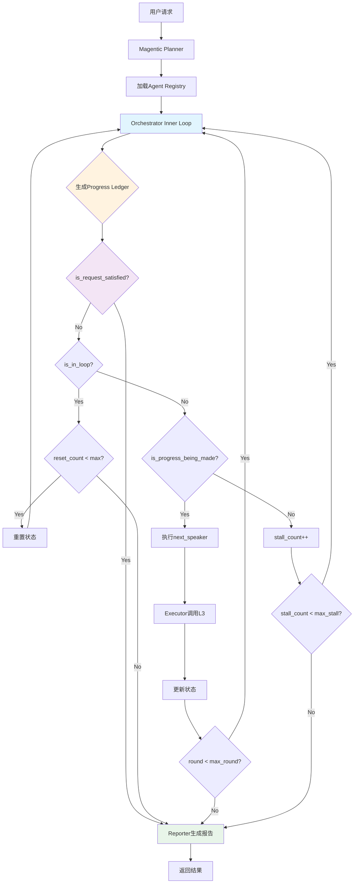

# LangManus 类图 

> 快速查看系统核心类结构

## 📑 目录

- [系统全局类图](#系统全局类图)
- [模块详细说明](#模块详细说明)
  - [1 状态管理层](#1-状态管理层)
  - [2 通信协议层](#2-通信协议层)
  - [3 智能体注册层](#3-智能体注册层)
  - [4 编排执行层](#4-编排执行层)
  - [5 工具集成层](#5-工具集成层)
  - [6 API接口层](#6-api接口层)

---

## 系统全局类图

> 所有模块的整体关系视图



---

## 模块详细说明

### 1 状态管理层

> 核心状态类，贯穿整个系统生命周期



**核心职责：**
- **MessagesState**: LangGraph 提供的基类，管理消息历史
- **DistributedState**: 分布式编排的完整状态
  - 支持三种编排模式（Sequential/Concurrent/Magentic-One）
  - 管理智能体注册表缓存
  - 跟踪任务执行计划和进度
  - 支持失败重试和重新规划
- **AgentInfo**: L3 层智能体的注册信息
- **TaskAssignment**: 记录任务分配和执行状态

**文件位置：** `src/graph/distributed_types.py`

---

### 2 通信协议层

> 标准化的 Agent-to-Agent (A2A) 通信协议



**核心职责：**
- **A2AMessage**: 所有 Agent 间通信的标准包装格式
- **A2ATaskRequest**: L2 编排器 → L3 智能体的任务请求
- **A2ATaskResponse**: L3 智能体 → L2 编排器的执行结果
- **A2AClient**: 实现 A2A 协议的异步 HTTP 客户端
  - 支持同步和流式通信
  - 自动重试和超时处理
- **A2AHealthChecker**: 批量健康检查，监控智能体状态

**文件位置：**
- 协议定义: `src/protocols/a2a_protocol.py`
- 客户端实现: `src/service/a2a_client.py`

---

### 3 智能体注册层

> 智能体注册、发现与检索



**核心职责：**

- **AgentRegistryClient**: 智能体注册中心的客户端
  - 支持配置文件和 Mock 两种模式
  - 自动选择精确匹配或 HNSW 检索（阈值：100）
  - 提供注册、注销、查询、健康检查等功能
- **LLMAgentSimulator**: 使用真实 LLM 模拟各类智能体
  - 为每种能力类型定义专门提示词
  - 开发测试阶段的替代方案

**文件位置：**
- 注册客户端: `src/service/agent_registry.py`
- LLM 模拟器: `src/service/llm_agent_simulator.py`

**配置文件：** `config/agent_registry.json`

---

### 4 编排执行层

> 自适应编排与任务执行



**核心职责：**
- **AdaptiveOrchestrator**: 自适应编排器
  - 评估任务复杂度（LLM 或规则）
  - 自动选择合适的编排模式
- **UnifiedExecutor**: 统一执行器
  - Sequential: 串行执行，2 次 LLM 调用
  - Concurrent: 并行执行，中等 LLM 开销
  - Magentic-One: 反馈循环，动态智能体选择
- **ProgressLedger**: Magentic-One 的核心组件
  - 每轮生成 5 维度分析
  - 判断任务完成、循环检测、进度评估
  - 动态选择下一个发言者和指令

**编排模式对比：**

| 模式 | 复杂度 | 执行方式 | 智能体选择 | LLM 调用 | 适用场景 |
|------|--------|---------|-----------|---------|---------|
| Sequential | Simple | 串行 | 预定义 | 2次 | 单步任务、简单查询 |
| Concurrent | Medium | 并行 | 预定义 | 中等 | 多角度分析、并行收集 |
| Magentic-One | Complex | 动态循环 | Progress Ledger | 多次 | 研究报告、复杂求解 |

**文件位置：**
- 自适应编排: `src/graph/adaptive_orchestrator.py`
- 统一执行器: `src/graph/unified_executor.py`
- Progress Ledger: `src/graph/progress_ledger.py`
- 图构建器: `src/graph/*_builder.py`
- 执行节点: `src/graph/*_nodes.py`

---

### 5 工具集成层

> L1 本地工具 + MCP 外部服务



**核心职责：**

**MCP 集成：**
- **MCPClient**: 连接单个 MCP 服务器
  - 使用 stdio 协议通信
  - 动态发现和调用工具
- **MCPToolRegistry**: 管理多个 MCP 服务器
  - 统一的工具调用接口
  - 示例：Brave Search、Filesystem、Puppeteer

**内置工具（L1层）：**
- **BuiltinFileSystemTool**: 文件系统操作
- **BuiltinSearchTool**: 搜索引擎（Tavily API）
- **BuiltinBashTool**: Bash 命令执行
- **BuiltinPythonReplTool**: Python 代码执行
- **BrowserTool**: 浏览器自动化（基于 browser-use）

**文件位置：**
- MCP 集成: `src/service/mcp_client.py`
- 内置工具: `src/service/builtin_tools.py`
- 工具实现: `src/tools/*.py`
- 工具装饰器: `src/tools/decorators.py`

---

### 6 API接口层

> FastAPI 流式接口



**核心职责：**
- **FastAPIApp**: 主应用
  - `/api/chat/stream`: SSE 流式聊天接口
  - `/health`: 健康检查
  - `/agents`: 智能体列表查询
- **ChatRequest/ChatMessage**: 请求模型
  - 支持文本和图像的多模态输入
  - 支持多轮对话历史
- **ChatResponse**: 流式事件
  - `start_of_workflow`: 工作流开始
  - `start_of_agent`: 智能体开始执行
  - `agent_action`: 智能体动作
  - `end_of_agent`: 智能体完成
  - `end_of_workflow`: 工作流结束
- **WorkflowService**: 工作流执行服务
  - 封装编排器调用
  - 事件流转换

**API 示例：**
```bash
curl -X POST http://localhost:8000/api/chat/stream \
  -H "Content-Type: application/json" \
  -d '{
    "messages": [{"role": "user", "content": "搜索最新的AI新闻"}],
    "debug": false,
    "deep_thinking_mode": false
  }'
```

**文件位置：**
- FastAPI 应用: `src/api/app.py`
- 工作流服务: `src/service/workflow_service.py`

---

**文件位置：**
- FastAPI 应用: `src/api/app.py`
- 工作流服务: `src/service/workflow_service.py`

---

## 🔄 系统数据流向

### 整体请求流程



### Magentic-One 详细流程



---

## 编排模式对比

| 维度 | Sequential | Concurrent | Magentic-One |
|------|-----------|------------|--------------|
| **复杂度** | Simple | Medium | Complex |
| **执行方式** | 串行 | 并行 | 动态循环 |
| **智能体选择** | 预定义 | 预定义 | Progress Ledger动态 |
| **LLM调用次数** | 2次 | 5-10次 | 10-50次 |
| **执行时间** | 最快 | 中等 | 较长 |
| **失败处理** | 规则重试 | 规则重试 | LLM重规划 |
| **适用场景** | 简单查询 | 多角度分析 | 复杂研究 |
| **成本** | 最低 | 中等 | 较高 |
| **准确性** | 中等 | 高 | 最高 |

### 场景示例

**Sequential 模式：**
- ✅ "今天北京天气如何？"
- ✅ "计算 123 + 456"
- ✅ "搜索最新的 AI 新闻"

**Concurrent 模式：**
- ✅ "对比三家公司的财报数据"
- ✅ "同时查询多个技术栈的最佳实践"
- ✅ "收集不同来源的市场分析"

**Magentic-One 模式：**
- ✅ "写一份关于量子计算的深度研究报告"
- ✅ "设计并实现一个完整的Todo应用"
- ✅ "分析并解决一个复杂的系统性能问题"

---

##  关键文件位置

| 模块 | 核心文件 | 说明 |
|------|---------|------|
| 状态定义 | `src/graph/distributed_types.py` | DistributedState, AgentInfo, TaskAssignment |
| A2A协议 | `src/protocols/a2a_protocol.py` | 所有A2A消息格式 |
| A2A客户端 | `src/service/a2a_client.py` | HTTP通信实现 |
| 智能体注册 | `src/service/agent_registry.py` | 注册中心客户端 |
| HNSW索引 | `src/service/agent_hnsw_index.py` | 向量检索实现 |
| LLM模拟器 | `src/service/llm_agent_simulator.py` | Mock智能体 |
| 自适应编排 | `src/graph/adaptive_orchestrator.py` | 复杂度评估 |
| 统一执行器 | `src/graph/unified_executor.py` | 模式选择 |
| Progress Ledger | `src/graph/progress_ledger.py` | 5维度分析 |
| 分布式节点 | `src/graph/distributed_nodes.py` | Planner/Executor/Monitor/Reporter |
| Magentic节点 | `src/graph/magentic_nodes.py` | Magentic-One特定节点 |
| 图构建器 | `src/graph/*_builder.py` | 各模式的图构建 |
| MCP集成 | `src/service/mcp_client.py` | MCP协议客户端 |
| 内置工具 | `src/service/builtin_tools.py` | L1工具注册表 |
| 工具实现 | `src/tools/*.py` | 各种具体工具 |
| API接口 | `src/api/app.py` | FastAPI应用 |
| 工作流服务 | `src/service/workflow_service.py` | 工作流执行 |

---


## 🔧 配置文件说明

### agent_registry.json

完整配置示例：

```json
{
  "version": "1.0",
  "agents": [
    {
      "id": "search_agent_001",
      "ip": "192.168.1.100",
      "port": 8080,
      "capability": "search",
      "status": "online",
      "description": "网络搜索智能体，支持多引擎搜索",
      "tags": ["search", "web", "information_retrieval"],
      "priority": 1,
      "max_concurrent_tasks": 5,
      "enabled": true,
      "metadata": {
        "version": "2.1.0",
        "supported_engines": ["google", "bing", "brave"],
        "rate_limit": 100
      }
    },
    {
      "id": "nlp_agent_001",
      "ip": "192.168.1.101",
      "port": 8081,
      "capability": "nlp",
      "status": "online", 
      "description": "自然语言处理智能体",
      "tags": ["nlp", "text", "analysis"],
      "priority": 2,
      "max_concurrent_tasks": 10,
      "enabled": true
    }
  ]
}
```

### .env

```bash
# LLM配置
REASONING_MODEL=qwq-plus          # 推理模型（Planner使用）
BASIC_MODEL=qwen-flash            # 基础模型（Reporter使用）
VL_MODEL=qwen2.5-vl-72b          # 视觉模型（Browser使用）

# API Keys
OPENAI_API_KEY=sk-xxx
ANTHROPIC_API_KEY=sk-ant-xxx
TAVILY_API_KEY=tvly-xxx

# Agent Registry
AGENT_REGISTRY_CONFIG=config/agent_registry.json
AGENT_REGISTRY_URL=http://localhost:8001/registry

# LLM Simulator
USE_LLM_SIMULATOR=true            # 是否使用LLM模拟器
LLM_SIMULATOR_MODEL=basic         # 模拟器使用的模型

# HNSW Index
HNSW_THRESHOLD=100                # 启用HNSW的阈值
HNSW_INDEX_PATH=data/agent_hnsw_index

# Execution
MAX_RETRIES=3                     # 最大重试次数
TIMEOUT_SECONDS=60                # 请求超时时间
MAX_REPLANNING=2                  # 最大重规划次数

# Magentic-One
MAGENTIC_MAX_ROUND=20             # 最大轮次
MAGENTIC_MAX_STALL=3              # 最大停滞次数

# Logging
LOG_LEVEL=INFO
DEBUG_MODE=false
```

---

