# LangManus 系统类图设计

> 基于三层架构（应用管理层、智能体编排层、智能体运行层）的类结构设计

## 1. 系统架构概览

LangManus 采用分层架构，包含以下核心模块：

```text
┌─────────────────────────────────────────────────────────────┐
│  应用管理层 (Application Management Layer)                   │
│  - 应用生命周期管理                                           │
│  - 智能体仓库管理                                             │
└─────────────────────────────────────────────────────────────┘
                              ↓
┌─────────────────────────────────────────────────────────────┐
│  智能体编排层 (Orchestration Layer)                          │
│  - 自适应编排器 (Adaptive Orchestrator)                      │
│  - 三种编排模式: Sequential/Concurrent/Magentic-One          │
│  - 智能体注册发现中心 (Agent Registry)                       │
│  - A2A 协议通信                                              │
└─────────────────────────────────────────────────────────────┘
                              ↓
┌─────────────────────────────────────────────────────────────┐
│  智能体运行层 (Runtime Layer)                                │
│  - L1 工具层 (本地工具)                                      │
│  - L2 编排器 (本地编排)                                      │
│  - L3 智能体 (远程智能体)                                    │
│  - MCP 服务集成                                              │
└─────────────────────────────────────────────────────────────┘
```

## 2. 核心类图

### 2.1 状态管理类 (State Management)

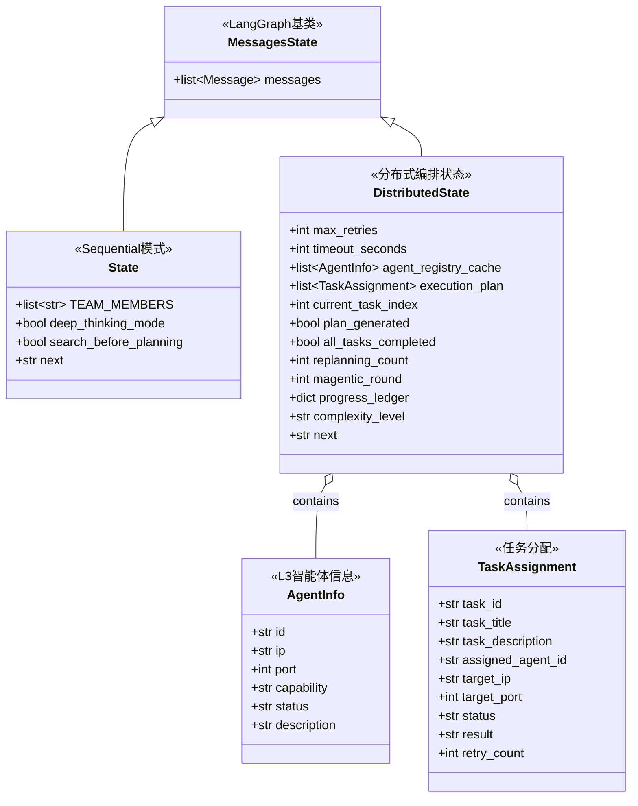

**说明：**
- `MessagesState`: LangGraph 提供的基础状态类，保存消息历史
- `State`: 简单 Sequential 模式使用的状态
- `DistributedState`: 分布式编排的完整状态，支持三种编排模式
- `AgentInfo`: L3 层智能体的注册信息
- `TaskAssignment`: 执行计划中的任务分配

### 2.2 A2A 通信协议类 (Agent-to-Agent Protocol)

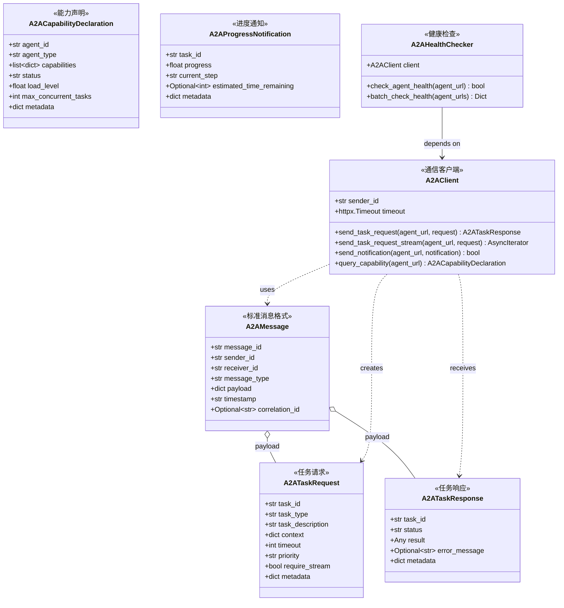

**说明：**
- `A2AMessage`: 所有 Agent 间通信的标准消息包装格式
- `A2ATaskRequest`: L2→L3 的任务请求格式
- `A2ATaskResponse`: L3→L2 的任务响应格式
- `A2AClient`: 实现 A2A 协议的 HTTP 客户端
- 支持流式通信和批量健康检查

### 2.3 智能体注册与发现 (Agent Registry & Discovery)

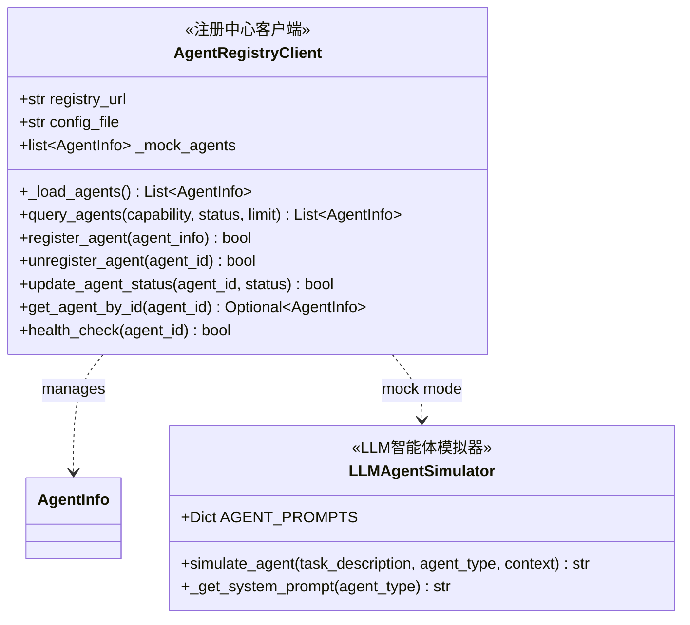

**说明：**
- `AgentRegistryClient`: 智能体注册中心的客户端
  - 支持配置文件模式和 Mock 模式
- `LLMAgentSimulator`: 使用真实 LLM 模拟各类智能体行为

### 2.4 Progress Ledger (Magentic-One 核心)

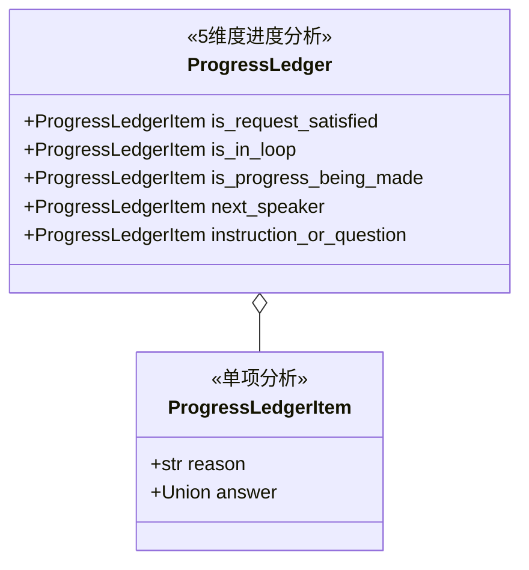

**说明：**
- Magentic-One 编排模式的核心组件
- 每轮生成 5 个维度的分析：
  1. **is_request_satisfied**: 任务是否完成
  2. **is_in_loop**: 是否陷入循环
  3. **is_progress_being_made**: 是否有进展
  4. **next_speaker**: 下一个发言者
  5. **instruction_or_question**: 具体指令

### 2.5 编排执行器 (Orchestration Executors)

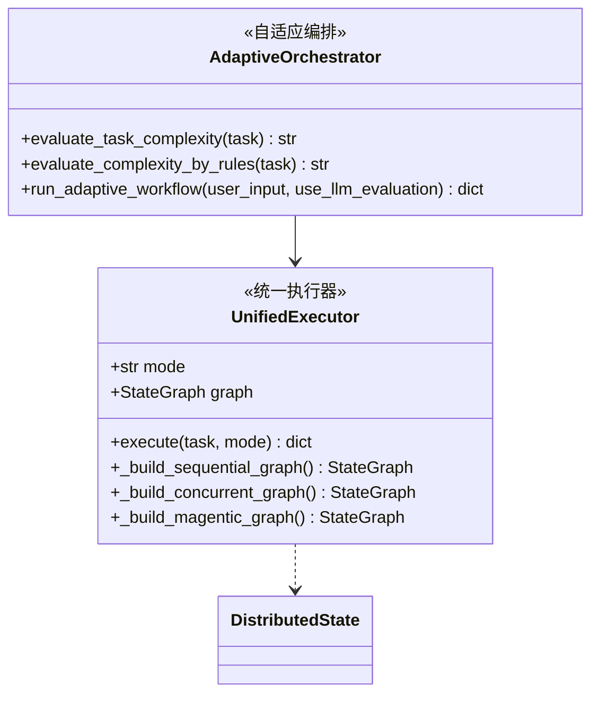

**说明：**
- `UnifiedExecutor`: 统一的编排执行器
  - Sequential: 线性执行，2 次 LLM 调用
  - Concurrent: 并行执行，中等 LLM 开销
  - Magentic-One: 反馈循环，动态智能体选择
- `AdaptiveOrchestrator`: 自适应选择编排模式
  - 支持 LLM 评估（精确但慢）
  - 支持规则评估（快速但粗糙）

### 2.6 MCP 服务集成 (Model Context Protocol)

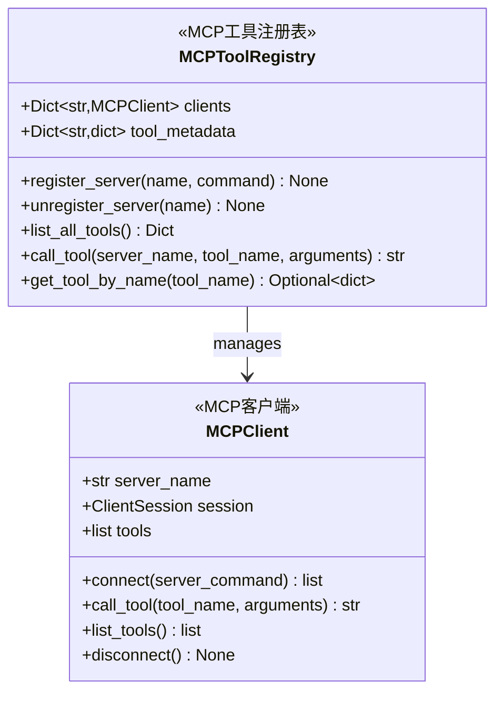

**说明：**
- 支持通过 MCP 协议集成外部工具服务器
- 动态加载和调用 MCP 工具
- 示例：Brave Search、Filesystem、Puppeteer 等

### 2.7 内置工具 (Built-in Tools)

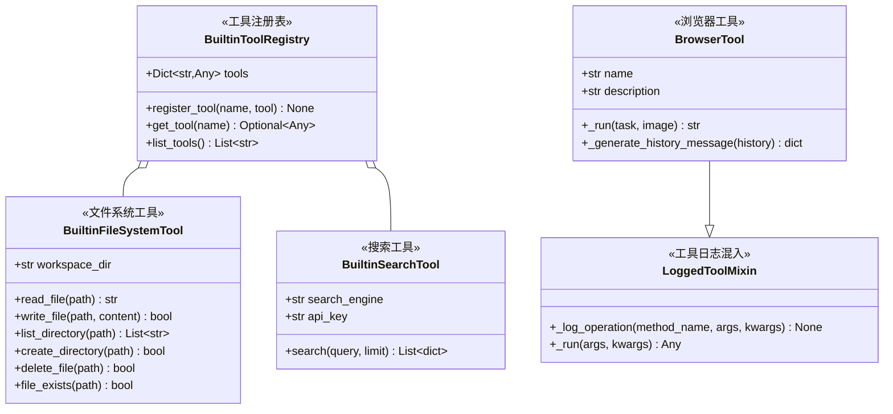

**说明：**
- L1 层本地工具，直接在 L2 编排器内执行
- 包括：bash、python_repl、search、crawl、browser、file_management
- 使用装饰器模式支持日志记录

### 2.8 API 层 (FastAPI)

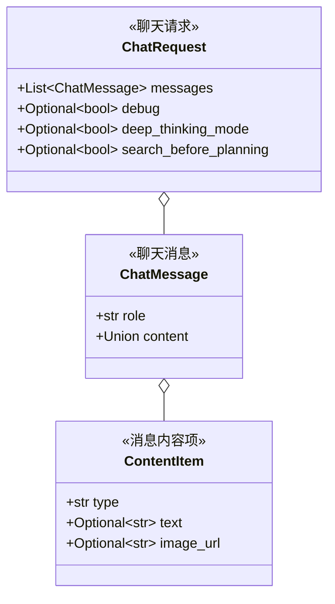

**说明：**
- 提供 `/api/chat/stream` SSE 流式接口
- 支持文本和图像的多模态输入
- 实时返回智能体执行事件

### 2.9 爬虫工具 (Crawler)

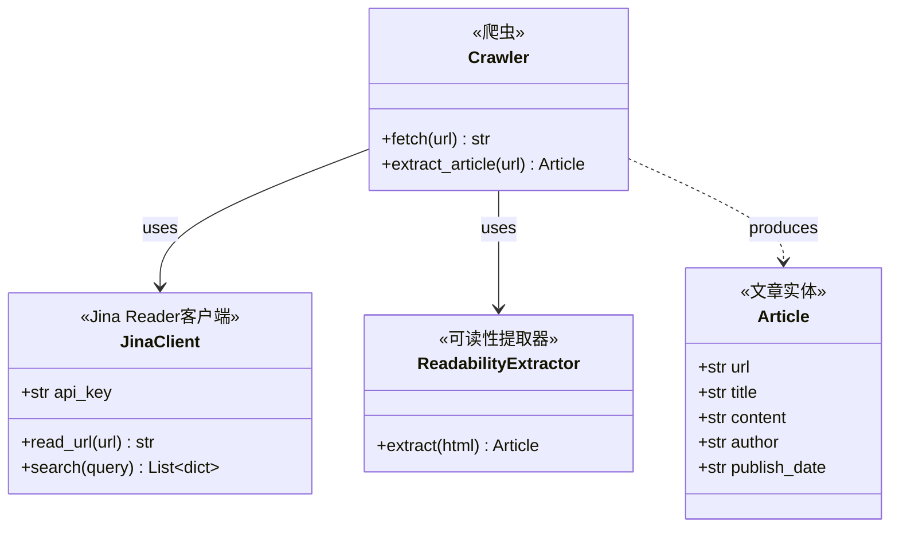

**说明：**
- 支持网页内容抓取和清洗
- 集成 Jina Reader API（r.jina.ai）
- 使用 Readability 算法提取主要内容

## 3. 编排模式对比

| 模式 | 适用场景 | LLM调用 | 执行方式 | 智能体选择 |
|------|---------|---------|---------|-----------|
| **Sequential** | 简单任务 | 2次 | 线性串行 | 预定义计划 |
| **Concurrent** | 中等任务 | 中等 | 并行执行 | 预定义计划 |
| **Magentic-One** | 复杂任务 | 多次 | 反馈循环 | 动态选择（Progress Ledger）|

### 3.1 Sequential 模式

```text
用户请求 → Planner → Executor(任务1) → Executor(任务2) → ... → Reporter → 结果
```

### 3.2 Concurrent 模式

```text
用户请求 → Planner → [Executor(任务1), Executor(任务2), ...] 并行 → Reporter → 结果
```

### 3.3 Magentic-One 模式

```text
用户请求 → Planner(初始化) ──┐
                              │
                              ↓
                     Orchestrator(生成Progress Ledger)
                              ↓
                     ┌────────┴────────┐
                     │                 │
                     ↓                 ↓
              已完成？            未完成？
                     │                 │
                     ↓                 ↓
                 Reporter       Executor → Orchestrator (循环)
                     │
                     ↓
                   结果
```

## 4. 数据流图

### 4.1 分布式任务执行流程

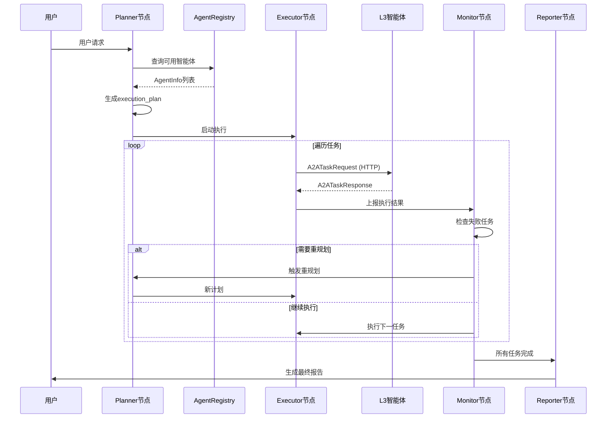

### 4.2 Magentic-One 动态编排流程

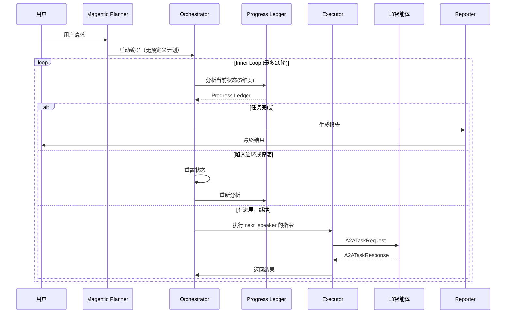

## 5. 关键设计模式

### 5.1 策略模式 (Strategy Pattern)
- `UnifiedExecutor` 根据 `mode` 选择不同的编排策略
- 三种编排模式封装为不同的 Graph 构建方法

### 5.2 工厂模式 (Factory Pattern)
- `get_llm_by_type()`: 根据类型创建不同的 LLM 实例
- `create_logged_tool()`: 动态创建带日志的工具类

### 5.3 注册表模式 (Registry Pattern)
- `AgentRegistryClient`: 智能体注册与发现
- `MCPToolRegistry`: MCP 工具注册
- `BuiltinToolRegistry`: 内置工具注册

### 5.4 命令模式 (Command Pattern)
- LangGraph 使用 `Command(goto=...)` 实现动态路由
- 节点返回命令而非直接修改状态

### 5.5 适配器模式 (Adapter Pattern)
- `A2AClient`: 将 HTTP 请求适配为标准的 A2A 协议
- `MCPClient`: 将 stdio 通信适配为统一的工具调用接口

### 5.6 混入模式 (Mixin Pattern)
- `LoggedToolMixin`: 为任何工具类添加日志功能
- 不侵入原有工具代码

## 6. 扩展点

### 6.1 添加新的 L3 智能体
1. 在 `config/agent_registry.json` 中注册
2. 实现 A2A 协议的 HTTP 接口
3. 声明 `capability` 和 `description`

### 6.2 添加新的 L1 工具
1. 在 `src/tools/` 创建工具文件
2. 使用 `@log_io` 装饰器
3. 在 `src/tools/__init__.py` 导出
4. 在 `src/config/agents.py` 配置到智能体

### 6.3 添加新的编排模式
1. 在 `src/graph/` 创建新的 builder
2. 实现对应的节点逻辑
3. 在 `UnifiedExecutor` 中注册

### 6.4 集成新的 MCP 服务器
1. 安装 MCP 服务器（npm 或 pip）
2. 在代码中调用 `MCPToolRegistry.register_server()`
3. 工具自动可用

## 7. 文件-类映射表

| 文件路径 | 主要类 | 用途 |
|---------|--------|------|
| `src/graph/distributed_types.py` | `DistributedState`, `AgentInfo`, `TaskAssignment` | 状态定义 |
| `src/protocols/a2a_protocol.py` | `A2AMessage`, `A2ATaskRequest`, `A2ATaskResponse` | A2A协议 |
| `src/service/agent_registry.py` | `AgentRegistryClient` | 智能体注册 |
| `src/service/a2a_client.py` | `A2AClient`, `A2AHealthChecker` | A2A通信 |
| `src/service/llm_agent_simulator.py` | `LLMAgentSimulator` | LLM模拟器 |
| `src/service/mcp_client.py` | `MCPClient`, `MCPToolRegistry` | MCP集成 |
| `src/graph/adaptive_orchestrator.py` | `AdaptiveOrchestrator` | 自适应编排 |
| `src/graph/unified_executor.py` | `UnifiedExecutor` | 统一执行器 |
| `src/graph/progress_ledger.py` | `ProgressLedger`, `ProgressLedgerItem` | 进度追踪 |
| `src/graph/magentic_nodes.py` | N/A (节点函数) | Magentic-One节点 |
| `src/graph/distributed_nodes.py` | N/A (节点函数) | 分布式节点 |
| `src/api/app.py` | `ChatRequest`, `ChatMessage`, `ContentItem` | FastAPI接口 |
| `src/tools/browser.py` | `BrowserTool` | 浏览器工具 |
| `src/crawler/crawler.py` | `Crawler`, `Article` | 网页爬虫 |

## 8. 配置文件说明

### 8.1 agent_registry.json
```json
{
  "agents": [
    {
      "id": "search_agent_001",
      "ip": "192.168.1.100",
      "port": 8080,
      "capability": "search",
      "status": "online",
      "description": "专业搜索智能体",
      "enabled": true
    }
  ]
}
```

### 8.2 .env
```bash
# LLM 配置
REASONING_MODEL=qwq-plus
BASIC_MODEL=qwen-flash
VL_MODEL=qwen2.5-vl-72b

# Agent Registry
AGENT_REGISTRY_CONFIG=config/agent_registry.json

# LLM Simulator
USE_LLM_SIMULATOR=true
LLM_SIMULATOR_MODEL=basic
```

## 9. 性能考虑

### 9.1 复杂度评估
- LLM 评估：~0.001元/次，500ms
- 规则评估：免费，<1ms，~85% 准确率

### 9.2 并发控制
- L3 智能体：支持声明 `max_concurrent_tasks`
- A2AClient：使用 `httpx.AsyncClient` 池化

## 10. 总结

LangManus 是一个三层架构的分布式智能体编排系统：

1. **应用管理层**：管理应用生命周期和智能体仓库
2. **编排层**：实现自适应编排、A2A 通信、智能体注册发现
3. **运行层**：执行本地工具（L1）、协调本地执行（L2）、调用远程智能体（L3）

核心特性：
- ✅ 自适应编排模式选择（Simple/Medium/Complex）
- ✅ Magentic-One 反馈循环与动态智能体选择
- ✅ 标准化 A2A 协议（L2↔L3, L3↔L3）
- ✅ MCP 协议集成（外部工具服务器）
- ✅ 混合编排（规则 + LLM 重规划）
- ✅ 流式 API 接口（SSE）

下一步改进：
- [ ] 替换 Mock Registry 为真实的 etcd/Consul
- [ ] 实现真实的 L3 智能体 HTTP 调用
- [ ] 添加分布式追踪（OpenTelemetry）
- [ ] 支持跨边缘设备编排
