# LangManus 系统接口与代码映射文档

---

## 📑 目录

- [一、系统架构总览](#一系统架构总览)
  - [1.1 三层架构图](#11-三层架构图)
  - [1.2 关键入口文件](#12-关键入口文件)
- [二、代码架构图](#二代码架构图)
  - [2.1 源码目录结构](#21-源码目录结构)
  - [2.2 模块依赖关系](#22-模块依赖关系)
- [三、核心类关系图](#三核心类关系图)
  - [3.1 状态管理与数据模型](#31-状态管理与数据模型)
  - [3.2 编排执行层](#32-编排执行层)
  - [3.3 服务与运行时层](#33-服务与运行时层)
- [四、应用管理层接口流程](#四应用管理层接口流程)
  - [4.1 安装/卸载应用](#41-安装卸载应用)
  - [4.2 启动应用](#42-启动应用)
  - [4.3 停止应用](#43-停止应用)
  - [4.4 交互呈现](#44-交互呈现)
- [五、智能体编排层接口流程](#五智能体编排层接口流程)
  - [5.1 智能体发现（ARDC Gossip）](#51-智能体发现ardc-gossip)
  - [5.2 单主体工作流编排](#52-单主体工作流编排)
  - [5.3 跨主体工作流编排](#53-跨主体工作流编排)
  - [5.4 跨主体重编排（Agent 失效）](#54-跨主体重编排agent-失效)
  - [5.5 工作流停止编排](#55-工作流停止编排)
- [六、智能体运行层接口流程](#六智能体运行层接口流程)
  - [6.1 智能体部署与调用](#61-智能体部署与调用)
  - [6.2 业务-资源智能体协同](#62-业务-资源智能体协同)
- [七、HTTP API 接口一览](#七http-api-接口一览)
  - [7.1 主服务接口（端口 8000）](#71-主服务接口端口-8000)
  - [7.2 Agent 节点接口（端口 9000+）](#72-agent-节点接口端口-9000)
- [八、跨层端到端数据流](#八跨层端到端数据流)
- [九、DistributedState 全字段说明](#九distributedstate-全字段说明)
- [十、设计模式与扩展点](#十设计模式与扩展点)
- [十一、骨架/Mock 区域说明](#十一骨架mock-区域说明)
- [附录：文件-类速查表](#附录文件-类速查表)

---

## 一、系统架构总览

### 1.1 三层架构图


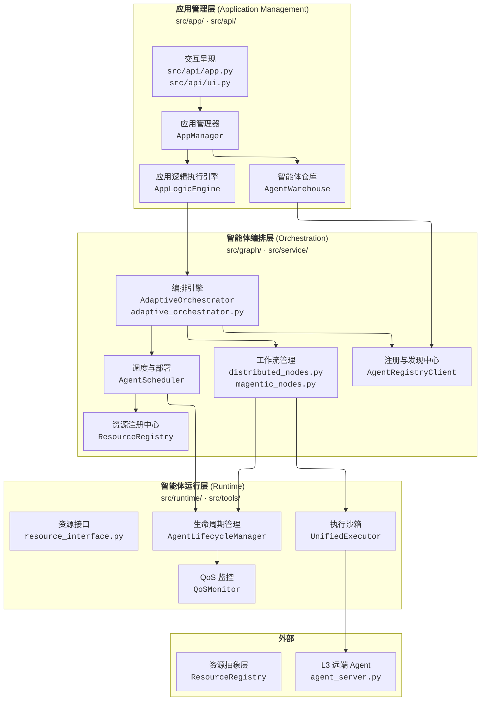
```mermaid
---
config:
  layout: elk
  theme: default
---
graph TB
    subgraph APP["<b>应用管理层</b> (Application Management)<br>src/app/ · src/api/"]
        APPM["应用管理器<br><code>AppManager</code>"]
        ALRE["应用逻辑执行引擎<br><code>AppLogicEngine</code>"]
        AW["智能体仓库<br><code>AgentWarehouse</code>"]
        DISP["交互呈现<br><code>src/api/app.py</code><br><code>src/api/ui.py</code>"]
    end

    subgraph ORCH["<b>智能体编排层</b> (Orchestration)<br>src/graph/ · src/service/"]
        AOE["编排引擎<br><code>AdaptiveOrchestrator</code><br><code>adaptive_orchestrator.py</code>"]
        AWM["工作流管理<br><code>distributed_nodes.py</code><br><code>magentic_nodes.py</code>"]
        ASD["调度与部署<br><code>AgentScheduler</code>"]
        ARDC["注册与发现中心<br><code>AgentRegistryClient</code>"]
        RRDC["资源注册中心<br><code>ResourceRegistry</code>"]
    end

    subgraph RUN["<b>智能体运行层</b> (Runtime)<br>src/runtime/ · src/tools/"]
        ALCM["生命周期管理<br><code>AgentLifecycleManager</code>"]
        QOS["QoS 监控<br><code>QoSMonitor</code>"]
        SBOX["执行沙箱<br><code>UnifiedExecutor</code>"]
        INTF["资源接口<br><code>resource_interface.py</code>"]
    end

    subgraph EXTERNAL["<b>外部</b>"]
        L3["L3 远端 Agent<br><code>agent_server.py</code>"]
        RES["资源抽象层<br><code>ResourceRegistry</code>"]
    end

    APPM --> ALRE
    APPM --> AW
    ALRE --> AOE
    AOE --> ARDC
    AOE --> ASD
    AOE --> AWM
    AWM --> ALCM
    AWM --> SBOX
    ASD --> RRDC
    ASD --> ALCM
    ALCM --> QOS
    SBOX --> L3
    AW --> ARDC
    DISP --> APPM
```

### 1.2 关键入口文件

| 入口 | 文件 | 用途 | 启动命令 |
|------|------|------|----------|
| 主 API 服务 | `server.py` | FastAPI 应用，端口 8000 | `python server.py` |
| Agent 节点服务 | `agent_server.py` | L3 Agent 节点，端口可配置 | `python agent_server.py 9000` |
| CLI 入口 | `distributed_main.py` | 命令行自适应工作流 | `python distributed_main.py "query"` |
| 演示模式 | `server.py` | 含 Demo UI | `DEMO_MODE=1 python server.py` |

---

## 二、代码架构图

### 2.1 源码目录结构

```text
src/
├── api/                    # HTTP API 层（FastAPI 路由、Web UI）
│   ├── app.py              # 所有 HTTP 路由定义
│   ├── ui.py               # 应用管理 Web UI 页面
│   └── demo_ui.py          # 车辆协同感知 Demo UI
│
├── app/                    # 应用管理层（APP）
│   ├── app_manager.py      # AppManager — 应用生命周期管理
│   ├── app_logic_engine.py # AppLogicEngine — 工作流启停逻辑
│   ├── agent_warehouse.py  # AgentWarehouse — 智能体镜像仓库（⚠️ 骨架）
│   ├── models.py           # AppInfo / AgentImage / GuidanceFile 数据模型
│   ├── pipeline_parser.py  # PipelineParser — Skills.md 中 Pipeline 解析
│   └── display.py          # CLI 显示工具
│
├── graph/                  # 智能体编排层核心（Orchestration）
│   ├── distributed_types.py       # DistributedState / AgentInfo / TaskAssignment 类型定义
│   ├── adaptive_orchestrator.py   # 自适应编排入口：复杂度评估 + 模式选择
│   ├── distributed_builder.py     # 分布式图构建：Planner→Executor→Monitor→Reporter
│   ├── distributed_nodes.py       # 分布式节点函数：planner/executor/monitor/reporter + 跨主体分发
│   ├── magentic_builder.py        # Magentic-One 图构建：Planner→Orchestrator⇄Executor→Reporter
│   ├── magentic_nodes.py          # Magentic-One 节点函数：planner/orchestrator/executor/reporter
│   ├── progress_ledger.py         # Progress Ledger：5 维度任务进度分析
│   ├── unified_executor.py        # UnifiedExecutor — 统一任务执行（MCP/Builtin/A2A 路由）
│   ├── builder.py                 # 简单 Sequential 图构建（旧版）
│   └── types.py                   # 旧版 State 类型
│
├── service/                # 支撑服务层
│   ├── agent_registry.py   # AgentRegistryClient — ARDC 注册/发现/Gossip
│   ├── agent_scheduler.py  # AgentScheduler — ASD 进程管理
│   ├── agent_hnsw_index.py # AgentHNSWIndex — HNSW 向量索引
│   ├── resource_registry.py# ResourceRegistry — RRDC 资源管理（⚠️ 骨架）
│   ├── a2a_client.py       # A2AClient — Agent-to-Agent HTTP 客户端
│   ├── llm_agent_simulator.py # LLMAgentSimulator — LLM 模拟 Agent 行为
│   ├── mcp_client.py       # MCPClient — MCP 协议集成
│   ├── builtin_tools.py    # 内置工具注册表
│   ├── workflow_service.py  # 工作流执行服务
│   ├── message_router.py   # MessageRouter — 消息路由（⚠️ 未完整实现）
│   └── demo_bus.py         # DemoEventBus — 演示事件总线
│
├── runtime/                # 智能体运行层
│   ├── lifecycle_manager.py # AgentLifecycleManager — ALCM 部署/订阅/引用计数
│   ├── qos_monitor.py      # QoSMonitor — QoS 监控/告警/回调
│   ├── models.py           # AgentInstance / ResourceConfig 运行时模型
│   └── resource_interface.py# 传感器/执行器接口（⚠️ Mock）
│
├── tools/                  # L1 本地工具
│   ├── bash_tool.py        # Bash 命令执行
│   ├── python_repl.py      # Python REPL
│   ├── search.py           # 搜索工具（Tavily）
│   ├── crawl.py            # 网页爬取
│   ├── browser.py          # 浏览器自动化
│   ├── file_management.py  # 文件操作
│   └── decorators.py       # @log_io 工具装饰器
│
├── config/                 # 配置管理
│   ├── env.py              # 环境变量 + LLM 三模型配置
│   ├── agents.py           # Agent 工厂定义
│   └── tools.py            # 工具配置
│
├── protocols/              # 通信协议定义
    └── a2a_protocol.py     # A2A 消息/请求/响应/能力声明 
```

### 2.2 模块依赖关系

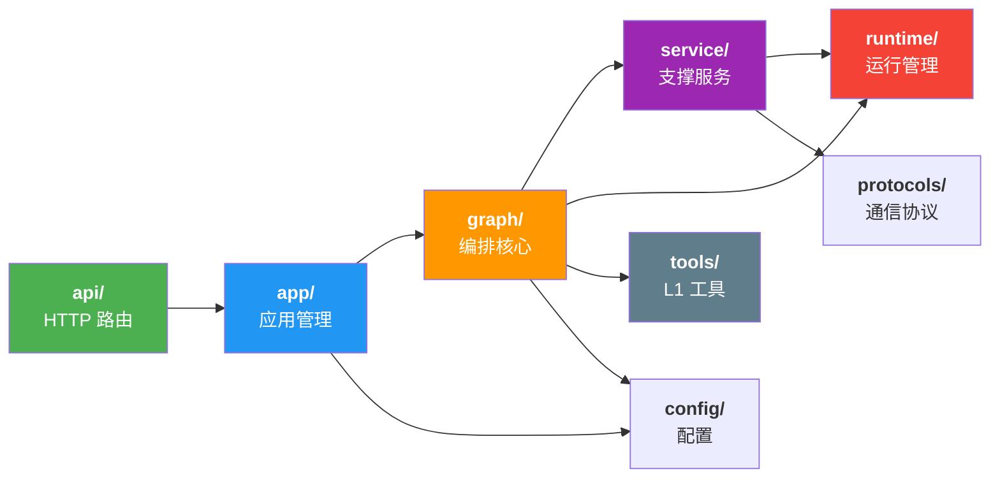
```mermaid
graph LR
    API["<b>api/</b><br>HTTP 路由"] --> APP["<b>app/</b><br>应用管理"]
    APP --> GRAPH["<b>graph/</b><br>编排核心"]
    GRAPH --> SERVICE["<b>service/</b><br>支撑服务"]
    GRAPH --> RUNTIME["<b>runtime/</b><br>运行管理"]
    SERVICE --> RUNTIME
    GRAPH --> TOOLS["<b>tools/</b><br>L1 工具"]
    SERVICE --> PROTOCOLS["<b>protocols/</b><br>通信协议"]
    APP --> CONFIG["<b>config/</b><br>配置"]
    GRAPH --> CONFIG

    style API fill:#4CAF50,color:white
    style APP fill:#2196F3,color:white
    style GRAPH fill:#FF9800,color:white
    style SERVICE fill:#9C27B0,color:white
    style RUNTIME fill:#F44336,color:white
    style TOOLS fill:#607D8B,color:white
```

**依赖方向**：`api/` → `app/` → `graph/` → `service/` + `runtime/` → `tools/` + `protocols/`

---

## 三、核心类关系图

### 3.1 状态管理与数据模型

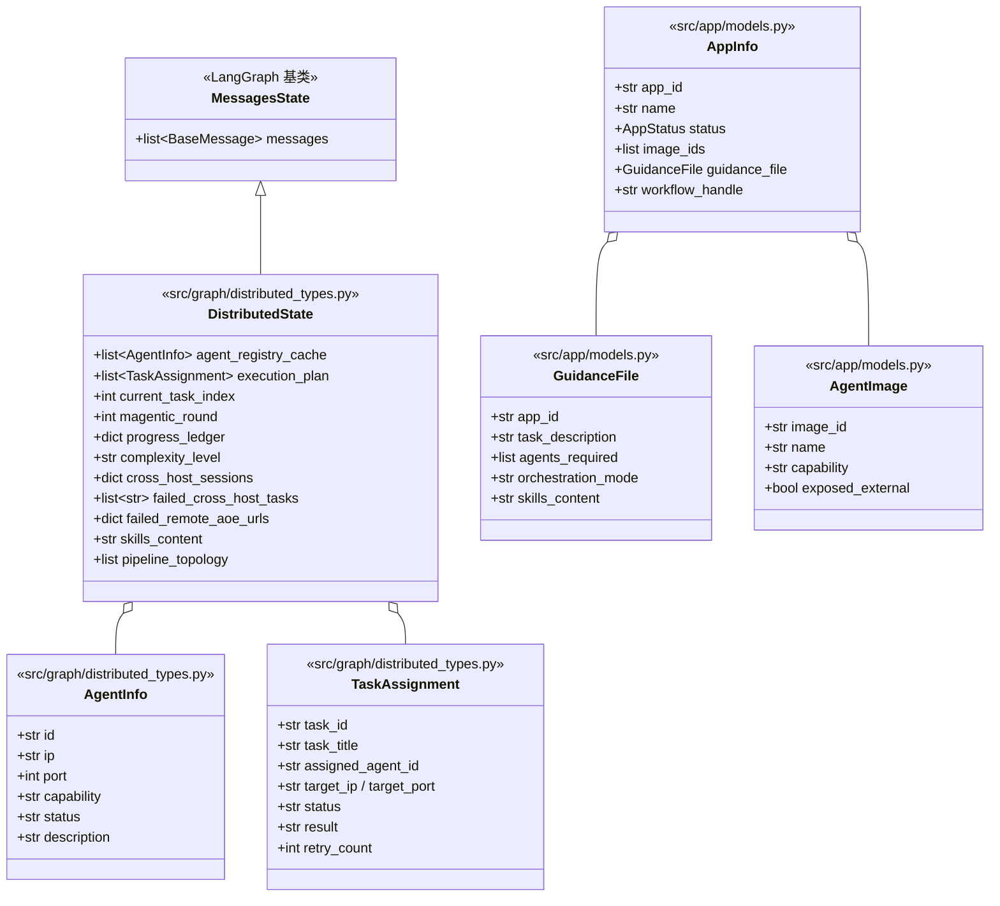
```mermaid
classDiagram
    class MessagesState {
        <<LangGraph 基类>>
        +list~BaseMessage~ messages
    }

    class DistributedState {
        <<src/graph/distributed_types.py>>
        +list~AgentInfo~ agent_registry_cache
        +list~TaskAssignment~ execution_plan
        +int current_task_index
        +int magentic_round
        +dict progress_ledger
        +str complexity_level
        +dict cross_host_sessions
        +list~str~ failed_cross_host_tasks
        +dict failed_remote_aoe_urls
        +str skills_content
        +list pipeline_topology
    }

    class AgentInfo {
        <<src/graph/distributed_types.py>>
        +str id
        +str ip
        +int port
        +str capability
        +str status
        +str description
    }

    class TaskAssignment {
        <<src/graph/distributed_types.py>>
        +str task_id
        +str task_title
        +str assigned_agent_id
        +str target_ip / target_port
        +str status
        +str result
        +int retry_count
    }

    class AppInfo {
        <<src/app/models.py>>
        +str app_id
        +str name
        +AppStatus status
        +list image_ids
        +GuidanceFile guidance_file
        +str workflow_handle
    }

    class GuidanceFile {
        <<src/app/models.py>>
        +str app_id
        +str task_description
        +list agents_required
        +str orchestration_mode
        +str skills_content
    }

    class AgentImage {
        <<src/app/models.py>>
        +str image_id
        +str name
        +str capability
        +bool exposed_external
    }

    MessagesState <|-- DistributedState
    DistributedState o-- AgentInfo
    DistributedState o-- TaskAssignment
    AppInfo o-- GuidanceFile
    AppInfo o-- AgentImage
```

### 3.2 编排执行层

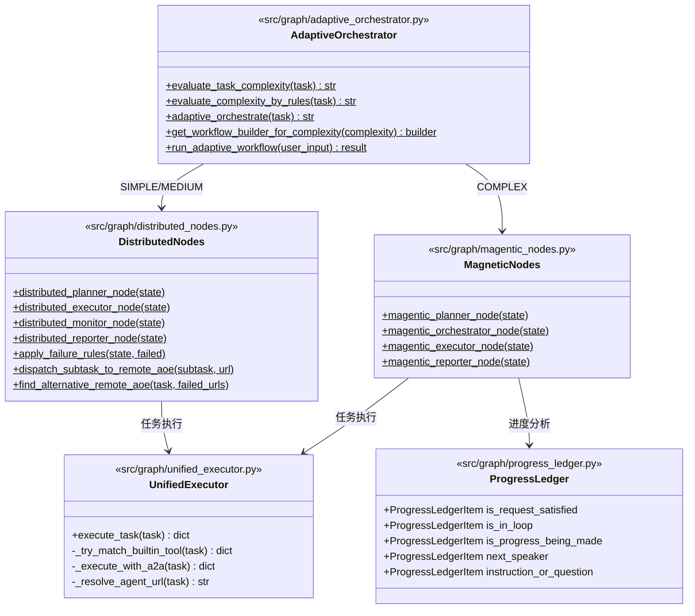
```mermaid
classDiagram
    class AdaptiveOrchestrator {
        <<src/graph/adaptive_orchestrator.py>>
        +evaluate_task_complexity(task)$ str
        +evaluate_complexity_by_rules(task)$ str
        +adaptive_orchestrate(task)$ str
        +get_workflow_builder_for_complexity(complexity)$ builder
        +run_adaptive_workflow(user_input)$ result
    }

    class UnifiedExecutor {
        <<src/graph/unified_executor.py>>
        +execute_task(task) dict
        -_try_match_builtin_tool(task) dict
        -_execute_with_a2a(task) dict
        -_resolve_agent_url(task) str
    }

    class ProgressLedger {
        <<src/graph/progress_ledger.py>>
        +ProgressLedgerItem is_request_satisfied
        +ProgressLedgerItem is_in_loop
        +ProgressLedgerItem is_progress_being_made
        +ProgressLedgerItem next_speaker
        +ProgressLedgerItem instruction_or_question
    }

    class DistributedNodes {
        <<src/graph/distributed_nodes.py>>
        +distributed_planner_node(state)$
        +distributed_executor_node(state)$
        +distributed_monitor_node(state)$
        +distributed_reporter_node(state)$
        +apply_failure_rules(state, failed)$
        +dispatch_subtask_to_remote_aoe(subtask, url)$
        +find_alternative_remote_aoe(task, failed_urls)$
    }

    class MagneticNodes {
        <<src/graph/magentic_nodes.py>>
        +magentic_planner_node(state)$
        +magentic_orchestrator_node(state)$
        +magentic_executor_node(state)$
        +magentic_reporter_node(state)$
    }

    AdaptiveOrchestrator --> DistributedNodes : SIMPLE/MEDIUM
    AdaptiveOrchestrator --> MagneticNodes : COMPLEX
    DistributedNodes --> UnifiedExecutor : 任务执行
    MagneticNodes --> UnifiedExecutor : 任务执行
    MagneticNodes --> ProgressLedger : 进度分析
```

### 3.3 服务与运行时层

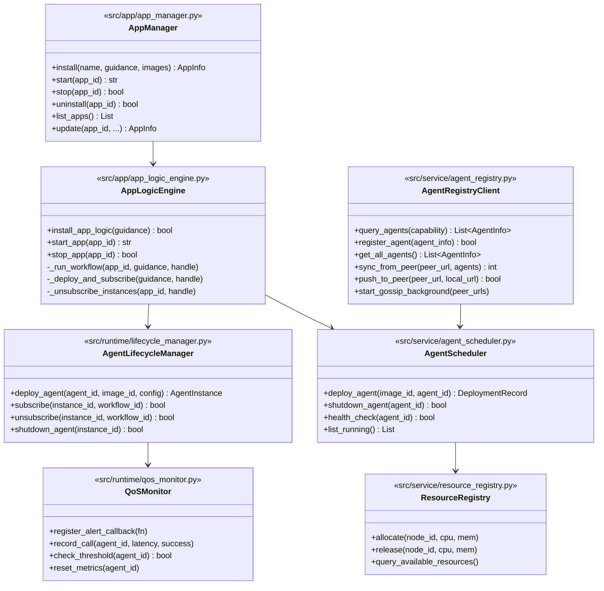
```mermaid
classDiagram
    class AppManager {
        <<src/app/app_manager.py>>
        +install(name, guidance, images) AppInfo
        +start(app_id) str
        +stop(app_id) bool
        +uninstall(app_id) bool
        +list_apps() List
        +update(app_id, ...) AppInfo
    }

    class AppLogicEngine {
        <<src/app/app_logic_engine.py>>
        +install_app_logic(guidance) bool
        +start_app(app_id) str
        +stop_app(app_id) bool
        -_run_workflow(app_id, guidance, handle)
        -_deploy_and_subscribe(guidance, handle)
        -_unsubscribe_instances(app_id, handle)
    }

    class AgentRegistryClient {
        <<src/service/agent_registry.py>>
        +query_agents(capability) List~AgentInfo~
        +register_agent(agent_info) bool
        +get_all_agents() List~AgentInfo~
        +sync_from_peer(peer_url, agents) int
        +push_to_peer(peer_url, local_url) bool
        +start_gossip_background(peer_urls)
    }

    class AgentScheduler {
        <<src/service/agent_scheduler.py>>
        +deploy_agent(image_id, agent_id) DeploymentRecord
        +shutdown_agent(agent_id) bool
        +health_check(agent_id) bool
        +list_running() List
    }

    class AgentLifecycleManager {
        <<src/runtime/lifecycle_manager.py>>
        +deploy_agent(agent_id, image_id, config) AgentInstance
        +subscribe(instance_id, workflow_id) bool
        +unsubscribe(instance_id, workflow_id) bool
        +shutdown_agent(instance_id) bool
    }

    class QoSMonitor {
        <<src/runtime/qos_monitor.py>>
        +register_alert_callback(fn)
        +record_call(agent_id, latency, success)
        +check_threshold(agent_id) bool
        +reset_metrics(agent_id)
    }

    class ResourceRegistry {
        <<src/service/resource_registry.py>>
        +allocate(node_id, cpu, mem)
        +release(node_id, cpu, mem)
        +query_available_resources()
    }

    AppManager --> AppLogicEngine
    AppLogicEngine --> AgentLifecycleManager
    AppLogicEngine --> AgentScheduler
    AgentScheduler --> ResourceRegistry
    AgentLifecycleManager --> QoSMonitor
    AgentRegistryClient --> AgentScheduler
```

---

## 四、应用管理层接口流程

### 4.1 安装/卸载应用

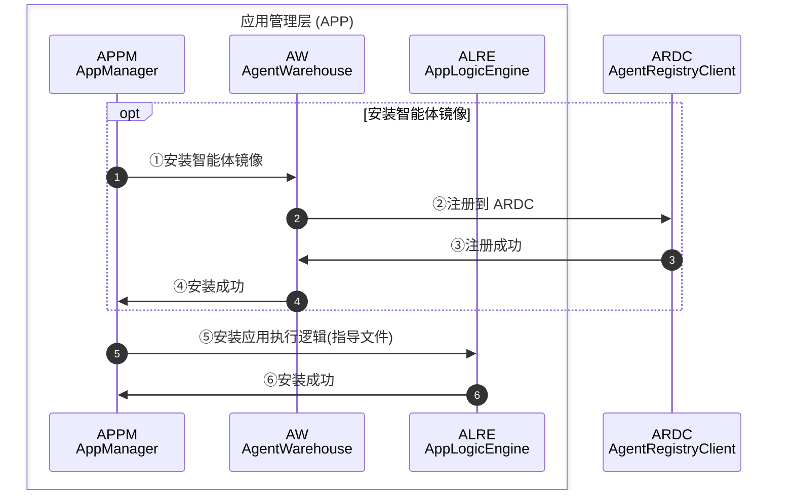
```mermaid
sequenceDiagram
    autonumber
    box 应用管理层 (APP)
        participant APPM as APPM<br>AppManager
        participant AW as AW<br>AgentWarehouse
        participant ALRE as ALRE<br>AppLogicEngine
    end
    participant ARDC as ARDC<br>AgentRegistryClient

    opt 安装智能体镜像
        APPM->>AW: ①安装智能体镜像
        AW->>ARDC: ②注册到 ARDC
        ARDC->>AW: ③注册成功
        AW->>APPM: ④安装成功
    end
    APPM->>ALRE: ⑤安装应用执行逻辑(指导文件)
    ALRE->>APPM: ⑥安装成功
```

**流程步骤 → 代码映射表**

| 步骤 | 动作 | 文件路径 | 类/函数 | 说明 |
|------|------|----------|---------|------|
| ① | APPM 安装智能体镜像 | `src/app/app_manager.py` | `AppManager.install()` L82 | 遍历 images 调用 warehouse |
| ① | AW 安装镜像 | `src/app/agent_warehouse.py` | `AgentWarehouse.install_agent()` L50 | 存储镜像元数据 |
| ② | AW 注册到 ARDC | `src/app/agent_warehouse.py` | `AgentWarehouse._register_to_ardc()` L122 | ⚠️ 骨架：调用 `AgentRegistryClient.register_agent()` |
| ③ | ARDC 注册确认 | `src/service/agent_registry.py` | `AgentRegistryClient.register_agent()` L356 | 添加到内存 agent 列表 |
| ⑤ | APPM 安装应用逻辑 | `src/app/app_manager.py` | `AppManager.install()` L82 → 内部调用 `engine.install_app_logic()` | 创建 AppInfo + GuidanceFile |
| ⑤ | ALRE 存储指导文件 | `src/app/app_logic_engine.py` | `AppLogicEngine.install_app_logic()` L47 | 存储编排指导文件到内存 |
| HTTP | 对外安装接口 | `src/api/app.py` | `install_app()` L250 | `POST /api/apps/install` |
| HTTP | 对外卸载接口 | `src/api/app.py` | `uninstall_app()` L343 | `DELETE /api/apps/{app_id}` |

**卸载流程**镜像对称：`AppManager.uninstall()` L132 → `AppLogicEngine.uninstall_app_logic()` L70 → `AgentWarehouse.uninstall_agent()` L84 → `AgentWarehouse._deregister_from_ardc()` L152

---

### 4.2 启动应用

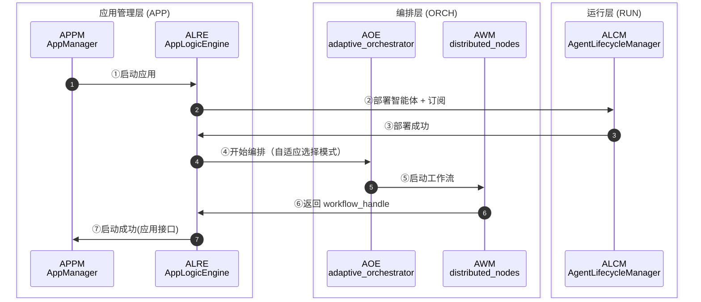
```mermaid
sequenceDiagram
    autonumber
    box 应用管理层 (APP)
        participant APPM as APPM<br>AppManager
        participant ALRE as ALRE<br>AppLogicEngine
    end
    box 编排层 (ORCH)
        participant AOE as AOE<br>adaptive_orchestrator
        participant AWM as AWM<br>distributed_nodes
    end
    box 运行层 (RUN)
        participant ALCM as ALCM<br>AgentLifecycleManager
    end

    APPM->>ALRE: ①启动应用
    ALRE->>ALCM: ②部署智能体 + 订阅
    ALCM->>ALRE: ③部署成功
    ALRE->>AOE: ④开始编排（自适应选择模式）
    AOE->>AWM: ⑤启动工作流
    AWM->>ALRE: ⑥返回 workflow_handle
    ALRE->>APPM: ⑦启动成功(应用接口)
```

**流程步骤 → 代码映射表**

| 步骤 | 动作 | 文件路径 | 类/函数 | 说明 |
|------|------|----------|---------|------|
| ① | APPM 启动应用 | `src/app/app_manager.py` | `AppManager.start()` L172 | 状态 → starting，调用 engine |
| ① | ALRE 启动应用 | `src/app/app_logic_engine.py` | `AppLogicEngine.start_app()` L98 | 创建 asyncio.Task 运行工作流 |
| ② | 部署智能体+订阅 | `src/app/app_logic_engine.py` | `AppLogicEngine._deploy_and_subscribe()` L328 | 调用 ALCM.deploy_agent() + subscribe() |
| ② | ALCM 部署 | `src/runtime/lifecycle_manager.py` | `AgentLifecycleManager.deploy_agent()` L48 | 创建 AgentInstance，⚠️ 内存 mock |
| ② | ALCM 订阅 | `src/runtime/lifecycle_manager.py` | `AgentLifecycleManager.subscribe()` L95 | 引用计数 +1 |
| ④ | 自适应编排 | `src/graph/adaptive_orchestrator.py` | `run_adaptive_workflow()` L173 | 评估复杂度 → 选择图构建器 → 执行 |
| ④ | 复杂度评估（规则） | `src/graph/adaptive_orchestrator.py` | `evaluate_complexity_by_rules()` L77 | 免费，<1ms，~85% 准确 |
| ④ | 复杂度评估（LLM） | `src/graph/adaptive_orchestrator.py` | `evaluate_task_complexity()` L44 | ~0.001 元/次，~500ms |
| ⑤ | 构建分布式图 | `src/graph/distributed_builder.py` | `build_distributed_graph()` L15 | SIMPLE/MEDIUM 模式 |
| ⑤ | 构建 Magentic 图 | `src/graph/magentic_builder.py` | `build_magentic_graph()` L20 | COMPLEX 模式 |
| HTTP | 对外启动接口 | `src/api/app.py` | `start_app()` L284 | `POST /api/apps/{app_id}/start` |

---

### 4.3 停止应用

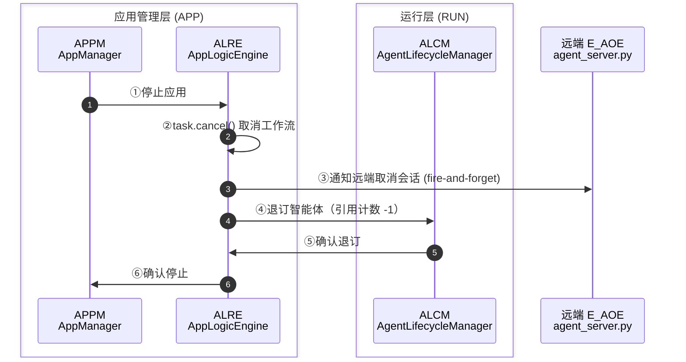
```mermaid
sequenceDiagram
    autonumber
    box 应用管理层 (APP)
        participant APPM as APPM<br>AppManager
        participant ALRE as ALRE<br>AppLogicEngine
    end
    box 运行层 (RUN)
        participant ALCM as ALCM<br>AgentLifecycleManager
    end
    participant REMOTE as 远端 E_AOE<br>agent_server.py

    APPM->>ALRE: ①停止应用
    ALRE->>ALRE: ②task.cancel() 取消工作流
    ALRE->>REMOTE: ③通知远端取消会话 (fire-and-forget)
    ALRE->>ALCM: ④退订智能体（引用计数 -1）
    ALCM->>ALRE: ⑤确认退订
    ALRE->>APPM: ⑥确认停止
```

**流程步骤 → 代码映射表**

| 步骤 | 动作 | 文件路径 | 类/函数 | 说明 |
|------|------|----------|---------|------|
| ① | APPM 停止 | `src/app/app_manager.py` | `AppManager.stop()` L218 | 状态 → stopping |
| ① | ALRE 停止 | `src/app/app_logic_engine.py` | `AppLogicEngine.stop_app()` L155 | `task.cancel()` 取消 asyncio Task |
| ③ | 通知远端取消 | `src/app/app_logic_engine.py` | `_cancel_remote_session()` L434 | `DELETE /orchestration/session/{id}` |
| ③ | 获取活跃远端会话 | `src/graph/distributed_nodes.py` | `get_active_remote_sessions()` L46 | 返回 session_id → remote_url 映射 |
| ④ | 退订智能体 | `src/app/app_logic_engine.py` | `AppLogicEngine._unsubscribe_instances()` L372 | 调用 ALCM.unsubscribe() |
| ④ | ALCM 退订 | `src/runtime/lifecycle_manager.py` | `AgentLifecycleManager.unsubscribe()` L115 | 引用计数 -1，归零自动 shutdown |
| HTTP | 对外停止接口 | `src/api/app.py` | `stop_app()` L319 | `POST /api/apps/{app_id}/stop` |

---

### 4.4 交互呈现

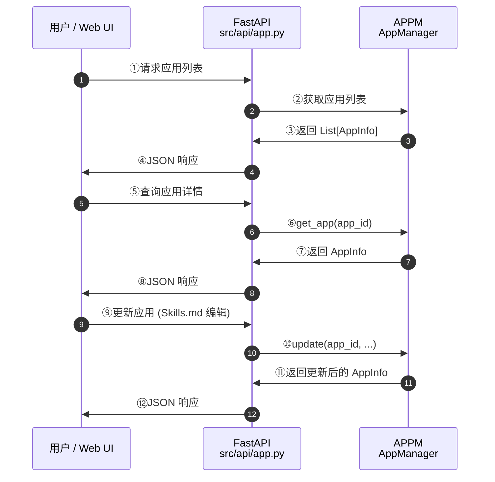
```mermaid
sequenceDiagram
    autonumber
    participant USER as 用户 / Web UI
    participant API as FastAPI<br>src/api/app.py
    participant APPM as APPM<br>AppManager

    USER->>API: ①请求应用列表
    API->>APPM: ②获取应用列表
    APPM->>API: ③返回 List[AppInfo]
    API->>USER: ④JSON 响应

    USER->>API: ⑤查询应用详情
    API->>APPM: ⑥get_app(app_id)
    APPM->>API: ⑦返回 AppInfo
    API->>USER: ⑧JSON 响应

    USER->>API: ⑨更新应用 (Skills.md 编辑)
    API->>APPM: ⑩update(app_id, ...)
    APPM->>API: ⑪返回更新后的 AppInfo
    API->>USER: ⑫JSON 响应
```

**流程步骤 → 代码映射表**

| 步骤 | 动作 | 文件路径 | 类/函数 | HTTP 接口 |
|------|------|----------|---------|-----------|
| ①② | 应用列表 | `src/api/app.py` | `list_apps()` L206 | `GET /api/apps/` |
| ①② | 运行中列表 | `src/api/app.py` | `list_running_apps()` L220 | `GET /api/apps/running` |
| ⑤⑥ | 查询详情 | `src/api/app.py` | `get_app()` L233 | `GET /api/apps/{app_id}` |
| ⑤⑥ | 应用接口查询 | `src/api/app.py` | `query_app_interface()` L508 | `POST /api/apps/{app_id}/interface` |
| ⑨⑩ | 更新应用 | `src/api/app.py` | `update_app()` L373 | `PATCH /api/apps/{app_id}` |
| — | Web UI 页面 | `src/api/app.py` | `web_ui()` L589 | `GET /ui` |
| — | UI HTML 生成 | `src/api/ui.py` | `get_ui_html()` | Skills.md 内联编辑器 |
| — | 业务逻辑 | `src/app/app_manager.py` | `AppManager.update()` L280 | 更新 name/skills/mode 等 |

---

## 五、智能体编排层接口流程

### 5.1 智能体发现（ARDC Gossip）

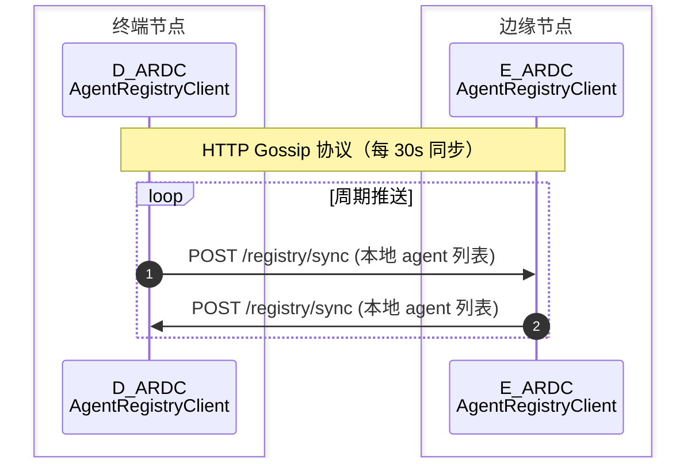
```mermaid
sequenceDiagram
    autonumber
    box 终端节点
        participant D_ARDC as D_ARDC<br>AgentRegistryClient
    end
    box 边缘节点
        participant E_ARDC as E_ARDC<br>AgentRegistryClient
    end

    Note over D_ARDC,E_ARDC: HTTP Gossip 协议（每 30s 同步）
    loop 周期推送
        D_ARDC->>E_ARDC: POST /registry/sync (本地 agent 列表)
        E_ARDC->>D_ARDC: POST /registry/sync (本地 agent 列表)
    end
```

**流程步骤 → 代码映射表**

| 步骤 | 动作 | 文件路径 | 类/函数 | 说明 |
|------|------|----------|---------|------|
| 启动 Gossip | 后台异步任务 | `src/service/agent_registry.py` | `AgentRegistryClient.start_gossip_background()` L345 | 通过 `PEER_AOE_URLS` 环境变量配置 peer 列表 |
| 推送 | 向 peer 推送 | `src/service/agent_registry.py` | `AgentRegistryClient.push_to_peer()` L313 | `httpx.AsyncClient POST /registry/sync` |
| 接收 | 从 peer 同步 | `src/service/agent_registry.py` | `AgentRegistryClient.sync_from_peer()` L278 | 更新 `_peer_agents` 缓存，记录时间戳 |
| 清理 | 过期 peer 清理 | `src/service/agent_registry.py` | `AgentRegistryClient.prune_stale_peers()` L306 | TTL 机制（默认 120s 无更新则清理） |
| 合并 | 全量 Agent 视图 | `src/service/agent_registry.py` | `AgentRegistryClient._merge_all_agents()` L245 | 合并本地 + 所有 peer 的 agents（去重） |
| HTTP | 接收推送的端点 | `src/api/app.py` | `registry_sync()` L53 | `POST /registry/sync`（主服务） |
| HTTP | 接收推送的端点 | `agent_server.py` | `registry_sync()` L173 | `POST /registry/sync`（Agent 节点） |

---

### 5.2 单主体工作流编排

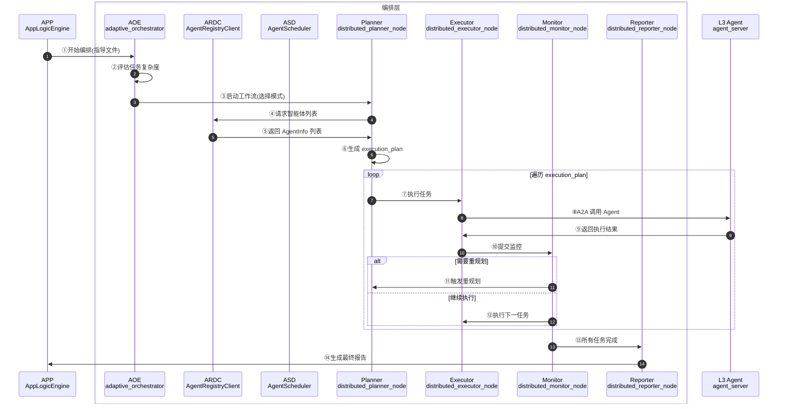
```mermaid
sequenceDiagram
    autonumber
    participant APP as APP<br>AppLogicEngine
    box 编排层
        participant AOE as AOE<br>adaptive_orchestrator
        participant ARDC as ARDC<br>AgentRegistryClient
        participant ASD as ASD<br>AgentScheduler
        participant AWM_P as Planner<br>distributed_planner_node
        participant AWM_E as Executor<br>distributed_executor_node
        participant AWM_M as Monitor<br>distributed_monitor_node
        participant AWM_R as Reporter<br>distributed_reporter_node
    end
    participant L3 as L3 Agent<br>agent_server

    APP->>AOE: ①开始编排(指导文件)
    AOE->>AOE: ②评估任务复杂度
    AOE->>AWM_P: ③启动工作流(选择模式)
    AWM_P->>ARDC: ④请求智能体列表
    ARDC->>AWM_P: ⑤返回 AgentInfo 列表
    AWM_P->>AWM_P: ⑥生成 execution_plan
    
    loop 遍历 execution_plan
        AWM_P->>AWM_E: ⑦执行任务
        AWM_E->>L3: ⑧A2A 调用 Agent
        L3->>AWM_E: ⑨返回执行结果
        AWM_E->>AWM_M: ⑩提交监控
        alt 需要重规划
            AWM_M->>AWM_P: ⑪触发重规划
        else 继续执行
            AWM_M->>AWM_E: ⑫执行下一任务
        end
    end
    
    AWM_M->>AWM_R: ⑬所有任务完成
    AWM_R->>APP: ⑭生成最终报告
```

**流程步骤 → 代码映射表**

| 步骤 | 动作 | 文件路径 | 类/函数 | 说明 |
|------|------|----------|---------|------|
| ① | 开始编排 | `src/graph/adaptive_orchestrator.py` | `run_adaptive_workflow()` L173 | 入口函数 |
| ② | 复杂度评估 | `src/graph/adaptive_orchestrator.py` | `adaptive_orchestrate()` L122 | 选择 LLM 或规则评估 |
| ③ | 选择图构建器 | `src/graph/adaptive_orchestrator.py` | `get_workflow_builder_for_complexity()` L158 | simple/medium → distributed，complex → magentic |
| ③ | 构建分布式图 | `src/graph/distributed_builder.py` | `build_distributed_graph()` L15 | `START → planner → executor → monitor → reporter → END` |
| ④ | 请求智能体列表 | `src/graph/distributed_nodes.py` | `distributed_planner_node()` L272 | 内部调用 `registry.query_agents()` |
| ④ | ARDC 查询 | `src/service/agent_registry.py` | `AgentRegistryClient.query_agents()` L175 | 精确匹配或 HNSW 检索 |
| ⑥ | 生成执行计划 | `src/graph/distributed_nodes.py` | `distributed_planner_node()` L272 | LLM 生成 List[TaskAssignment] |
| ⑦⑧ | 执行任务 | `src/graph/distributed_nodes.py` | `distributed_executor_node()` L850 | 调用 `UnifiedExecutor.execute_task()` |
| ⑧ | 统一执行器 | `src/graph/unified_executor.py` | `UnifiedExecutor.execute_task()` L40 | 路由：Builtin → MCP → A2A |
| ⑧ | A2A 调用 | `src/graph/unified_executor.py` | `UnifiedExecutor._execute_with_a2a()` L203 | 通过 A2AClient 发送 HTTP 请求 |
| ⑩ | 监控检查 | `src/graph/distributed_nodes.py` | `distributed_monitor_node()` L1003 | 检查失败任务，决定路由 |
| ⑪ | 失败处理规则 | `src/graph/distributed_nodes.py` | `apply_failure_rules()` L1086 | Rule 0(failover) > Rule 1(skip) |
| ⑪ | LLM 重规划 | `src/graph/distributed_nodes.py` | `trigger_llm_replanning()` L1252 | 最多 2 次重规划 |
| ⑭ | 生成报告 | `src/graph/distributed_nodes.py` | `distributed_reporter_node()` L1430 | 汇总所有 task 结果 |

---

### 5.3 跨主体工作流编排

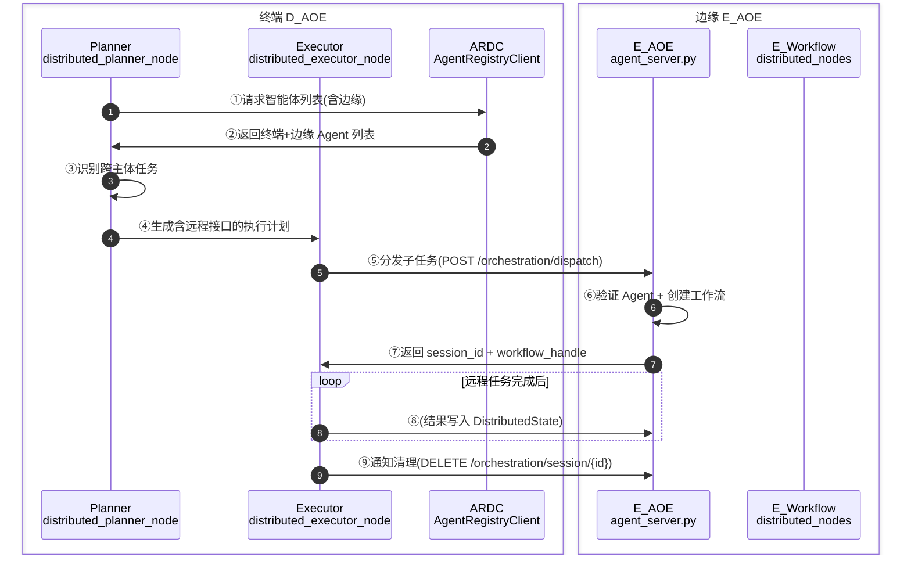
```mermaid
sequenceDiagram
    autonumber
    box 终端 D_AOE
        participant D_PLAN as Planner<br>distributed_planner_node
        participant D_EXEC as Executor<br>distributed_executor_node
        participant D_ARDC as ARDC<br>AgentRegistryClient
    end
    box 边缘 E_AOE
        participant E_SRV as E_AOE<br>agent_server.py
        participant E_WF as E_Workflow<br>distributed_nodes
    end

    D_PLAN->>D_ARDC: ①请求智能体列表(含边缘)
    D_ARDC->>D_PLAN: ②返回终端+边缘 Agent 列表
    D_PLAN->>D_PLAN: ③识别跨主体任务
    D_PLAN->>D_EXEC: ④生成含远程接口的执行计划

    D_EXEC->>E_SRV: ⑤分发子任务(POST /orchestration/dispatch)
    E_SRV->>E_SRV: ⑥验证 Agent + 创建工作流
    E_SRV->>D_EXEC: ⑦返回 session_id + workflow_handle
    
    loop 远程任务完成后
        D_EXEC->>E_SRV: ⑧(结果写入 DistributedState)
    end
    
    D_EXEC->>E_SRV: ⑨通知清理(DELETE /orchestration/session/{id})
```

**流程步骤 → 代码映射表**

| 步骤 | 动作 | 文件路径 | 类/函数 | 说明 |
|------|------|----------|---------|------|
| ① | 请求全量 Agent | `src/service/agent_registry.py` | `AgentRegistryClient.get_all_agents()` L235 | 合并本地 + Gossip peer agents |
| ③ | 识别跨主体任务 | `src/graph/distributed_nodes.py` | `identify_cross_host_tasks()` L236 | 对比本地 Agent 列表，标记远程任务 |
| ④ | 写入跨主体会话 | `src/graph/distributed_types.py` | `DistributedState.cross_host_sessions` | `Dict[task_id, remote_url]` 映射 |
| ⑤ | 分发子任务 | `src/graph/distributed_nodes.py` | `dispatch_subtask_to_remote_aoe()` L56 | `httpx.AsyncClient POST /orchestration/dispatch` |
| ⑥ | E_AOE 接收分发 | `agent_server.py` | `dispatch_subtask()` L203 | `asyncio.create_task()` 启动独立工作流 |
| ⑦ | 返回会话 ID | `agent_server.py` | `dispatch_subtask()` L203 | `_SessionRegistry` 记录 session→task |
| ⑨ | 会话清理 | `src/graph/distributed_nodes.py` | `_cleanup_remote_session()` L170 | `httpx DELETE /orchestration/session/{id}` |
| ⑨ | E_AOE 关闭会话 | `agent_server.py` | `close_session()` L289 | `task.cancel()` + ALCM unsubscribe |

---

### 5.4 跨主体重编排（Agent 失效）

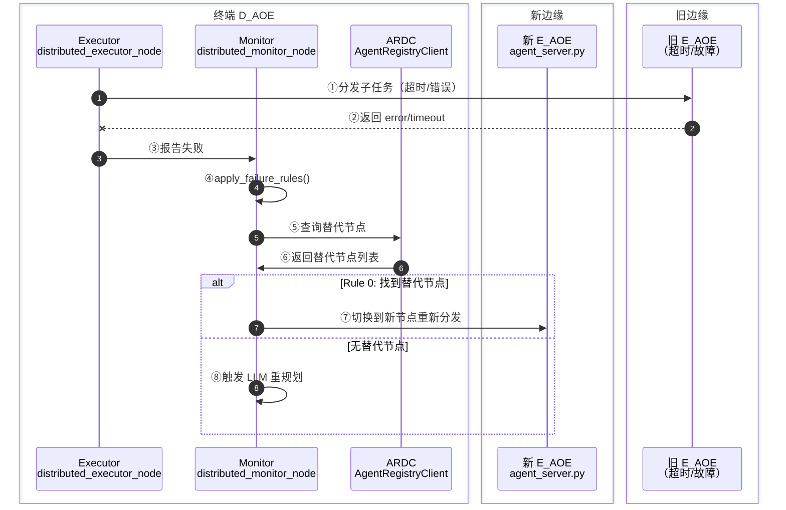
```mermaid
sequenceDiagram
    autonumber
    box 终端 D_AOE
        participant D_EXEC as Executor<br>distributed_executor_node
        participant D_MON as Monitor<br>distributed_monitor_node
        participant D_ARDC as ARDC<br>AgentRegistryClient
    end
    box 新边缘
        participant E_NEW as 新 E_AOE<br>agent_server.py
    end
    box 旧边缘
        participant E_OLD as 旧 E_AOE<br>（超时/故障）
    end

    D_EXEC->>E_OLD: ①分发子任务（超时/错误）
    E_OLD--xD_EXEC: ②返回 error/timeout
    D_EXEC->>D_MON: ③报告失败
    D_MON->>D_MON: ④apply_failure_rules()
    D_MON->>D_ARDC: ⑤查询替代节点
    D_ARDC->>D_MON: ⑥返回替代节点列表
    
    alt Rule 0: 找到替代节点
        D_MON->>E_NEW: ⑦切换到新节点重新分发
    else 无替代节点
        D_MON->>D_MON: ⑧触发 LLM 重规划
    end
```

**流程步骤 → 代码映射表**

| 步骤 | 动作 | 文件路径 | 类/函数 | 说明 |
|------|------|----------|---------|------|
| ① | 分发超时/失败 | `src/graph/distributed_nodes.py` | `dispatch_subtask_to_remote_aoe()` L56 | 返回 `status=error/timeout` |
| ② | 记录失败节点 | `src/graph/distributed_types.py` | `DistributedState.failed_remote_aoe_urls` | `Dict[task_id, List[str]]` |
| ④ | 应用失败规则 | `src/graph/distributed_nodes.py` | `apply_failure_rules()` L1086 | Rule 0 优先级 > Rule 1 |
| ⑤ | 查询替代节点 | `src/graph/distributed_nodes.py` | `find_alternative_remote_aoe()` L170 | 跳过本地 IP 和已失败 URL，匹配相同 capability |
| ⑦ | Rule 0 切换 | `src/graph/distributed_nodes.py` | `apply_failure_rules()` 内 Rule 0 | 更新 `cross_host_sessions`，重置 `current_task_index` |
| ⑧ | LLM 重规划 | `src/graph/distributed_nodes.py` | `trigger_llm_replanning()` L1252 | 最多 2 次（`max_replanning`） |
| — | 跳过失败任务 | `src/graph/distributed_nodes.py` | `apply_failure_rules()` 内 Rule 1 | 标记任务 skip，继续执行 |

**失败处理优先级**：
1. **Rule 0（最高）**：`find_alternative_remote_aoe()` 找到替代节点 → 切换并重试
2. **Rule 1**：跳过 `failed_cross_host_tasks` 中的任务
3. **兜底**：`trigger_llm_replanning()` 触发 LLM 重新规划

---

### 5.5 工作流停止编排

#### 单主体停止

| 步骤 | 动作 | 文件路径 | 类/函数 |
|------|------|----------|---------|
| 停止工作流 | `task.cancel()` | `src/app/app_logic_engine.py` | `AppLogicEngine.stop_app()` L155 |
| 退订智能体 | 引用计数 -1 | `src/runtime/lifecycle_manager.py` | `AgentLifecycleManager.unsubscribe()` L115 |
| 关闭实例 | ASD 关闭进程 | `src/service/agent_scheduler.py` | `AgentScheduler.shutdown_agent()` L220 |

#### 跨主体停止

| 步骤 | 动作 | 文件路径 | 类/函数 |
|------|------|----------|---------|
| 获取远端会话 | 查找活跃会话 | `src/graph/distributed_nodes.py` | `get_active_remote_sessions()` L46 |
| 通知远端取消 | fire-and-forget | `src/app/app_logic_engine.py` | `_cancel_remote_session()` L434 |
| 远端处理 | 取消 Task + 退订 | `agent_server.py` | `close_session()` L289 |
| 远端清理 | ALCM unsubscribe | `agent_server.py` 内调用 | `AgentLifecycleManager.unsubscribe()` |

---

## 六、智能体运行层接口流程

### 6.1 智能体部署与调用

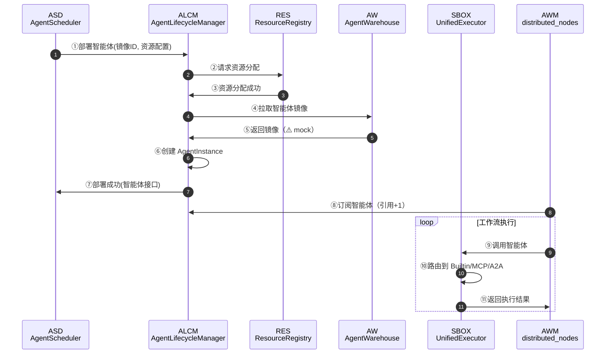
```mermaid
sequenceDiagram
    autonumber
    participant ASD as ASD<br>AgentScheduler
    participant ALCM as ALCM<br>AgentLifecycleManager
    participant RES as RES<br>ResourceRegistry
    participant AW as AW<br>AgentWarehouse
    participant SBOX as SBOX<br>UnifiedExecutor
    participant AWM as AWM<br>distributed_nodes

    ASD->>ALCM: ①部署智能体(镜像ID, 资源配置)
    ALCM->>RES: ②请求资源分配
    RES->>ALCM: ③资源分配成功
    ALCM->>AW: ④拉取智能体镜像
    AW->>ALCM: ⑤返回镜像（⚠️ mock）
    ALCM->>ALCM: ⑥创建 AgentInstance
    ALCM->>ASD: ⑦部署成功(智能体接口)
    AWM->>ALCM: ⑧订阅智能体（引用+1）

    loop 工作流执行
        AWM->>SBOX: ⑨调用智能体
        SBOX->>SBOX: ⑩路由到 Builtin/MCP/A2A
        SBOX->>AWM: ⑪返回执行结果
    end
```

**流程步骤 → 代码映射表**

| 步骤 | 动作 | 文件路径 | 类/函数 | 说明 |
|------|------|----------|---------|------|
| ① | ASD 部署 | `src/service/agent_scheduler.py` | `AgentScheduler.deploy_agent()` L125 | subprocess 启动 `agent_server.py`，自动端口分配 |
| ① | ALCM 部署 | `src/runtime/lifecycle_manager.py` | `AgentLifecycleManager.deploy_agent()` L48 | 创建 `AgentInstance`，⚠️ 内存 mock |
| ② | 资源分配 | `src/service/resource_registry.py` | `ResourceRegistry.allocate()` L202 | ⚠️ 骨架：内存实现 |
| ④ | 拉取镜像 | `src/app/agent_warehouse.py` | `AgentWarehouse.get_image()` L108 | ⚠️ 骨架：不实际拉取 |
| ⑧ | 订阅智能体 | `src/runtime/lifecycle_manager.py` | `AgentLifecycleManager.subscribe()` L95 | 引用计数 +1 |
| ⑨ | 调用智能体 | `src/graph/unified_executor.py` | `UnifiedExecutor.execute_task()` L40 | 统一任务执行入口 |
| ⑩ | 匹配内置工具 | `src/graph/unified_executor.py` | `UnifiedExecutor._try_match_builtin_tool()` L107 | bash/search/file 等 |
| ⑩ | A2A 调用 | `src/graph/unified_executor.py` | `UnifiedExecutor._execute_with_a2a()` L203 | HTTP 调用远端 Agent |
| ⑩ | URL 解析 | `src/graph/unified_executor.py` | `UnifiedExecutor._resolve_agent_url()` L233 | 4 层优先级解析 |

---

### 6.2 业务-资源智能体协同

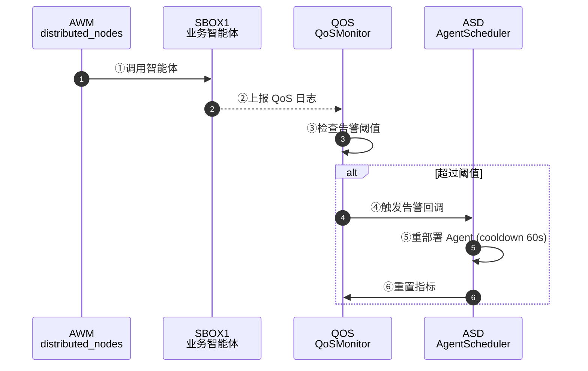
```mermaid
sequenceDiagram
    autonumber
    participant AWM as AWM<br>distributed_nodes
    participant SBOX1 as SBOX1<br>业务智能体
    participant QOS as QOS<br>QoSMonitor
    participant ASD as ASD<br>AgentScheduler

    AWM->>SBOX1: ①调用智能体
    SBOX1-->>QOS: ②上报 QoS 日志
    QOS->>QOS: ③检查告警阈值
    
    alt 超过阈值
        QOS->>ASD: ④触发告警回调
        ASD->>ASD: ⑤重部署 Agent (cooldown 60s)
        ASD->>QOS: ⑥重置指标
    end
```

**流程步骤 → 代码映射表**

| 步骤 | 动作 | 文件路径 | 类/函数 | 说明 |
|------|------|----------|---------|------|
| ② | 上报调用记录 | `src/runtime/qos_monitor.py` | `QoSMonitor.record_call()` L72 | 记录延迟 + 成功/失败 |
| ③ | 检查阈值 | `src/runtime/qos_monitor.py` | `QoSMonitor.check_threshold()` L131 | `max_avg_latency_ms` / `min_success_rate` |
| ④ | 注册告警回调 | `src/runtime/qos_monitor.py` | `QoSMonitor.register_alert_callback()` L50 | 回调函数在超阈值时触发 |
| ④ | 初始化回调 | `src/app/app_logic_engine.py` | `AppLogicEngine._register_qos_callback()` L397 | 进程启动时注册一次 |
| ⑤ | 重部署 Agent | `src/service/agent_scheduler.py` | `AgentScheduler.deploy_agent()` L125 | 关闭旧进程 + 启动新进程 |
| ⑥ | 重置指标 | `src/runtime/qos_monitor.py` | `QoSMonitor.reset_metrics()` L140 | redeploy 后清除历史统计 |
| HTTP | QoS 查询接口 | `src/api/app.py` | `get_qos_metrics()` L439 | `GET /api/qos/metrics` |
| HTTP | 单 Agent QoS | `src/api/app.py` | `get_agent_qos_metrics()` L457 | `GET /api/qos/metrics/{agent_id}` |

---

## 七、HTTP API 接口一览

### 7.1 主服务接口（端口 8000）

> 文件：`src/api/app.py`，由 `server.py` 启动

#### 应用管理

| 方法 | 路径 | 处理函数 | 行号 | 说明 |
|------|------|----------|------|------|
| POST | `/api/apps/install` | `install_app()` | L250 | 安装应用 |
| GET | `/api/apps/` | `list_apps()` | L206 | 获取所有应用列表 |
| GET | `/api/apps/running` | `list_running_apps()` | L220 | 获取运行中应用 |
| GET | `/api/apps/{app_id}` | `get_app()` | L233 | 查询单个应用 |
| POST | `/api/apps/{app_id}/start` | `start_app()` | L284 | 启动应用 |
| POST | `/api/apps/{app_id}/stop` | `stop_app()` | L319 | 停止应用 |
| DELETE | `/api/apps/{app_id}` | `uninstall_app()` | L343 | 卸载应用 |
| PATCH | `/api/apps/{app_id}` | `update_app()` | L373 | 更新应用配置 |
| POST | `/api/apps/{app_id}/interface` | `query_app_interface()` | L508 | 向运行中应用发送查询 |
| GET | `/api/apps/{app_id}/interface` | `get_app_interface_info()` | L547 | 获取应用接口说明 |

#### 聊天接口

| 方法 | 路径 | 处理函数 | 行号 | 说明 |
|------|------|----------|------|------|
| POST | `/api/chat/stream` | `chat_endpoint()` | L120 | SSE 流式聊天（Server-Sent Events） |

#### Agent 与运行时管理

| 方法 | 路径 | 处理函数 | 行号 | 说明 |
|------|------|----------|------|------|
| GET | `/api/agents/instances` | `list_agent_instances()` | L407 | Agent 实例列表 |
| GET | `/api/agents/instances/{id}` | `get_agent_instance()` | L422 | 单个 Agent 实例 |
| GET | `/api/agents/deployments` | `list_agent_deployments()` | L570 | ASD 部署记录 |
| GET | `/api/qos/metrics` | `get_qos_metrics()` | L439 | 所有 Agent QoS 指标 |
| GET | `/api/qos/metrics/{agent_id}` | `get_agent_qos_metrics()` | L457 | 单个 Agent QoS 指标 |
| GET | `/api/resources/` | `query_resources()` | L478 | 可用资源查询 |

#### Gossip 与 UI

| 方法 | 路径 | 处理函数 | 行号 | 说明 |
|------|------|----------|------|------|
| POST | `/registry/sync` | `registry_sync()` | L53 | ARDC Gossip 同步 |
| GET | `/ui` | `web_ui()` | L589 | 应用管理 Web UI |
| GET | `/demo` | `demo_page()` | L604 | 演示可视化页面 |
| WS | `/demo/ws` | `demo_ws()` | ~L650 | Demo WebSocket 事件流 |
| POST | `/demo/start` | `demo_start()` | L628 | 启动演示工作流 |

### 7.2 Agent 节点接口（端口 9000+）

> 文件：`agent_server.py`

| 方法 | 路径 | 处理函数 | 行号 | 说明 |
|------|------|----------|------|------|
| POST | `/a2a/execute` | `execute_task()` | L117 | A2A 协议任务执行 |
| GET | `/health` | `health_check()` | L157 | 健康检查 |
| POST | `/registry/sync` | `registry_sync()` | L173 | ARDC Gossip 同步 |
| POST | `/orchestration/dispatch` | `dispatch_subtask()` | L203 | 跨主体子任务接收 |
| DELETE | `/orchestration/session/{session_id}` | `close_session()` | L289 | 会话关闭（取消工作流） |

---

## 八、跨层端到端数据流

> 从用户请求到最终结果的完整调用链

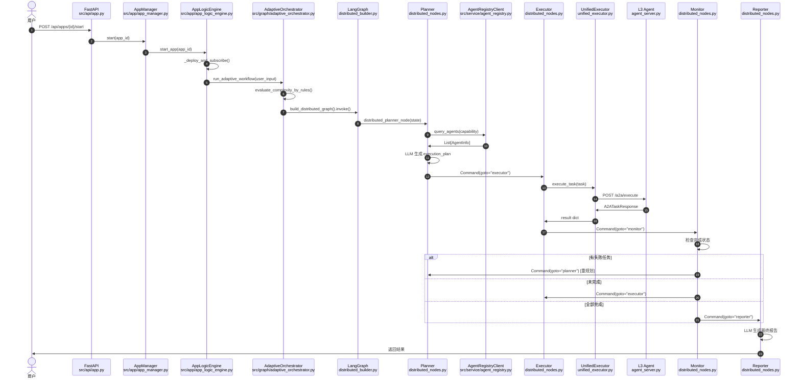
```mermaid
sequenceDiagram
    autonumber
    actor User as 用户
    participant API as FastAPI<br>src/api/app.py
    participant APPM as AppManager<br>src/app/app_manager.py
    participant ALRE as AppLogicEngine<br>src/app/app_logic_engine.py
    participant AOE as AdaptiveOrchestrator<br>src/graph/adaptive_orchestrator.py
    participant GRAPH as LangGraph<br>distributed_builder.py
    participant PLAN as Planner<br>distributed_nodes.py
    participant ARDC as AgentRegistryClient<br>src/service/agent_registry.py
    participant EXEC as Executor<br>distributed_nodes.py
    participant UE as UnifiedExecutor<br>unified_executor.py
    participant L3 as L3 Agent<br>agent_server.py
    participant MON as Monitor<br>distributed_nodes.py
    participant RPT as Reporter<br>distributed_nodes.py

    User->>API: POST /api/apps/{id}/start
    API->>APPM: start(app_id)
    APPM->>ALRE: start_app(app_id)
    ALRE->>ALRE: _deploy_and_subscribe()
    ALRE->>AOE: run_adaptive_workflow(user_input)
    AOE->>AOE: evaluate_complexity_by_rules()
    AOE->>GRAPH: build_distributed_graph().invoke()
    
    GRAPH->>PLAN: distributed_planner_node(state)
    PLAN->>ARDC: query_agents(capability)
    ARDC->>PLAN: List[AgentInfo]
    PLAN->>PLAN: LLM 生成 execution_plan
    
    PLAN->>EXEC: Command(goto="executor")
    EXEC->>UE: execute_task(task)
    UE->>L3: POST /a2a/execute
    L3->>UE: A2ATaskResponse
    UE->>EXEC: result dict
    
    EXEC->>MON: Command(goto="monitor")
    MON->>MON: 检查完成状态
    
    alt 有失败任务
        MON->>PLAN: Command(goto="planner") [重规划]
    else 未完成
        MON->>EXEC: Command(goto="executor")
    else 全部完成
        MON->>RPT: Command(goto="reporter")
    end
    
    RPT->>RPT: LLM 生成最终报告
    RPT->>User: 返回结果
```

**关键函数调用链**：

```
POST /api/apps/{id}/start                    [src/api/app.py L284]
  → AppManager.start()                       [src/app/app_manager.py L172]
    → AppLogicEngine.start_app()             [src/app/app_logic_engine.py L98]
      → _deploy_and_subscribe()              [src/app/app_logic_engine.py L328]
        → AgentLifecycleManager.deploy_agent()   [src/runtime/lifecycle_manager.py L48]
        → AgentLifecycleManager.subscribe()      [src/runtime/lifecycle_manager.py L95]
      → run_adaptive_workflow()              [src/graph/adaptive_orchestrator.py L173]
        → evaluate_complexity_by_rules()     [src/graph/adaptive_orchestrator.py L77]
        → build_distributed_graph()          [src/graph/distributed_builder.py L15]
        → graph.ainvoke(state)
          → distributed_planner_node()       [src/graph/distributed_nodes.py L272]
            → AgentRegistryClient.query_agents() [src/service/agent_registry.py L175]
          → distributed_executor_node()      [src/graph/distributed_nodes.py L850]
            → UnifiedExecutor.execute_task() [src/graph/unified_executor.py L40]
          → distributed_monitor_node()       [src/graph/distributed_nodes.py L1003]
            → apply_failure_rules()          [src/graph/distributed_nodes.py L1086]
          → distributed_reporter_node()      [src/graph/distributed_nodes.py L1430]
```

---

## 九、DistributedState 全字段说明

> 文件：`src/graph/distributed_types.py` L36-107

### 配置与超时

| 字段 | 类型 | 用途 | 写入节点 | 读取节点 |
|------|------|------|----------|----------|
| `max_retries` | `int` | 单任务最大重试次数 | 初始化 | executor, monitor |
| `timeout_seconds` | `int` | 任务超时秒数 | 初始化 | executor |

### Agent 注册表

| 字段 | 类型 | 用途 | 写入节点 | 读取节点 |
|------|------|------|----------|----------|
| `agent_registry_cache` | `List[AgentInfo]` | L3 Agent 信息缓存 | planner | executor, monitor |
| `registry_last_update` | `str` | 缓存最后更新时间 | planner | planner |

### 执行计划

| 字段 | 类型 | 用途 | 写入节点 | 读取节点 |
|------|------|------|----------|----------|
| `execution_plan` | `List[TaskAssignment]` | 任务分配列表 | planner | executor, monitor, reporter |
| `current_task_index` | `int` | 当前执行任务索引 | executor, monitor | executor |
| `plan_generated` | `bool` | 计划是否已生成 | planner | executor |
| `all_tasks_completed` | `bool` | 所有任务是否完成 | monitor | reporter |
| `failed_tasks` | `List[str]` | 失败任务 ID 列表 | executor, monitor | monitor, reporter |

### 重规划

| 字段 | 类型 | 用途 | 写入节点 | 读取节点 |
|------|------|------|----------|----------|
| `replanning_count` | `int` | 已重规划次数 | monitor | monitor |
| `max_replanning` | `int` | 最大重规划次数（默认 2） | 初始化 | monitor |
| `replanning_enabled` | `bool` | 是否允许重规划 | 初始化 | monitor |
| `last_replan_reason` | `str` | 最后一次重规划原因 | monitor | planner |

### Magentic-One 专用

| 字段 | 类型 | 用途 | 写入节点 | 读取节点 |
|------|------|------|----------|----------|
| `magentic_round` | `int` | 当前 Inner Loop 轮次 | orchestrator | orchestrator, executor |
| `magentic_stall_count` | `int` | 连续停滞计数 | orchestrator | orchestrator |
| `magentic_max_round` | `int` | 最大轮次（默认 20） | 初始化 | orchestrator |
| `magentic_max_stall` | `int` | 最大停滞次数 | 初始化 | orchestrator |
| `magentic_mode` | `str` | 当前 Magentic 模式 | planner | orchestrator |
| `progress_ledger` | `dict` | 5 维度进度评估 | orchestrator | orchestrator |
| `reset_count` | `int` | 状态重置次数 | orchestrator | orchestrator |
| `complexity_level` | `str` | 任务复杂度（simple/medium/complex） | adaptive_orchestrate | planner |

### 跨主体

| 字段 | 类型 | 用途 | 写入节点 | 读取节点 |
|------|------|------|----------|----------|
| `cross_host_sessions` | `Dict[str, str]` | task_id → remote_url 映射 | planner, monitor | executor |
| `session_timeout_seconds` | `int` | 远程会话超时 | 初始化 | executor |
| `failed_cross_host_tasks` | `List[str]` | 失败的跨主体任务 ID | monitor | monitor |
| `failed_remote_aoe_urls` | `Dict[str, List[str]]` | 按 task 维度记录已失败节点 | executor | monitor |

### 应用指导

| 字段 | 类型 | 用途 | 写入节点 | 读取节点 |
|------|------|------|----------|----------|
| `skills_content` | `str` | Skills.md 原始内容 | 初始化 | planner |
| `pipeline_topology` | `List` | Pipeline 拓扑结构 | 初始化 | planner |
| `next` | `str` | 路由目标节点名 | 各节点 | LangGraph 框架 |

---

## 十、设计模式与扩展点

### 设计模式

| 模式 | 应用位置 | 说明 |
|------|----------|------|
| **策略模式** | `AdaptiveOrchestrator` → `get_workflow_builder_for_complexity()` | 按复杂度选择编排策略 |
| **工厂模式** | `AppInfo.create()` / `AgentImage.create()` / `get_llm_by_type()` | 对象创建标准化 |
| **单例模式** | `get_app_manager()` / `get_app_logic_engine()` / `get_registry_client()` | 全局唯一实例 |
| **注册表模式** | `AgentRegistryClient` / `MCPToolRegistry` / `BuiltinToolRegistry` | 统一注册与发现 |
| **命令模式** | `Command(goto=...)` | LangGraph 动态路由，节点返回命令而非直接修改状态 |
| **适配器模式** | `A2AClient` / `MCPClient` | HTTP 到标准协议、stdio 到工具调用的适配 |
| **混入模式** | `LoggedToolMixin` / `@log_io` | 非侵入式日志功能 |

### 扩展点

#### 添加新的 L3 智能体
1. 在 `config/agent_registry.json` 中注册（`id`、`capability`、`ip`、`port`）
2. 实现 A2A 协议的 HTTP 接口（参考 `agent_server.py` 的 `POST /a2a/execute`）
3. 声明 `capability` 和 `description`

#### 添加新的 L1 工具
1. 在 `src/tools/` 创建工具文件，使用 `@log_io` 装饰器
2. 在 `src/tools/__init__.py` 导出
3. 在 `src/config/agents.py` 配置到智能体的 tools 列表

#### 添加新的编排模式
1. 在 `src/graph/` 创建新的 `*_builder.py` 和 `*_nodes.py`
2. 在 `adaptive_orchestrator.py` 的 `get_workflow_builder_for_complexity()` 中注册
3. 编写对应测试

#### 集成新的 MCP 服务器
1. 安装 MCP 服务器（npm 或 pip）
2. 调用 `MCPToolRegistry.register_server(name, command)`
3. 工具通过 `MCPToolRegistry.call_tool()` 自动可用

---

## 十一、骨架/Mock 区域说明

| 区域 | 文件 | 当前实现 | 生产替换方向 |
|------|------|----------|--------------|
| **RRDC 资源分配** | `src/service/resource_registry.py` | 内存字典，3 个 mock 节点 | etcd/Consul + 真实节点探测 |
| **AW 镜像拉取** | `src/app/agent_warehouse.py` | 不拉取真实镜像，JSON 存储元数据 | Docker Registry + 真实镜像拉取 |
| **ASD 容器管理** | `src/service/agent_scheduler.py` | `subprocess.Popen` 启动 `agent_server.py` | Docker SDK / K8s API |
| **ALCM 引用计数** | `src/runtime/lifecycle_manager.py` | 内存字典计数，无真实容器关闭 | 对接 ASD Docker SDK |
| **SBOX 沙箱隔离** | `src/graph/unified_executor.py` | 无容器隔离，直接调用工具 | 容器沙箱 / gVisor |
| **COMM 中间件** | `src/service/message_router.py` | 空壳结构 | pub/sub 消息中间件 |
| **INTF 硬件接口** | `src/runtime/resource_interface.py` | 返回 mock 传感器数据 | 真实硬件驱动对接 |

---

## 附录：文件-类速查表

| 文件路径 | 主要类/函数 | 用途 |
|----------|-------------|------|
| `src/graph/distributed_types.py` | `DistributedState`, `AgentInfo`, `TaskAssignment` | 核心状态定义 |
| `src/graph/adaptive_orchestrator.py` | `run_adaptive_workflow()`, `evaluate_complexity_by_rules()` | 自适应编排入口 |
| `src/graph/distributed_builder.py` | `build_distributed_graph()` | 分布式图构建 |
| `src/graph/distributed_nodes.py` | `distributed_planner_node()`, `distributed_executor_node()`, `distributed_monitor_node()`, `distributed_reporter_node()`, `apply_failure_rules()`, `dispatch_subtask_to_remote_aoe()`, `find_alternative_remote_aoe()` | 分布式工作流节点 |
| `src/graph/magentic_builder.py` | `build_magentic_graph()` | Magentic-One 图构建 |
| `src/graph/magentic_nodes.py` | `magentic_planner_node()`, `magentic_orchestrator_node()`, `magentic_executor_node()`, `magentic_reporter_node()` | Magentic-One 节点 |
| `src/graph/progress_ledger.py` | `ProgressLedger`, `create_progress_ledger()`, `is_task_completed()` | 5 维度进度分析 |
| `src/graph/unified_executor.py` | `UnifiedExecutor` | 统一任务执行（Builtin/MCP/A2A） |
| `src/app/app_manager.py` | `AppManager` | 应用生命周期管理 |
| `src/app/app_logic_engine.py` | `AppLogicEngine` | 工作流启停逻辑 |
| `src/app/agent_warehouse.py` | `AgentWarehouse` | 智能体镜像仓库（⚠️ 骨架） |
| `src/app/models.py` | `AppInfo`, `AgentImage`, `GuidanceFile` | 数据模型 |
| `src/app/pipeline_parser.py` | `parse_pipeline()`, `topology_to_description()` | Pipeline 拓扑解析 |
| `src/service/agent_registry.py` | `AgentRegistryClient` | ARDC 注册/发现/Gossip |
| `src/service/agent_scheduler.py` | `AgentScheduler`, `DeploymentRecord` | ASD 进程管理 |
| `src/service/resource_registry.py` | `ResourceRegistry`, `ResourceInfo` | RRDC 资源管理（⚠️ 骨架） |
| `src/service/a2a_client.py` | `A2AClient`, `A2AHealthChecker` | A2A HTTP 通信 |
| `src/service/llm_agent_simulator.py` | `LLMAgentSimulator` | LLM 模拟 Agent |
| `src/service/mcp_client.py` | `MCPClient`, `MCPToolRegistry` | MCP 协议集成 |
| `src/runtime/lifecycle_manager.py` | `AgentLifecycleManager` | ALCM 部署/订阅/引用计数 |
| `src/runtime/qos_monitor.py` | `QoSMonitor` | QoS 监控/告警/回调 |
| `src/protocols/a2a_protocol.py` | `A2AMessage`, `A2ATaskRequest`, `A2ATaskResponse` | A2A 通信协议定义 |
| `src/api/app.py` | FastAPI 路由定义 | 所有 HTTP 端点 |
| `agent_server.py` | FastAPI Agent 节点 | L3 Agent HTTP 服务 |
| `server.py` | uvicorn 启动入口 | 主服务启动 |
| `src/config/env.py` | `REASONING_MODEL`, `BASIC_MODEL`, `VL_MODEL` | LLM 三模型配置 |


> **关联文档**：  
>
> - 类图详细设计 → `接口/类图.md` + `接口/类图设计.md`  
> - 原始接口流程 → `接口/应用管理层接口流程v1.md` / `接口/智能体编排层接口流程v1.md` / `接口/智能体运行层接口流程v1.md`  
> - 实现状态档案 → `接口/当前进度.md`  
> - 部署运维 → `docs/部署运维/运行指南.md`
